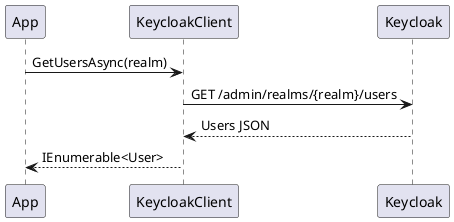

# Claude Code Configuration

This directory contains protocols and scripts for Claude Code to work effectively with this repository.

## Structure

```
.claude/
├── README.md                           # This file
├── document-style-guide.md             # Writing and formatting standards
├── protocols/
│   └── update-documentation.md         # Protocol for updating docs with PlantUML
└── scripts/
    ├── check-doc-updates.sh            # Check which docs need updates
    └── analyze-doc-changes.sh          # Detailed analysis for a specific doc
```

## Style Guide

### document-style-guide.md

Comprehensive writing and formatting standards for all documentation.

**Defines:**
- Writing style (voice, tone, terminology)
- Formatting conventions (headings, lists, tables)
- Code example structure and requirements
- PlantUML diagram formatting
- API documentation patterns
- Metadata management
- Quality checklist

**Must Follow:** All documentation updates MUST adhere to this style guide.

## Protocols

### update-documentation.md

Comprehensive protocol for creating and updating documentation in the `./docs` directory.

**Key Features:**
- Enforces [Document Style Guide](./document-style-guide.md) compliance
- Markdown standards and structure
- PlantUML diagram guidelines (C4 and UML)
- Git diff analysis to detect changes since last update
- Metadata management (timestamp, git hash, version)
- Code example templates
- Sequence diagram patterns
- Best practices and checklists

**Usage:**
When updating documentation, Claude Code will follow this protocol to:
1. Review and follow the Document Style Guide
2. Extract the last git hash from existing documentation
3. Generate diff since that hash to identify changes
4. Update only affected sections
5. Include proper PlantUML diagrams for complex flows
6. Ensure style guide compliance
7. Update metadata with current timestamp and git hash

## Scripts

### check-doc-updates.sh

Bash script to check which documentation files need updates based on source code changes.

**Usage:**
```bash
# Run from repository root
bash .claude/scripts/check-doc-updates.sh
```

**Output:**
- ✅ Up to date - No changes needed
- 🔄 Needs update - Source code changed, documentation should be updated
- ℹ️ Metadata update only - No code changes, just update metadata
- ⚠️ Warning - Issue detected (file not found, no metadata)

**Example:**
```
=== Documentation Update Check ===

✅ authentication-core.md - Up to date
🔄 user-management-operations.md - Needs update
   Last: 9bc2d34a37e88fae053f63977e0bfbd02a61441d
   Current: a1b2c3d4e5f6g7h8i9j0k1l2m3n4o5p6q7r8s9t0
   Changed files:
    src/Keycloak.ApiClient.Net/Users/KeycloakClient.cs | 15 ++++++++++-----
```

### analyze-doc-changes.sh

Detailed analysis script for a specific documentation file, showing exactly what changed.

**Usage:**
```bash
# Run from repository root
bash .claude/scripts/analyze-doc-changes.sh <doc-file-name>

# Example
bash .claude/scripts/analyze-doc-changes.sh user-management-operations.md
```

**Output:**
- Commit history since last update
- File statistics (lines added/removed)
- Public method changes (added/removed)
- Model changes
- Recommended actions for updating documentation

**Example:**
```
╔════════════════════════════════════════════════════════════════════╗
║         Documentation Change Analysis                              ║
╚════════════════════════════════════════════════════════════════════╝

Documentation: user-management-operations.md
Last Documented: 9bc2d34a37e88fae053f63977e0bfbd02a61441d
Current Commit:  a1b2c3d4e5f6g7h8i9j0k1l2m3n4o5p6q7r8s9t0

━━━━━━━━━━━━━━━━━━━━━━━━━━━━━━━━━━━━━━━━━━━━━━━━━━━━━━━━━━━━━━━━━
📁 Users
━━━━━━━━━━━━━━━━━━━━━━━━━━━━━━━━━━━━━━━━━━━━━━━━━━━━━━━━━━━━━━━━━

📊 File Statistics:
   src/Keycloak.ApiClient.Net/Users/KeycloakClient.cs | 15 ++++++++++-----

📝 Commits:
   a1b2c3d Add GetUserRolesAsync method

🔍 Public Method Changes:
   Added:
   + public async Task<IEnumerable<Role>> GetUserRolesAsync(string realm, string userId)

╔════════════════════════════════════════════════════════════════════╗
║  Recommended Actions                                               ║
╚════════════════════════════════════════════════════════════════════╝

1. Review the changes above
2. Update user-management-operations.md following .claude/protocols/update-documentation.md
3. Add/update documentation for new/changed methods
4. Add PlantUML sequence diagrams for complex new operations
5. Update code examples if behavior changed
6. Update metadata header
```

## How Claude Code Uses This

When Claude Code is asked to update documentation, it will:

1. **Read the style guide** from `document-style-guide.md` (REQUIRED)
2. **Read the protocol** from `protocols/update-documentation.md`
3. **Run the check script** to identify which docs need updates
4. **Extract git hashes** from documentation metadata
5. **Generate diffs** for changed source files
6. **Update documentation** following both the style guide and protocol
7. **Include PlantUML diagrams** using C4 and UML styles per style guide
8. **Verify style guide compliance** using the checklist
9. **Update metadata** with current timestamp and git hash

## Adding New Protocols

To add a new protocol:

1. Create a new `.md` file in `protocols/`
2. Follow the structure of existing protocols
3. Include clear examples and templates
4. Document when and how to use the protocol
5. Update this README with a reference to the new protocol

## Example Workflow

### Updating User Management Documentation

```bash
# 1. Check what needs updating
bash .claude/scripts/check-doc-updates.sh

# 2. If user-management-operations.md needs update, extract last hash
LAST_HASH=$(grep "Git Commit:" docs/user-management-operations.md | grep -oP '\(\K[^)]+')

# 3. See what changed
git diff $LAST_HASH HEAD -- src/Keycloak.ApiClient.Net/Users/

# 4. Update documentation following the protocol
# - Add new methods
# - Update changed signatures
# - Add PlantUML diagrams for new flows
# - Update metadata

# 5. Verify with the script
bash .claude/scripts/check-doc-updates.sh
```

## PlantUML Integration

Documentation uses PlantUML for diagrams. Examples:

**C4 Context Diagram:**
```plantuml
@startuml
!include https://raw.githubusercontent.com/plantuml-stdlib/C4-PlantUML/master/C4_Context.puml
Person(user, "User")
System(app, "Application")
System_Ext(keycloak, "Keycloak")
Rel(user, app, "Uses")
Rel(app, keycloak, "Manages", "REST API")
@enduml
```

**UML Sequence Diagram:**


See `protocols/update-documentation.md` for complete diagram guidelines.

## Maintenance

### Updating Protocols

When updating protocols:
1. Follow semantic versioning (update Protocol Version in the document)
2. Document what changed and why
3. Keep examples current with library version
4. Test any scripts referenced in the protocol

### Updating Scripts

When updating scripts:
1. Test thoroughly before committing
2. Maintain backward compatibility when possible
3. Update protocol documentation if script behavior changes
4. Add comments explaining complex logic

## Related Documentation

- Main README: `../README.md`
- CLAUDE.md: `../CLAUDE.md` (Codebase guide for Claude Code)
- API Documentation: `../docs/` (User-facing documentation)

## Version

**Created**: 2026-01-20
**Git Commit**: 9bc2d34
**Library Version**: 2.0.2
