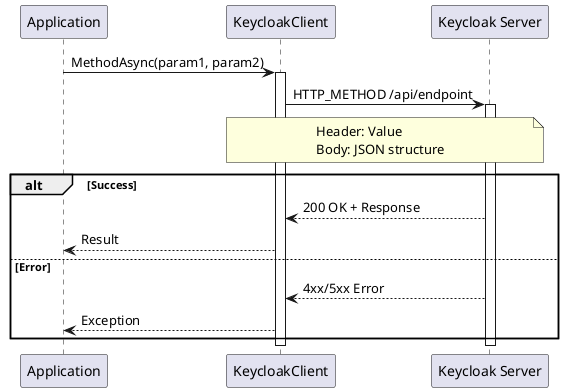

# Document Style Guide

This style guide defines the writing conventions, formatting standards, and structural patterns for all documentation in the `./docs` directory.

> **Document Metadata**
> Last Updated: 2026-01-20 19:35:00 UTC
> Git Commit: `9bc2d34` (9bc2d34a37e88fae053f63977e0bfbd02a61441d)
> Library Version: 2.0.2

## Table of Contents

- [Document Structure](#document-structure)
- [Writing Style](#writing-style)
- [Formatting Conventions](#formatting-conventions)
- [Code Examples](#code-examples)
- [PlantUML Diagrams](#plantuml-diagrams)
- [API Documentation Pattern](#api-documentation-pattern)
- [Metadata Management](#metadata-management)
- [Cross-References](#cross-references)
- [Common Patterns](#common-patterns)
- [Quality Checklist](#quality-checklist)

## Document Structure

### Required Elements

Every documentation file MUST include:

1. **Title (H1)** - One per document
2. **Metadata Header** - Blockquote with update info
3. **Overview** - Brief description
4. **Table of Contents** - Auto-generated navigation
5. **Content Sections** - Properly hierarchical
6. **Related Resources** - Links to other docs

### Metadata Header Format

```markdown
# Document Title - Subtitle

> **Document Metadata**
> Last Updated: YYYY-MM-DD HH:MM:SS UTC
> Git Commit: `short-hash` (full-hash)
> Library Version: X.Y.Z

## Overview

Brief overview paragraph explaining what this document covers.
```

### Section Hierarchy

```markdown
# Title (H1) - Used once for document title

## Major Section (H2) - Main divisions

### Subsection (H3) - Topic breakdowns

#### Detail (H4) - Specific details

**Bold for Emphasis** - In-line labels
```

**Rules:**
- Never skip heading levels (e.g., H2 to H4)
- Use sentence case for headings: "Authentication modes" not "Authentication Modes"
- Keep headings descriptive and scannable
- Maximum heading depth: H4

### Table of Contents

Generate TOC with proper indentation:

```markdown
## Table of Contents

- [Key Features](#key-features)
- [Authentication Modes](#authentication-modes)
  - [Username and Password](#username-and-password)
  - [Client Secret](#client-secret)
- [Examples](#examples)
  - [Basic Example](#basic-example)
  - [Advanced Example](#advanced-example)
- [Best Practices](#best-practices)
```

**Rules:**
- Use fragment links (kebab-case)
- Indent sub-items with 2 spaces
- Match heading structure exactly
- Update when adding/removing sections

## Writing Style

### Voice and Tone

- **Active voice**: "The client authenticates" not "Authentication is performed"
- **Present tense**: "Returns a list" not "Will return a list"
- **Direct**: "Use this method" not "This method can be used"
- **Technical but clear**: Assume familiarity with C# and REST APIs

### Sentence Structure

- **Keep sentences concise** - One idea per sentence
- **Use clear subjects** - Avoid ambiguous pronouns
- **Be specific** - "The CreateUserAsync method" not "This method"
- **Avoid redundancy** - "Brief" not "Brief and concise"

### Terminology

**Consistent terms:**
- "Keycloak Admin REST API" (first use), then "Admin API"
- "KeycloakClient" or "the client"
- "Realm" not "realm name" (unless specifically the string)
- "User ID" or "userId" (code context)
- "Boolean" or "bool" (C# context)
- "Async method" not "asynchronous method"

**Avoid:**
- "Simply", "just", "easily" (subjective)
- "Obviously", "clearly" (condescending)
- "May" when meaning "might" (use "might" or "can")

## Formatting Conventions

### Inline Code

Use backticks for:
- Method names: `CreateUserAsync`
- Class names: `KeycloakClient`
- Parameters: `realm`, `userId`
- Values: `true`, `"master"`, `401`
- File paths: `src/Users/KeycloakClient.cs`
- HTTP methods: `POST`, `GET`

```markdown
The `CreateUserAsync` method accepts a `realm` parameter.
```

### Bold Text

Use for:
- **Section labels** in structured content
- **Important keywords** (sparingly)
- **Status indicators** in tables

```markdown
**Use Case:** Service accounts and automated processes

**Returns:** Boolean indicating success
```

### Italic Text

Use for:
- *Emphasis* when absolutely necessary
- Foreign terms on first use

Avoid overuse - prefer structure over emphasis.

### Lists

**Unordered lists** (use `-`):
```markdown
- First item
- Second item
  - Nested item (indent 2 spaces)
  - Another nested item
- Third item
```

**Ordered lists** (use `1.`):
```markdown
1. First step
2. Second step
3. Third step
   - Sub-item under step 3
4. Fourth step
```

**Description lists** (for key-value pairs):
```markdown
**parameter1** - Description of parameter
**parameter2** - Description of parameter
```

### Tables

Use tables for structured data:

```markdown
| Parameter | Type | Required | Description |
|-----------|------|----------|-------------|
| realm | string | Yes | The realm name |
| userId | string | Yes | The user's ID |
| email | string | No | Email address |
```

**Rules:**
- Always include header row
- Use consistent column widths (visual)
- Left-align text columns
- Use emoji for status (✅ ❌ ⚠️)

### Blockquotes

Use for:
- Metadata headers
- Important warnings
- Deprecation notices

```markdown
> **⚠️ WARNING**
> This method performs irreversible changes. Ensure you have backups.

> **💡 TIP**
> Use pagination for large result sets to improve performance.

> **⚠️ DEPRECATED**
> This method is deprecated as of version X.Y.Z. Use `NewMethod` instead.
```

## Code Examples

### Basic Structure

Every code example must be:
1. **Complete** - Runnable without modifications
2. **Accurate** - Reflects current API
3. **Realistic** - Uses reasonable values
4. **Formatted** - Properly indented

### C# Code Blocks

```markdown
```csharp
using Keycloak.ApiClient.Net;
using Keycloak.ApiClient.Net.Models.Users;

var client = new KeycloakClient(
    "https://keycloak.example.com",
    "admin",
    "password"
);

var users = await client.GetUsersAsync("master");
foreach (var user in users)
{
    Console.WriteLine($"User: {user.Username}");
}
```​
```

**Rules:**
- Always specify language: `csharp`, `bash`, `json`, `plaintext`
- Include necessary `using` statements
- Use 4-space indentation
- Show realistic parameter values
- Include error handling in complex examples

### Inline vs. Block Examples

**Inline** (simple calls):
```markdown
Call `await client.GetUsersAsync("master")` to retrieve users.
```

**Block** (complete examples):
````markdown
```csharp
var users = await client.GetUsersAsync(
    realm: "master",
    username: "john.doe",
    first: 0,
    max: 100
);
```​
````

### Example Progression

Show examples in order of complexity:

```markdown
### Get Users

Retrieves users from a realm.

```csharp
// Simple - Get all users
var users = await client.GetUsersAsync("master");
```​

```csharp
// Filtered - Search by username
var users = await client.GetUsersAsync(
    realm: "master",
    username: "john.doe"
);
```​

```csharp
// Advanced - Multiple filters with pagination
var users = await client.GetUsersAsync(
    realm: "master",
    email: "john@example.com",
    firstName: "John",
    lastName: "Doe",
    first: 0,
    max: 100,
    briefRepresentation: true
);
```​
```

### Error Handling Examples

Include error handling in advanced examples:

```csharp
try
{
    var users = await client.GetUsersAsync("master");
    return users;
}
catch (FlurlHttpException ex)
{
    switch (ex.StatusCode)
    {
        case 401:
            Console.WriteLine("Authentication failed");
            break;
        case 403:
            Console.WriteLine("Insufficient permissions");
            break;
        case 404:
            Console.WriteLine("Realm not found");
            break;
        default:
            Console.WriteLine($"API error: {ex.Message}");
            break;
    }
    throw;
}
```

## PlantUML Diagrams

### Diagram Types

Use specific diagram types for different purposes:

1. **Sequence Diagrams** - API call flows
2. **C4 Context** - System relationships
3. **C4 Container** - Component structure
4. **Class Diagrams** - Model relationships
5. **State Diagrams** - Status transitions
6. **Activity Diagrams** - Workflow logic

### Sequence Diagram Style

Standard format for API operations:

````markdown


### Alt/Opt/Loop Blocks

```plantuml
alt Token exists
    Auth --> KC: Use cached token
else Token expired
    Auth -> KS: Request new token
    KS --> Auth: access_token
end

opt User has permissions
    KC -> KS: Perform operation
end

loop For each user
    App -> KC: GetUserAsync(userId)
    KC --> App: User
end
```

## API Documentation Pattern

### Standard Method Documentation

Use this template for every API method:

````markdown
### Method Name

Brief one-sentence description.

```csharp
// Simple usage example
var result = await client.MethodAsync("master", parameter);
```​

**Sequence Diagram:**

```plantuml
@startuml
[Include sequence diagram]
@enduml
```​

**Signature:**
```csharp
public async Task<ReturnType> MethodAsync(
    string realm,
    ParameterType parameter
)
```​

**Parameters:**
- `realm` - The realm name
- `parameter` - Description of what this parameter does

**Returns:** `ReturnType` - Description of return value

**Location:** `/src/Keycloak.ApiClient.Net/Resource/KeycloakClient.cs:123`

**Keycloak API:** [Resource Name - Operation](https://www.keycloak.org/docs-api/latest/rest-api/index.html#_anchor)

**Example:**
```csharp
[Complete runnable example with error handling]
```​
````

### Parameter Documentation

Format for documenting parameters:

```markdown
**Parameters:**
- `realm` - The realm name where the operation will be performed
- `userId` - The unique identifier of the user
- `user` - User object containing the data to create/update
- `briefRepresentation` - Optional. When `true`, returns minimal user data. Default: `false`
- `first` - Optional. Pagination offset (0-based). Default: `0`
- `max` - Optional. Maximum number of results. Default: `100`
```



**Rules:**
- Use backticks for parameter names
- Start with "Optional." for optional parameters
- Include default values when applicable
- Describe the purpose, not just the type

### Return Value Documentation

```markdown
**Returns:** `bool` - `true` if the operation succeeded (HTTP 2xx), `false` otherwise

**Returns:** `string` - The created resource's ID, or `null` if creation failed

**Returns:** `IEnumerable<User>` - Collection of users matching the search criteria. Empty if no matches.

**Returns:** `Task<Credential>` - The generated client secret credentials
```

### Use Case Documentation

```markdown
**Use Case:** Direct admin access, testing, development environments

**Use Case:** Service accounts, automated processes, backend services

**Use Case:** Token refresh, external identity providers, custom authentication flows
```

## Metadata Management

### Update Requirements

Update metadata when:
- Adding new content
- Modifying existing content
- Fixing typos or errors
- Changing examples

### Metadata Format

```markdown
> **Document Metadata**
> Last Updated: 2026-01-20 19:35:00 UTC
> Git Commit: `9bc2d34` (9bc2d34a37e88fae053f63977e0bfbd02a61441d)
> Library Version: 2.0.2
```

### Getting Current Values

```bash
# Timestamp (UTC)
date -u +"%Y-%m-%d %H:%M:%S"

# Git hash
git rev-parse --short HEAD  # Short: 9bc2d34
git rev-parse HEAD          # Full: 9bc2d34a37e8...

# Library version
grep '<Version>' src/Keycloak.ApiClient.Net/Keycloak.ApiClient.Net.csproj
```

## Cross-References

### Internal Links

```markdown
See [Authentication](./authentication-core.md) for details.

Refer to the [User Model](#user-model) section above.

Check [Create User](#create-user) for examples.
```

**Rules:**
- Use relative paths for file links: `./filename.md`
- Use fragment links for same-page sections: `#section-name`
- Use descriptive link text (not "click here")
- Verify links after adding/renaming sections

### External Links

```markdown
[Keycloak Admin REST API](https://www.keycloak.org/docs-api/)

[OAuth 2.0 Specification](https://oauth.net/2/)

[GitHub Repository](https://github.com/org/repo)
```

### Code Location References

Always include both source code location AND official Keycloak API documentation:

```markdown
**Location:** `/src/Keycloak.ApiClient.Net/Users/KeycloakClient.cs:18`

**Keycloak API:** [Users Resource - Create User](https://www.keycloak.org/docs-api/latest/rest-api/index.html#_users_resource)

**Implementation:** See `Common/Extensions/FlurlRequestExtensions.cs:58`

**Model:** `Models/Users/User.cs:10`
```

**Finding Keycloak API References:**
1. Go to https://www.keycloak.org/docs-api/latest/rest-api/
2. Search for the resource (Users, Clients, Roles, etc.)
3. Find the specific endpoint documentation
4. Link to that section with descriptive text

**Common resource anchors:**
- `#_users_resource` - Users operations
- `#_clients_resource` - Clients operations
- `#_realms_admin_resource` - Realm administration
- `#_roles_resource` - Roles operations
- `#_groups_resource` - Groups operations

## Common Patterns

### Key Features Section

```markdown
## Key Features

- User CRUD operations
- Password management and reset
- Session management
- Email actions
```

**Rules:**
- Use bullet list
- Concise phrases (not full sentences)
- Group related features
- 5-10 items maximum

### Best Practices Section

```markdown
## Best Practices

1. **Practice Name**: Description of what to do and why
2. **Another Practice**: Explanation with example if needed
3. **Security Consideration**: Important security guidance
```

**Rules:**
- Numbered list for sequential/priority
- Bold the practice name
- Explain the "why" not just the "what"
- Include code examples for complex practices

### Error Codes Section

```markdown
## Error Codes

| Code | Description | Solution |
|------|-------------|----------|
| 401 | Unauthorized - Invalid or missing credentials | Verify username/password or token |
| 403 | Forbidden - Insufficient permissions | Check user has required realm role |
| 404 | Not Found - Realm or resource doesn't exist | Verify realm name and resource ID |
| 409 | Conflict - Resource already exists | Use different username or ID |
| 500 | Internal Server Error | Check Keycloak logs |
```

### Related Resources Section

```markdown
## Related Resources

- [Authentication](./authentication-core.md)
- [Client Management](./client-management-operations.md)
- [Keycloak Admin REST API](https://www.keycloak.org/docs-api/)
- [Main README](../README.md)
```

## Quality Checklist

Before finalizing documentation:

### Content
- [ ] Metadata header is current
- [ ] Overview clearly explains purpose
- [ ] Table of contents is accurate
- [ ] All sections are complete
- [ ] Examples are tested and working
- [ ] No TODO markers remain

### Style
- [ ] Consistent terminology throughout
- [ ] Active voice used
- [ ] Present tense used
- [ ] No spelling/grammar errors
- [ ] Proper capitalization

### Formatting
- [ ] Heading hierarchy is correct
- [ ] Code blocks have language specified
- [ ] Inline code uses backticks
- [ ] Tables are properly formatted
- [ ] Lists use consistent markers

### Code Examples
- [ ] All examples are complete
- [ ] Using statements included
- [ ] Realistic parameter values
- [ ] Error handling shown where appropriate
- [ ] Examples progress from simple to complex

### Diagrams
- [ ] PlantUML syntax is valid
- [ ] Participants are clearly named
- [ ] Activation boxes used correctly
- [ ] Notes provide useful context
- [ ] Diagrams render correctly

### References
- [ ] All internal links work
- [ ] External links are current
- [ ] Code locations are accurate (source file and line number)
- [ ] Keycloak API references included for all operations
- [ ] Keycloak API links point to correct endpoints
- [ ] Cross-references are relevant

## Version History

**Version 1.0.0** (2026-01-20)
- Initial style guide
- Based on existing documentation patterns
- Includes PlantUML standards
- Metadata management procedures
