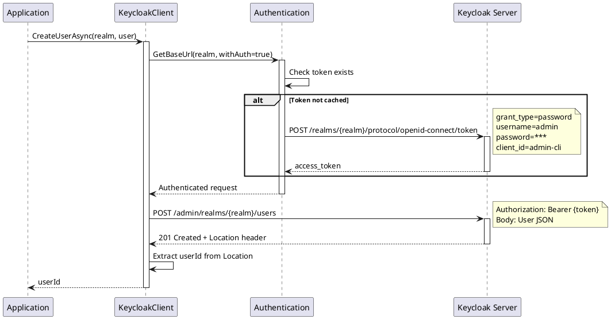
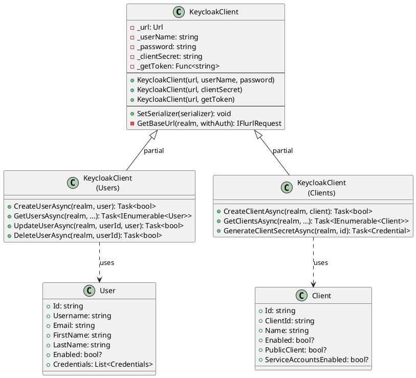
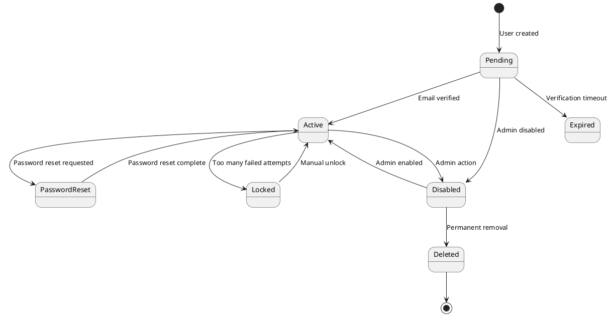
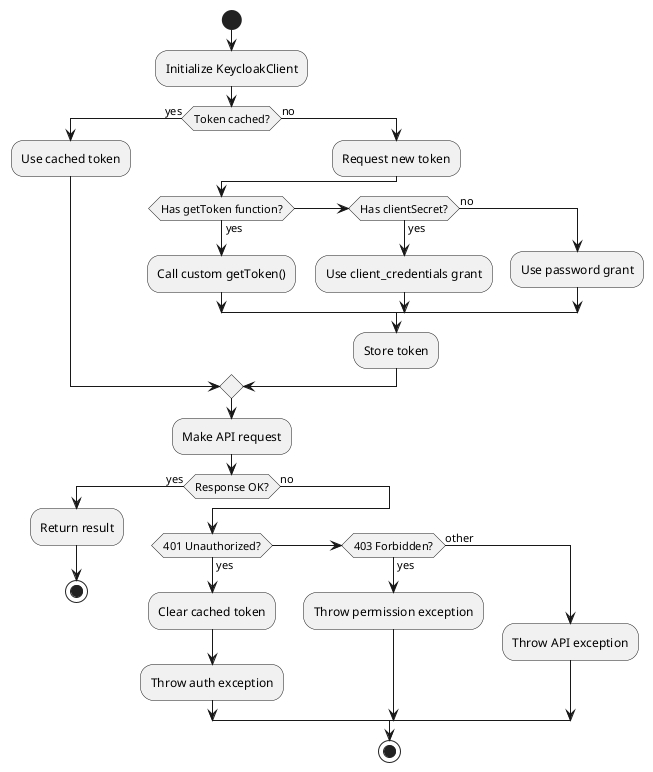
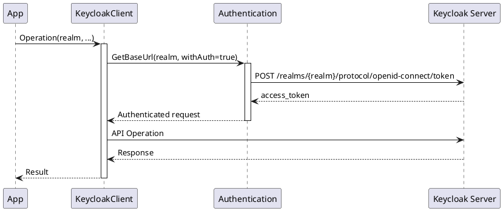

# Documentation Update Protocol

This protocol defines standards and procedures for updating documentation in the `./docs` directory.

## Overview

Documentation in this project uses Markdown with embedded PlantUML diagrams following C4 and UML conventions to provide comprehensive, visual guides for using the Keycloak.ApiClient.Net library.

**IMPORTANT:** All documentation MUST follow the **[Document Style Guide](../document-style-guide.md)** for writing style, formatting conventions, and structural patterns.

## When This Protocol is Triggered

This protocol should be activated when the user:
- Explicitly asks to "update the docs" or "update documentation"
- Says "review my changes" (implying docs may need updates)
- Asks to "document this" or "add documentation for X"
- Mentions making changes and asks about documentation
- Uses similar phrases indicating documentation work is needed

When triggered, follow the full workflow in this protocol to analyze changes and update documentation accordingly.

## When to Update Documentation

Update documentation when:
- Adding new API methods or features
- Changing existing API signatures or behavior
- Fixing bugs that affect documented behavior
- Improving examples or explanations
- Adding new use cases or patterns
- Updating dependencies that affect usage

## Document Structure

### Required Metadata Header

Every documentation file MUST include a metadata header immediately after the title:

```markdown
# Document Title

> **Document Metadata**
> Last Updated: YYYY-MM-DD HH:MM:SS UTC
> Git Commit: `short-hash` (full-hash)
> Library Version: X.Y.Z

## Overview
```

**To update metadata:**
1. Get current timestamp: `date -u +"%Y-%m-%d %H:%M:%S"`
2. Get git hash: `git rev-parse HEAD` (full) and `git rev-parse --short HEAD` (short)
3. Get version from `src/Keycloak.ApiClient.Net/Keycloak.ApiClient.Net.csproj`

### Standard Sections

Each operation documentation should include:

1. **Overview** - Brief description of the feature/operation
2. **Table of Contents** - Auto-generated navigation
3. **Key Features** - Bullet list of main capabilities
4. **Model/API Reference** - Data structures and signatures
5. **Operations** - Detailed method documentation
6. **Examples** - Complete, runnable code samples
7. **Diagrams** - Sequence diagrams for complex flows
8. **Best Practices** - Recommendations and patterns
9. **Error Codes** - Common errors and handling
10. **Related Resources** - Links to related docs

## Writing and Formatting Standards

**All documentation updates MUST adhere to the [Document Style Guide](../document-style-guide.md).**

The style guide defines:
- **Writing style** - Voice, tone, terminology
- **Formatting conventions** - Headings, lists, tables, inline code
- **Code examples** - Structure, completeness, error handling
- **PlantUML diagrams** - Types, formatting, participant naming
- **API documentation patterns** - Method documentation template
- **Metadata management** - Update requirements and format
- **Cross-references** - Internal and external links
- **Quality checklist** - Pre-publication review

### Quick Reference

Key style requirements (see style guide for full details):

**Voice and Tone:**
- Active voice: "The client authenticates" not "Authentication is performed"
- Present tense: "Returns a list" not "Will return a list"
- Direct and technical but clear

**Headings:**
- ATX-style (`#`, `##`, `###`)
- One H1 per document
- Sentence case: "Authentication modes" not "Authentication Modes"
- Never skip levels (H2 → H3 → H4)

**Code Blocks:**
- Always specify language: `csharp`, `bash`, `json`
- Include necessary `using` statements
- Use 4-space indentation
- Show realistic parameter values

**Inline Code:**
- Method names: `CreateUserAsync`
- Class names: `KeycloakClient`
- Parameters: `realm`, `userId`
- Values: `true`, `"master"`, `401`

**Lists:**
- Unordered: Use `-` consistently
- Ordered: Use `1.` with auto-numbering
- Indent nested items by 2 spaces

**Tables:**
- Always include header row
- Use emoji for status (✅ ❌ ⚠️)
- Left-align text columns

## PlantUML Diagram Standards

### When to Use Diagrams

Include diagrams for:
- Authentication flows
- Multi-step operations
- System interactions
- Complex decision trees
- Architecture overviews
- Component relationships

### C4 Model Diagrams

Use C4 diagrams for architecture and system context:

#### System Context Diagram

```markdown
```plantuml
@startuml
!include https://raw.githubusercontent.com/plantuml-stdlib/C4-PlantUML/master/C4_Context.puml

LAYOUT_WITH_LEGEND()

title System Context - Keycloak Integration

Person(user, "Application User", "Authenticates via application")
System(app, "Application", "Your application using Keycloak.ApiClient.Net")
System_Ext(keycloak, "Keycloak Server", "Identity and Access Management")

Rel(user, app, "Uses")
Rel(app, keycloak, "Manages users, clients, roles", "Admin REST API")
@enduml
```​
```

#### Container Diagram

```markdown
```plantuml
@startuml
!include https://raw.githubusercontent.com/plantuml-stdlib/C4-PlantUML/master/C4_Container.puml

LAYOUT_WITH_LEGEND()

title Container Diagram - Keycloak Client Library

Person(dev, "Developer")
Container(app, "Application", ".NET", "Your application code")
Container(client, "KeycloakClient", ".NET Library", "Provides Keycloak API access")
Container(flurl, "Flurl.Http", ".NET Library", "HTTP client")
System_Ext(keycloak, "Keycloak Server", "IAM Server")

Rel(dev, app, "Develops")
Rel(app, client, "Uses API methods")
Rel(client, flurl, "HTTP requests")
Rel(flurl, keycloak, "REST API calls", "HTTPS/JSON")
@enduml
```​
```

#### Component Diagram

```markdown
```plantuml
@startuml
!include https://raw.githubusercontent.com/plantuml-stdlib/C4-PlantUML/master/C4_Component.puml

LAYOUT_WITH_LEGEND()

title Component Diagram - KeycloakClient Architecture

Container_Boundary(client, "KeycloakClient") {
    Component(auth, "Authentication", "Partial Class", "Handles auth flows")
    Component(users, "Users", "Partial Class", "User CRUD operations")
    Component(clients, "Clients", "Partial Class", "Client management")
    Component(roles, "Roles", "Partial Class", "Role operations")
    Component(groups, "Groups", "Partial Class", "Group operations")
    Component(core, "Core", "Base Class", "Base URL, serialization")
}

System_Ext(keycloak, "Keycloak Server")

Rel(users, core, "Uses")
Rel(clients, core, "Uses")
Rel(roles, core, "Uses")
Rel(groups, core, "Uses")
Rel(auth, core, "Extends")
Rel(core, keycloak, "API Calls")
@enduml
```​
```

### UML Sequence Diagrams

Use sequence diagrams for operation flows:

#### Standard Sequence Diagram

```markdown


#### Best Practices for Sequence Diagrams

1. **Clear Participants**: Name participants clearly
   - Application: The consuming application
   - KeycloakClient: The library
   - Keycloak Server: The backend
   - Other components as needed

2. **Activation Boxes**: Use `activate`/`deactivate` to show execution context

3. **Notes**: Add notes for important details
   ```plantuml
   note right
       grant_type=password
       username=admin
   end note
   ```

4. **Alt/Opt Blocks**: Show conditional flows
   ```plantuml
   alt Token exists
       Auth --> KC: Use cached token
   else Token expired
       Auth -> KS: Request new token
   end
   ```

5. **Return Messages**: Use `-->` for return values

### UML Class Diagrams

Use class diagrams for model relationships:

```markdown


### State Diagrams

Use state diagrams for status transitions:

```markdown


### Activity Diagrams

Use activity diagrams for workflows:

```markdown


## Code Examples

### Complete and Runnable

All code examples must be:
- **Complete**: Include all necessary using statements and setup
- **Runnable**: Can be copy-pasted and executed
- **Realistic**: Use realistic parameter values
- **Error Handled**: Show proper error handling

### Example Template

```markdown
### Operation Name

Brief description of what the operation does.

**Location**: `/src/Keycloak.ApiClient.Net/Resource/KeycloakClient.cs:123`

**Signature**:
```csharp
public async Task<ReturnType> MethodNameAsync(
    string realm,
    ParameterType parameter
)
```​

**Parameters**:
- `realm` - The realm name
- `parameter` - Description of parameter

**Returns**: Description of return value

**Example**:
```csharp
using Keycloak.ApiClient.Net;
using Keycloak.ApiClient.Net.Models.Users;

var client = new KeycloakClient(
    "https://keycloak.example.com",
    "admin",
    "password"
);

try
{
    var result = await client.MethodNameAsync("master", parameter);
    Console.WriteLine($"Success: {result}");
}
catch (FlurlHttpException ex)
{
    Console.WriteLine($"Error: {ex.StatusCode} - {ex.Message}");
}
```​

**Sequence Diagram**:
```plantuml
[Include relevant sequence diagram]
```​
```

## API Reference Location

Always include the source code location for each operation:

```markdown
**Location**: `/src/Keycloak.ApiClient.Net/Users/KeycloakClient.cs:18`
```

Format: `/src/Keycloak.ApiClient.Net/{ResourceFolder}/KeycloakClient.cs:{lineNumber}`

## Keycloak API Documentation References

**REQUIRED:** Every API operation MUST include a reference to the official Keycloak Admin REST API documentation.

**How to add Keycloak API references:**

1. **Navigate to official docs:**
   https://www.keycloak.org/docs-api/latest/rest-api/

2. **Find the resource section:**
   - Search the page for the resource (e.g., "Users Resource", "Clients Resource")
   - Locate the specific endpoint (e.g., POST /admin/realms/{realm}/users)

3. **Add the reference in documentation:**
   ```markdown
   **Keycloak API:** [Users Resource - Create New User](https://www.keycloak.org/docs-api/latest/rest-api/index.html#_users_resource)
   ```

**Common resource section anchors:**
- `#_users_resource` - User management operations
- `#_clients_resource` - Client management operations
- `#_realms_admin_resource` - Realm administration
- `#_roles_resource` - Role management
- `#_roles_by_id_resource` - Roles by ID operations
- `#_groups_resource` - Group management
- `#_attack_detection_resource` - Attack detection
- `#_authentication_management_resource` - Authentication flows
- `#_client_scopes_resource` - Client scopes
- `#_identity_providers_resource` - Identity providers
- `#_protocol_mappers_resource` - Protocol mappers
- `#_scope_mappings_resource` - Scope mappings

**Why this is important:**
- Provides authoritative source for API behavior
- Shows official request/response formats
- Enables users to verify parameter requirements
- Helps track changes in Keycloak versions
- Links implementation to specification

## Updating Existing Documentation

### Analyzing Changes Since Last Update

Before updating documentation, analyze what changed in the codebase since the last documented update.

#### Step 1: Extract Last Update Hash

```bash
# Extract the git hash from documentation metadata
# Example from docs/user-management-operations.md:
# > Git Commit: `9bc2d34` (9bc2d34a37e88fae053f63977e0bfbd02a61441d)

grep -A 2 "Document Metadata" docs/user-management-operations.md | \
  grep "Git Commit" | \
  sed 's/.*(\(.*\)).*/\1/'
```

Or programmatically in your workflow:

```bash
# Store last hash from doc
LAST_HASH=$(grep "Git Commit:" docs/user-management-operations.md | \
  grep -oP '\(\K[^)]+')

# Get current hash
CURRENT_HASH=$(git rev-parse HEAD)

echo "Last documented: $LAST_HASH"
echo "Current commit: $CURRENT_HASH"
```

#### Step 2: Generate Diff for Relevant Files

```bash
# Get list of changed files since last documentation update
git diff --name-only $LAST_HASH HEAD

# Focus on source files for specific documentation
# For user-management-operations.md, check Users folder
git diff $LAST_HASH HEAD -- src/Keycloak.ApiClient.Net/Users/

# For detailed changes with context
git diff $LAST_HASH HEAD -- src/Keycloak.ApiClient.Net/Users/ > /tmp/users-changes.diff

# For summary of changes
git log --oneline $LAST_HASH..HEAD -- src/Keycloak.ApiClient.Net/Users/
```

#### Step 3: Analyze Changes

Review the diff to identify documentation updates needed:

```bash
# Show what functions were added/removed/modified
git diff $LAST_HASH HEAD -- src/Keycloak.ApiClient.Net/Users/KeycloakClient.cs | \
  grep -E '^\+.*public|^\-.*public'

# Show changed method signatures
git diff $LAST_HASH HEAD -- src/Keycloak.ApiClient.Net/Users/KeycloakClient.cs | \
  grep -B2 -A5 "public async Task"

# List commits affecting the resource
git log --pretty=format:"%h %s" $LAST_HASH..HEAD -- src/Keycloak.ApiClient.Net/Users/
```

#### Example Analysis Workflow

```bash
#!/bin/bash
# Script to analyze documentation updates needed

DOC_FILE="docs/user-management-operations.md"
SOURCE_DIR="src/Keycloak.ApiClient.Net/Users/"

# Extract last hash
LAST_HASH=$(grep "Git Commit:" "$DOC_FILE" | grep -oP '\(\K[^)]+' | head -1)
CURRENT_HASH=$(git rev-parse HEAD)

if [ "$LAST_HASH" == "$CURRENT_HASH" ]; then
    echo "Documentation is up to date"
    exit 0
fi

echo "=== Changes since last documentation update ==="
echo "Last documented: $LAST_HASH"
echo "Current commit: $CURRENT_HASH"
echo ""

echo "=== Commits since last update ==="
git log --oneline --decorate $LAST_HASH..$CURRENT_HASH -- "$SOURCE_DIR"
echo ""

echo "=== Modified files ==="
git diff --stat $LAST_HASH HEAD -- "$SOURCE_DIR"
echo ""

echo "=== New/Modified public methods ==="
git diff $LAST_HASH HEAD -- "$SOURCE_DIR" | grep -E '^\+.*public (async )?Task'
echo ""

echo "=== Removed public methods ==="
git diff $LAST_HASH HEAD -- "$SOURCE_DIR" | grep -E '^\-.*public (async )?Task'
echo ""

echo "=== Modified models ==="
git diff $LAST_HASH HEAD -- "src/Keycloak.ApiClient.Net/Models/Users/"
```

#### Step 4: Targeted Documentation Updates

Based on the diff analysis, update only affected sections:

**If new methods added:**
- Add new operation documentation
- Add code examples
- Add sequence diagrams if complex
- Update table of contents
- Update API reference section

**If method signatures changed:**
- Update parameter documentation
- Update code examples
- Update sequence diagrams if flow changed
- Add migration notes if breaking change

**If models changed:**
- Update model definitions
- Update related examples
- Note any breaking changes

**If behavior changed:**
- Update operation descriptions
- Update examples to reflect new behavior
- Update best practices if affected
- Update error handling if changed

### Step-by-Step Update Process

1. **Read existing documentation** to understand current structure and style
2. **Extract last git hash** from document metadata
3. **Generate diff** since last hash for relevant source files
4. **Analyze changes** to identify what documentation needs updating:
   - New methods → Add documentation
   - Changed signatures → Update parameters
   - Modified behavior → Update descriptions
   - New models → Document structures
5. **Update metadata header** with current timestamp and git hash
6. **Update affected sections** following the standards in this protocol
7. **Add diagrams** if new operations involve complex flows
8. **Update table of contents** if adding new sections
9. **Verify all code examples** are accurate and complete
10. **Check all links** are valid
11. **Update version references** if library version changed

### Metadata Update Commands

```bash
# Get current timestamp (UTC)
date -u +"%Y-%m-%d %H:%M:%S"

# Get git hash
git rev-parse --short HEAD  # Short hash
git rev-parse HEAD          # Full hash

# Get library version
grep '<Version>' src/Keycloak.ApiClient.Net/Keycloak.ApiClient.Net.csproj

# Extract last documented hash from a doc file
grep "Git Commit:" docs/user-management-operations.md | \
  grep -oP '\(\K[^)]+'

# Compare last documented hash with current
LAST_HASH=$(grep "Git Commit:" docs/user-management-operations.md | grep -oP '\(\K[^)]+')
CURRENT_HASH=$(git rev-parse HEAD)
if [ "$LAST_HASH" != "$CURRENT_HASH" ]; then
    echo "Documentation needs update"
    git diff --stat $LAST_HASH HEAD -- src/Keycloak.ApiClient.Net/Users/
fi
```

### Automated Documentation Update Script

Create a helper script `.claude/scripts/check-doc-updates.sh`:

```bash
#!/bin/bash
# Check which documentation files need updates based on git changes

DOCS_DIR="docs"
SRC_DIR="src/Keycloak.ApiClient.Net"

# Mapping of doc files to source directories
declare -A DOC_MAPPINGS=(
    ["user-management-operations.md"]="Users"
    ["client-management-operations.md"]="Clients"
    ["role-group-management-operations.md"]="Roles,Groups,RoleMapper,ScopeMappings"
    ["realm-administration-operations.md"]="RealmsAdmin,Root"
    ["authentication-core.md"]="KeycloakClient.cs,Common/Extensions"
)

echo "=== Documentation Update Check ==="
echo ""

for doc_file in "${!DOC_MAPPINGS[@]}"; do
    DOC_PATH="$DOCS_DIR/$doc_file"

    if [ ! -f "$DOC_PATH" ]; then
        echo "⚠️  $doc_file - File not found"
        continue
    fi

    # Extract last hash
    LAST_HASH=$(grep "Git Commit:" "$DOC_PATH" | grep -oP '\(\K[^)]+' | head -1)
    CURRENT_HASH=$(git rev-parse HEAD)

    if [ -z "$LAST_HASH" ]; then
        echo "⚠️  $doc_file - No metadata found"
        continue
    fi

    if [ "$LAST_HASH" == "$CURRENT_HASH" ]; then
        echo "✅ $doc_file - Up to date"
        continue
    fi

    # Check if source files changed
    SOURCE_PATHS="${DOC_MAPPINGS[$doc_file]}"
    CHANGED=false

    IFS=',' read -ra PATHS <<< "$SOURCE_PATHS"
    for path in "${PATHS[@]}"; do
        if git diff --quiet $LAST_HASH HEAD -- "$SRC_DIR/$path"; then
            continue
        else
            CHANGED=true
            break
        fi
    done

    if [ "$CHANGED" = true ]; then
        echo "🔄 $doc_file - Needs update"
        echo "   Last: $LAST_HASH"
        echo "   Current: $CURRENT_HASH"
        echo "   Changed files:"
        for path in "${PATHS[@]}"; do
            git diff --stat $LAST_HASH HEAD -- "$SRC_DIR/$path" 2>/dev/null | sed 's/^/   /'
        done
        echo ""
    else
        echo "ℹ️  $doc_file - Code unchanged (metadata update only needed)"
    fi
done
```

## Creating New Documentation

### File Naming Convention

- Use kebab-case: `feature-name-operations.md`
- Be descriptive: `user-management-operations.md` not `users.md`
- Group related operations: `role-group-management-operations.md`

### New Document Template

```markdown
# Feature Name - Operations

> **Document Metadata**
> Last Updated: YYYY-MM-DD HH:MM:SS UTC
> Git Commit: `short-hash` (full-hash)
> Library Version: X.Y.Z

## Overview

Brief overview of the feature and its purpose.

## Table of Contents

- [Key Features](#key-features)
- [Model](#model)
- [Operations](#operations)
- [Examples](#examples)
- [Best Practices](#best-practices)
- [Error Codes](#error-codes)
- [Related Resources](#related-resources)

## Key Features

- Feature 1
- Feature 2
- Feature 3

## Model

```csharp
// Model definition
```​

## Operations

### Operation Name

[Operation documentation following example template above]

## Examples

### Complete Example: [Scenario Name]

[Full working example demonstrating multiple operations]

## Best Practices

1. **Practice 1**: Description
2. **Practice 2**: Description

## Error Codes

| Code | Description | Solution |
|------|-------------|----------|
| 401  | Unauthorized | Check credentials |
| 403  | Forbidden | Check permissions |
| 404  | Not Found | Verify realm/resource exists |

## Related Resources

- [Related Doc 1](./related-doc.md)
- [Keycloak API Docs](https://www.keycloak.org/docs-api/)
```

## Documentation Review Checklist

Before finalizing documentation updates:

### Style Guide Compliance
- [ ] **Reviewed [Document Style Guide](../document-style-guide.md)** before making changes
- [ ] **Active voice** used throughout (not passive)
- [ ] **Present tense** used for descriptions
- [ ] **Consistent terminology** (KeycloakClient, realm, async method, etc.)
- [ ] **Sentence case headings** used
- [ ] **Proper heading hierarchy** (no skipped levels)

### Content
- [ ] Metadata header is updated with current timestamp and git hash
- [ ] Library version matches current project version
- [ ] All code examples are complete and runnable
- [ ] Examples progress from simple to complex
- [ ] Error handling is demonstrated in examples
- [ ] Diagrams are included for complex operations
- [ ] Best practices section provides value
- [ ] No TODO markers remain
- [ ] No spelling or grammar errors

### Formatting
- [ ] PlantUML syntax is valid and renders correctly
- [ ] Code blocks have language specified (`csharp`, `bash`, etc.)
- [ ] Inline code uses backticks for methods, classes, parameters
- [ ] Tables are properly formatted with headers
- [ ] Lists use consistent markers (`-` for unordered, `1.` for ordered)
- [ ] Markdown formatting is consistent

### References
- [ ] All internal links work
- [ ] All external links are current
- [ ] Code locations reference correct files and line numbers
- [ ] Table of contents is accurate
- [ ] New operations are added to main README.md index

### Code Examples (per Style Guide)
- [ ] Complete with all necessary `using` statements
- [ ] 4-space indentation
- [ ] Realistic parameter values
- [ ] Follow progression: simple → filtered → advanced
- [ ] Error handling in complex examples

## PlantUML Validation

To validate PlantUML diagrams:

```bash
# Install PlantUML
# Validate a diagram
java -jar plantuml.jar -syntax file.puml

# Generate PNG from markdown
java -jar plantuml.jar -tpng file.md
```

Or use online tools:
- http://www.plantuml.com/plantuml/
- https://planttext.com/

## Common Patterns

### Authentication Flow Pattern



### CRUD Operation Pattern

For each resource (Users, Clients, etc.), document:
1. Create (with and without ID retrieval)
2. Read (list and get by ID)
3. Update
4. Delete

### Error Handling Pattern

Always show error handling in examples:

```csharp
try
{
    var result = await client.OperationAsync(realm, param);
    return result;
}
catch (FlurlHttpException ex)
{
    switch (ex.StatusCode)
    {
        case 401:
            Console.WriteLine("Authentication failed");
            break;
        case 403:
            Console.WriteLine("Insufficient permissions");
            break;
        case 404:
            Console.WriteLine("Resource not found");
            break;
        default:
            Console.WriteLine($"API error: {ex.Message}");
            break;
    }
    throw;
}
```

## Maintenance

### Regular Updates

- Update metadata whenever making any changes
- Review documentation when dependency versions change
- Verify examples still work with new library versions
- Update diagrams if architecture or flows change
- Keep error codes current with Keycloak API changes

### Deprecation Notice

When documenting deprecated features:

```markdown
> **⚠️ DEPRECATED**
> This method is deprecated as of version X.Y.Z and will be removed in version X+1.0.0.
> Use `NewMethodAsync` instead. See [Migration Guide](./migration.md).
```

## Tools and Resources

### Recommended Tools

- **Markdown Editor**: VS Code with Markdown Preview Enhanced
- **PlantUML**: Official PlantUML extension for VS Code
- **C4 PlantUML**: https://github.com/plantuml-stdlib/C4-PlantUML
- **Markdown Linter**: markdownlint for consistency

### Resources

- [PlantUML Documentation](https://plantuml.com/)
- [C4 Model](https://c4model.com/)
- [UML Diagrams](https://www.uml-diagrams.org/)
- [Markdown Guide](https://www.markdownguide.org/)
- [CommonMark Spec](https://commonmark.org/)

## Examples from Current Documentation

See existing documentation files for reference:
- `docs/authentication-core.md` - Sequence diagrams for auth flows
- `docs/user-management-operations.md` - Complete CRUD examples
- `docs/README.md` - Main index structure

## Related Documents

- **[Document Style Guide](../document-style-guide.md)** - Writing and formatting standards (MUST FOLLOW)
- **[.claude/README.md](../README.md)** - Overview of Claude Code configuration
- **[CLAUDE.md](../../CLAUDE.md)** - Codebase guide for Claude Code

## Protocol Version

**Protocol Version**: 1.1.0
**Last Updated**: 2026-01-20
**Git Commit**: 9bc2d34

**Changelog:**
- v1.1.0 (2026-01-20): Added Document Style Guide requirement
- v1.0.0 (2026-01-20): Initial protocol with git diff analysis
