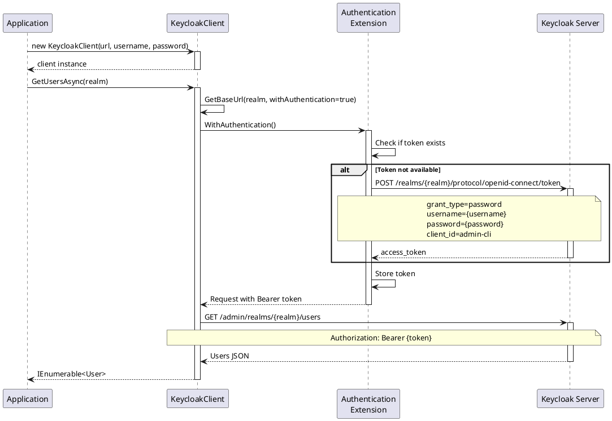
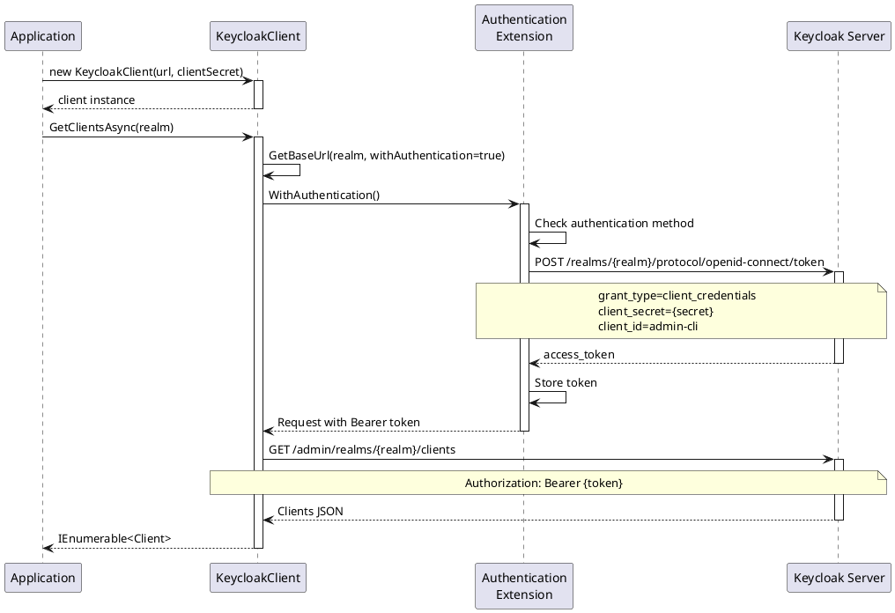
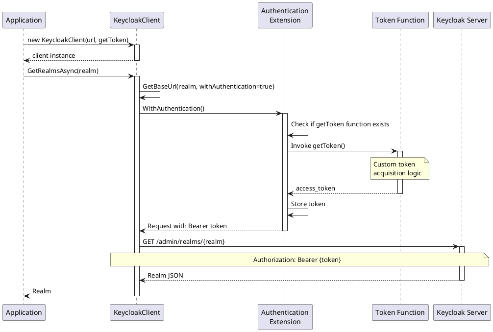

# Authentication - Core Operations

> **Document Metadata**
> Last Updated: 2026-01-20 19:30:00 UTC
> Git Commit: `9bc2d34` (9bc2d34a37e88fae053f63977e0bfbd02a61441d)
> Library Version: 2.0.2

## Overview

The Keycloak.ApiClient.Net library provides a flexible authentication system that supports multiple authentication modes for connecting to Keycloak Admin REST API. The library handles token management automatically and provides a fluent interface for making authenticated requests.

## Table of Contents

- [Architecture](#architecture)
- [Authentication Modes](#authentication-modes)
  - [1. Username and Password Authentication](#1-username-and-password-authentication)
  - [2. Client Secret Authentication](#2-client-secret-authentication)
  - [3. Token Function Authentication](#3-token-function-authentication)
  - [4. Combined Authentication](#4-combined-authentication)
- [Authentication Flow](#authentication-flow)
  - [Sequence Diagram - Username/Password Authentication](#sequence-diagram---usernamepassword-authentication)
  - [Sequence Diagram - Client Secret Authentication](#sequence-diagram---client-secret-authentication)
  - [Sequence Diagram - Custom Token Function](#sequence-diagram---custom-token-function)
- [Authentication Priority](#authentication-priority)
- [Token Management](#token-management)
  - [Token Acquisition](#token-acquisition)
  - [Token Caching](#token-caching)
- [Configuration Examples](#configuration-examples)
  - [Basic Configuration (Development)](#basic-configuration-development)
  - [Production Configuration with Config File](#production-configuration-with-config-file)
  - [Service Account Configuration](#service-account-configuration)
  - [Advanced Token Management](#advanced-token-management)
- [Custom Serialization](#custom-serialization)
- [Error Handling](#error-handling)
  - [Authentication Failures](#authentication-failures)
- [Security Best Practices](#security-best-practices)
- [Related Resources](#related-resources)

## Architecture

The library uses **Flurl.Http** as the underlying HTTP client and implements automatic token acquisition and management. All API calls require authentication, which is handled transparently by the `KeycloakClient` class.

## Authentication Modes

The library supports three primary authentication modes:

### 1. Username and Password Authentication

Authenticates using admin credentials with the Resource Owner Password Credentials grant type.

```csharp
var client = new KeycloakClient(
    url: "https://keycloak.example.com",
    userName: "admin",
    password: "admin_password"
);
```

**Use Case:** Direct admin access, testing, development environments

**Grant Type:** `password`

**Client ID:** `admin-cli` (default)

### 2. Client Secret Authentication

Authenticates using client credentials for service-to-service communication.

```csharp
var client = new KeycloakClient(
    url: "https://keycloak.example.com",
    clientSecret: "your-client-secret"
);
```

**Use Case:** Service accounts, automated processes, backend services

**Grant Type:** `client_credentials`

**Client ID:** `admin-cli` (default)

### 3. Token Function Authentication

Provides custom token acquisition logic for advanced scenarios.

```csharp
var client = new KeycloakClient(
    url: "https://keycloak.example.com",
    getToken: () => {
        // Custom token acquisition logic
        return GetTokenFromExternalSource();
    }
);
```

**Use Case:** Token refresh, external identity providers, custom authentication flows

### 4. Combined Authentication

Supports multiple authentication parameters for flexible scenarios.

```csharp
// Username, password, and client secret
var client = new KeycloakClient(
    url: "https://keycloak.example.com",
    userName: "admin",
    password: "admin_password",
    clientSecret: "client-secret"
);

// All authentication methods
var client = new KeycloakClient(
    url: "https://keycloak.example.com",
    userName: "admin",
    password: "admin_password",
    clientSecret: "client-secret",
    getToken: () => GetCustomToken()
);
```

## Authentication Flow

### Sequence Diagram - Username/Password Authentication



### Sequence Diagram - Client Secret Authentication



### Sequence Diagram - Custom Token Function



## Authentication Priority

When multiple authentication parameters are provided, the library uses the following priority:

1. **Token Function** (`getToken`) - Highest priority
2. **Client Secret** (`clientSecret`)
3. **Username/Password** (`userName` + `password`) - Lowest priority

This is implemented in the `WithAuthentication` extension method:

```csharp
public static IFlurlRequest WithAuthentication(
    this IFlurlRequest request,
    Func<string> getToken,
    string url,
    string realm,
    string userName,
    string password,
    string clientSecret)
{
    string token = null;

    if (getToken != null)
    {
        token = getToken();
    }
    else if (clientSecret != null)
    {
        token = GetAccessToken(url, realm, clientSecret);
    }
    else
    {
        token = GetAccessToken(url, realm, userName, password);
    }

    return request.WithOAuthBearerToken(token);
}
```

## Token Management

### Token Acquisition

The library acquires tokens synchronously during request initialization. Tokens are obtained from:

**For Password Grant:**
- Endpoint: `/realms/{realm}/protocol/openid-connect/token`
- Method: POST
- Content-Type: `application/x-www-form-urlencoded`

**For Client Credentials Grant:**
- Endpoint: `/realms/{realm}/protocol/openid-connect/token`
- Method: POST
- Content-Type: `application/x-www-form-urlencoded`

### Token Caching

Currently, the library acquires a new token for each request. The token is not cached between requests. This ensures fresh tokens but may impact performance for high-frequency operations.

**Consideration:** For production environments with high request volumes, consider implementing custom token caching using the `getToken` function parameter.

## Configuration Examples

### Basic Configuration (Development)

```csharp
var client = new KeycloakClient(
    "https://keycloak.example.com",
    "admin",
    "password"
);
```

### Production Configuration with Config File

```csharp
var configuration = new ConfigurationBuilder()
    .AddJsonFile("appsettings.json")
    .Build();

var client = new KeycloakClient(
    url: configuration["Keycloak:BaseUrl"],
    userName: configuration["Keycloak:AdminUsername"],
    password: configuration["Keycloak:AdminPassword"]
);
```

### Service Account Configuration

```csharp
var client = new KeycloakClient(
    "https://keycloak.example.com",
    clientSecret: Environment.GetEnvironmentVariable("KEYCLOAK_CLIENT_SECRET")
);
```

### Advanced Token Management

```csharp
private string cachedToken;
private DateTime tokenExpiry;

var client = new KeycloakClient(
    "https://keycloak.example.com",
    getToken: () =>
    {
        if (string.IsNullOrEmpty(cachedToken) || DateTime.UtcNow >= tokenExpiry)
        {
            // Refresh token logic
            var newToken = AcquireNewToken();
            cachedToken = newToken.AccessToken;
            tokenExpiry = DateTime.UtcNow.AddSeconds(newToken.ExpiresIn - 30);
        }
        return cachedToken;
    }
);
```

## Custom Serialization

The library uses Newtonsoft.Json with camelCase naming convention by default. You can customize the serializer:

```csharp
var client = new KeycloakClient(
    "https://keycloak.example.com",
    "admin",
    "password"
);

client.SetSerializer(new NewtonsoftJsonSerializer(new JsonSerializerSettings
{
    ContractResolver = new CamelCasePropertyNamesContractResolver(),
    NullValueHandling = NullValueHandling.Ignore,
    DateFormatHandling = DateFormatHandling.IsoDateFormat
}));
```

## Error Handling

### Authentication Failures

```csharp
try
{
    var users = await client.GetUsersAsync("master");
}
catch (FlurlHttpException ex)
{
    if (ex.StatusCode == 401)
    {
        // Invalid credentials or expired token
        Console.WriteLine("Authentication failed");
    }
    else if (ex.StatusCode == 403)
    {
        // Insufficient permissions
        Console.WriteLine("Access forbidden");
    }
}
```

## Security Best Practices

1. **Never hardcode credentials** - Use configuration files, environment variables, or secret management systems
2. **Use service accounts** - Prefer client credentials for automated processes
3. **Implement token caching** - Reduce token acquisition overhead in production
4. **Secure token storage** - If caching tokens, ensure they're stored securely
5. **Use HTTPS** - Always use secure connections to Keycloak
6. **Rotate secrets regularly** - Update client secrets and passwords periodically
7. **Implement proper error handling** - Don't expose authentication details in error messages
8. **Use least privilege** - Grant only necessary permissions to service accounts

## Related Resources

- [Keycloak Admin REST API Documentation](https://www.keycloak.org/docs-api/)
- [OAuth 2.0 Grant Types](https://oauth.net/2/grant-types/)
- [OpenID Connect Protocol](https://openid.net/connect/)
