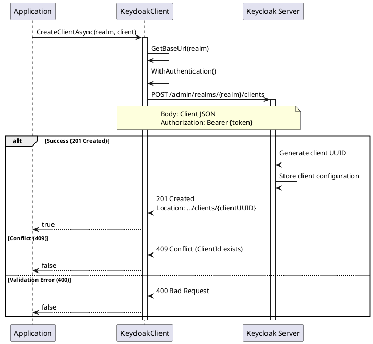
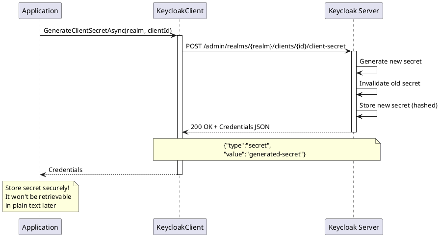
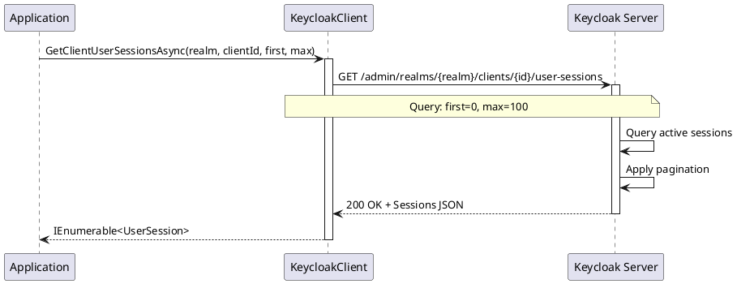
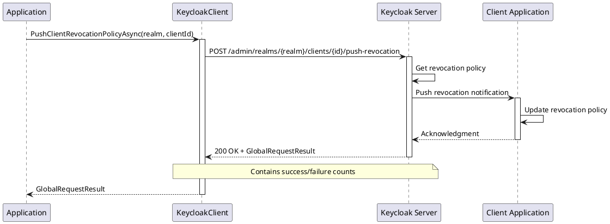
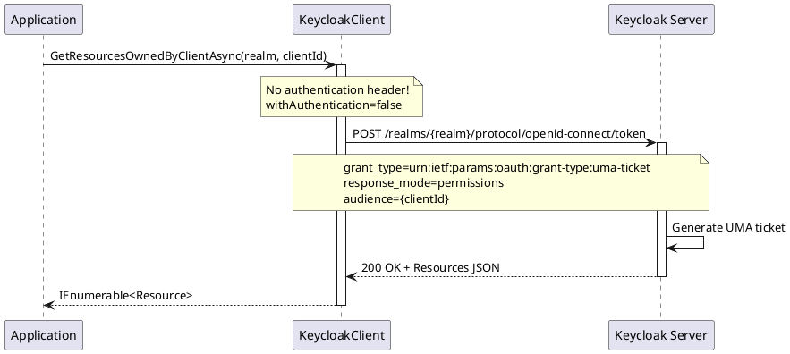

# Client Management - Operations

> **Document Metadata**
> Last Updated: 2026-01-20 19:30:00 UTC
> Git Commit: `9bc2d34` (9bc2d34a37e88fae053f63977e0bfbd02a61441d)
> Library Version: 2.0.2

## Overview

The Client Management API provides comprehensive operations for managing OAuth 2.0/OpenID Connect clients in Keycloak. Clients represent applications and services that can request authentication and obtain tokens from Keycloak.

## Table of Contents

- [Key Features](#key-features)
- [Client Model](#client-model)
- [Client CRUD Operations](#client-crud-operations)
  - [Create Client](#create-client)
  - [Create Client and Retrieve ID](#create-client-and-retrieve-id)
  - [Get Clients](#get-clients)
  - [Get Client by ID](#get-client-by-id)
  - [Update Client](#update-client)
  - [Delete Client](#delete-client)
- [Client Secret Management](#client-secret-management)
  - [Generate Client Secret](#generate-client-secret)
  - [Get Client Secret](#get-client-secret)
- [Client Scope Management](#client-scope-management)
  - [Get Default Client Scopes](#get-default-client-scopes)
  - [Add Default Client Scope](#add-default-client-scope)
  - [Remove Default Client Scope](#remove-default-client-scope)
  - [Get Optional Client Scopes](#get-optional-client-scopes)
  - [Add Optional Client Scope](#add-optional-client-scope)
  - [Remove Optional Client Scope](#remove-optional-client-scope)
- [Session and Statistics Management](#session-and-statistics-management)
  - [Get Client Session Count](#get-client-session-count)
  - [Get Client User Sessions](#get-client-user-sessions)
  - [Get Client Offline Session Count](#get-client-offline-session-count)
  - [Get Client Offline Sessions](#get-client-offline-sessions)
- [Protocol Mapper Evaluation](#protocol-mapper-evaluation)
  - [Get Protocol Mappers in Token Generation](#get-protocol-mappers-in-token-generation)
  - [Get Client Granted Scope Mappings](#get-client-granted-scope-mappings)
  - [Get Client Not Granted Scope Mappings](#get-client-not-granted-scope-mappings)
  - [Generate Example Access Token](#generate-example-access-token)
- [Service Account Management](#service-account-management)
  - [Get Service Account User](#get-service-account-user)
- [Client Authorization Permissions](#client-authorization-permissions)
  - [Get Client Authorization Permissions](#get-client-authorization-permissions)
  - [Set Client Authorization Permissions](#set-client-authorization-permissions)
- [Cluster Node Management](#cluster-node-management)
  - [Register Client Cluster Node](#register-client-cluster-node)
  - [Unregister Client Cluster Node](#unregister-client-cluster-node)
  - [Test Client Cluster Nodes Availability](#test-client-cluster-nodes-availability)
- [Revocation and Registration](#revocation-and-registration)
  - [Push Client Revocation Policy](#push-client-revocation-policy)
  - [Generate Client Registration Access Token](#generate-client-registration-access-token)
- [Resource Management](#resource-management)
  - [Get Resources Owned by Client](#get-resources-owned-by-client)
- [Complete Example: Client Lifecycle](#complete-example-client-lifecycle)
- [Client Types and Use Cases](#client-types-and-use-cases)
  - [Public Client](#public-client)
  - [Confidential Client](#confidential-client)
  - [Bearer-Only Client](#bearer-only-client)
- [Best Practices](#best-practices)
- [Error Codes](#error-codes)
- [Related Resources](#related-resources)

## Key Features

- Client CRUD operations
- Client secret generation and retrieval
- Client scope management (default and optional)
- Service account management
- Session management and statistics
- Client registration tokens
- Client authorization permissions
- Protocol mapper evaluation
- Cluster node management

## Client Model

The core `Client` model includes:

```csharp
public class Client
{
    public string Id { get; set; }
    public string ClientId { get; set; }
    public string Name { get; set; }
    public string Description { get; set; }
    public string RootUrl { get; set; }
    public string BaseUrl { get; set; }
    public bool? Enabled { get; set; }
    public bool? PublicClient { get; set; }
    public bool? BearerOnly { get; set; }
    public bool? ServiceAccountsEnabled { get; set; }
    public bool? DirectAccessGrantsEnabled { get; set; }
    public bool? StandardFlowEnabled { get; set; }
    public bool? ImplicitFlowEnabled { get; set; }
    public List<string> RedirectUris { get; set; }
    public List<string> WebOrigins { get; set; }
    public string Protocol { get; set; }
    public Dictionary<string, string> Attributes { get; set; }
    // Additional properties...
}
```

## Client CRUD Operations

### Create Client

Creates a new client in the specified realm.

```csharp
var client = new Client
{
    ClientId = "my-application",
    Name = "My Application",
    Enabled = true,
    PublicClient = false,
    ServiceAccountsEnabled = true,
    StandardFlowEnabled = true,
    DirectAccessGrantsEnabled = true,
    RedirectUris = new List<string>
    {
        "https://myapp.com/*",
        "http://localhost:3000/*"
    },
    WebOrigins = new List<string> { "*" },
    Protocol = "openid-connect"
};

bool success = await keycloakClient.CreateClientAsync("master", client);
```

**Sequence Diagram:**



**Returns:** `bool` - `true` if client was created successfully

**Location:** `/src/Keycloak.ApiClient.Net/Clients/KeycloakClient.cs:19`

### Create Client and Retrieve ID

Creates a client and returns the generated client UUID.

```csharp
string clientUUID = await keycloakClient.CreateClientAndRetrieveClientIdAsync("master", client);
// clientUUID: "f4e7d8c9-1234-5678-9abc-def012345678"
```

**Note:** This returns the internal UUID, not the `clientId` (which is what you specified).

**Returns:** `string` - The created client's UUID extracted from the Location header

**Location:** `/src/Keycloak.ApiClient.Net/Clients/KeycloakClient.cs:25`

### Get Clients

Retrieves clients with optional filtering.

```csharp
// Get all clients
var clients = await keycloakClient.GetClientsAsync("master");

// Filter by clientId
var clients = await keycloakClient.GetClientsAsync(
    realm: "master",
    clientId: "my-application"
);

// Get only viewable clients
var clients = await keycloakClient.GetClientsAsync(
    realm: "master",
    viewableOnly: true
);
```

**Parameters:**
- `realm` (required) - The realm name
- `clientId` - Filter by client ID (application identifier, not UUID)
- `viewableOnly` - Return only clients user has view permissions for

**Returns:** `IEnumerable<Client>`

**Location:** `/src/Keycloak.ApiClient.Net/Clients/KeycloakClient.cs:43`

### Get Client by ID

Retrieves a specific client by its UUID.

```csharp
Client client = await keycloakClient.GetClientAsync("master", clientUUID);
```

**Returns:** `Client`

**Location:** `/src/Keycloak.ApiClient.Net/Clients/KeycloakClient.cs:58`

### Update Client

Updates an existing client's configuration.

```csharp
client.Enabled = false;
client.RedirectUris.Add("https://newdomain.com/*");

bool success = await keycloakClient.UpdateClientAsync("master", clientUUID, client);
```

**Returns:** `bool` - `true` if update was successful

**Location:** `/src/Keycloak.ApiClient.Net/Clients/KeycloakClient.cs:63`

### Delete Client

Deletes a client from the realm.

```csharp
bool success = await keycloakClient.DeleteClientAsync("master", clientUUID);
```

**Returns:** `bool` - `true` if deletion was successful

**Location:** `/src/Keycloak.ApiClient.Net/Clients/KeycloakClient.cs:72`

## Client Secret Management

### Generate Client Secret

Generates a new secret for a confidential client.

```csharp
Credentials credentials = await keycloakClient.GenerateClientSecretAsync("master", clientUUID);
Console.WriteLine($"New Secret: {credentials.Value}");
```

**Sequence Diagram:**



**Returns:** `Credentials` containing the new secret

**Security Note:** Store the secret securely immediately. It cannot be retrieved in plain text later.

**Location:** `/src/Keycloak.ApiClient.Net/Clients/KeycloakClient.cs:81`

### Get Client Secret

Retrieves the current client secret (if available).

```csharp
Credentials credentials = await keycloakClient.GetClientSecretAsync("master", clientUUID);
Console.WriteLine($"Secret: {credentials.Value}");
```

**Returns:** `Credentials` containing the secret

**Location:** `/src/Keycloak.ApiClient.Net/Clients/KeycloakClient.cs:87`

## Client Scope Management

### Get Default Client Scopes

Retrieves default scopes assigned to a client.

```csharp
IEnumerable<ClientScope> scopes =
    await keycloakClient.GetDefaultClientScopesAsync("master", clientUUID);

foreach (var scope in scopes)
{
    Console.WriteLine($"Scope: {scope.Name}");
}
```

**Returns:** `IEnumerable<ClientScope>`

**Location:** `/src/Keycloak.ApiClient.Net/Clients/KeycloakClient.cs:92`

### Add Default Client Scope

Assigns a default scope to a client.

```csharp
bool success = await keycloakClient.UpdateDefaultClientScopeAsync(
    "master",
    clientUUID,
    clientScopeId
);
```

**Returns:** `bool` - `true` if scope was assigned

**Location:** `/src/Keycloak.ApiClient.Net/Clients/KeycloakClient.cs:97`

### Remove Default Client Scope

Removes a default scope from a client.

```csharp
bool success = await keycloakClient.DeleteDefaultClientScopeAsync(
    "master",
    clientUUID,
    clientScopeId
);
```

**Returns:** `bool` - `true` if scope was removed

**Location:** `/src/Keycloak.ApiClient.Net/Clients/KeycloakClient.cs:106`

### Get Optional Client Scopes

Retrieves optional scopes available to a client.

```csharp
IEnumerable<ClientScope> scopes =
    await keycloakClient.GetOptionalClientScopesAsync("master", clientUUID);
```

**Returns:** `IEnumerable<ClientScope>`

**Location:** `/src/Keycloak.ApiClient.Net/Clients/KeycloakClient.cs:235`

### Add Optional Client Scope

Assigns an optional scope to a client.

```csharp
bool success = await keycloakClient.UpdateOptionalClientScopeAsync(
    "master",
    clientUUID,
    clientScopeId
);
```

**Returns:** `bool` - `true` if scope was assigned

**Location:** `/src/Keycloak.ApiClient.Net/Clients/KeycloakClient.cs:240`

### Remove Optional Client Scope

Removes an optional scope from a client.

```csharp
bool success = await keycloakClient.DeleteOptionalClientScopeAsync(
    "master",
    clientUUID,
    clientScopeId
);
```

**Returns:** `bool` - `true` if scope was removed

**Location:** `/src/Keycloak.ApiClient.Net/Clients/KeycloakClient.cs:249`

## Session and Statistics Management

### Get Client Session Count

Gets the count of active sessions for a client.

```csharp
long sessionCount = await keycloakClient.GetClientSessionCountAsync("master", clientUUID);
Console.WriteLine($"Active sessions: {sessionCount}");
```

**Returns:** `long` - Number of active sessions

**Location:** `/src/Keycloak.ApiClient.Net/Clients/KeycloakClient.cs:276`

### Get Client User Sessions

Retrieves active user sessions for a client.

```csharp
IEnumerable<UserSession> sessions = await keycloakClient.GetClientUserSessionsAsync(
    realm: "master",
    clientId: clientUUID,
    first: 0,   // Offset
    max: 100    // Limit
);

foreach (var session in sessions)
{
    Console.WriteLine($"User: {session.Username}, Start: {session.Start}");
}
```

**Sequence Diagram:**



**Returns:** `IEnumerable<UserSession>`

**Location:** `/src/Keycloak.ApiClient.Net/Clients/KeycloakClient.cs:291`

### Get Client Offline Session Count

Gets the count of offline sessions for a client.

```csharp
long offlineCount = await keycloakClient.GetClientOfflineSessionCountAsync("master", clientUUID);
```

**Returns:** `long` - Number of offline sessions

**Location:** `/src/Keycloak.ApiClient.Net/Clients/KeycloakClient.cs:210`

### Get Client Offline Sessions

Retrieves offline sessions for a client.

```csharp
IEnumerable<UserSession> offlineSessions =
    await keycloakClient.GetClientOfflineSessionsAsync(
        realm: "master",
        clientId: clientUUID,
        first: 0,
        max: 100
    );
```

**Returns:** `IEnumerable<UserSession>`

**Location:** `/src/Keycloak.ApiClient.Net/Clients/KeycloakClient.cs:220`

## Protocol Mapper Evaluation

### Get Protocol Mappers in Token Generation

Evaluates which protocol mappers would be used in token generation.

```csharp
IEnumerable<ClientScopeEvaluateResourceProtocolMapperEvaluation> mappers =
    await keycloakClient.GetProtocolMappersInTokenGenerationAsync(
        realm: "master",
        clientId: clientUUID,
        scope: "openid profile email"
    );

foreach (var mapper in mappers)
{
    Console.WriteLine($"Mapper: {mapper.ProtocolMapper}");
}
```

**Returns:** `IEnumerable<ClientScopeEvaluateResourceProtocolMapperEvaluation>`

**Location:** `/src/Keycloak.ApiClient.Net/Clients/KeycloakClient.cs:131`

### Get Client Granted Scope Mappings

Gets granted scope mappings for evaluation.

```csharp
IEnumerable<Role> grantedRoles =
    await keycloakClient.GetClientGrantedScopeMappingsAsync(
        realm: "master",
        clientId: clientUUID,
        roleContainerId: roleContainerId,
        scope: "openid"
    );
```

**Returns:** `IEnumerable<Role>`

**Location:** `/src/Keycloak.ApiClient.Net/Clients/KeycloakClient.cs:145`

### Get Client Not Granted Scope Mappings

Gets scope mappings that are not granted.

```csharp
IEnumerable<Role> notGrantedRoles =
    await keycloakClient.GetClientNotGrantedScopeMappingsAsync(
        realm: "master",
        clientId: clientUUID,
        roleContainerId: roleContainerId,
        scope: "openid"
    );
```

**Returns:** `IEnumerable<Role>`

**Location:** `/src/Keycloak.ApiClient.Net/Clients/KeycloakClient.cs:159`

### Generate Example Access Token

Generates an example access token for testing.

```csharp
AccessToken token = await keycloakClient.GenerateClientExampleAccessTokenAsync(
    realm: "master",
    clientId: clientUUID,
    scope: "openid profile",
    userId: userId
);
```

**Note:** This method is marked as `[Obsolete("Not working yet")]`

**Location:** `/src/Keycloak.ApiClient.Net/Clients/KeycloakClient.cs:116`

## Service Account Management

### Get Service Account User

Retrieves the user associated with a client's service account.

```csharp
User serviceAccountUser = await keycloakClient.GetUserForServiceAccountAsync(
    "master",
    clientUUID
);

Console.WriteLine($"Service Account: {serviceAccountUser.Username}");
```

**Note:** This method is marked as `[Obsolete("Not working yet")]`

**Use Case:** Service accounts allow clients to authenticate as themselves (not on behalf of a user).

**Location:** `/src/Keycloak.ApiClient.Net/Clients/KeycloakClient.cs:271`

## Client Authorization Permissions

### Get Client Authorization Permissions

Retrieves authorization permissions for a client.

```csharp
ManagementPermission permissions =
    await keycloakClient.GetClientAuthorizationPermissionsInitializedAsync(
        "master",
        clientUUID
    );
```

**Note:** This method is marked as `[Obsolete("Not working yet")]`

**Location:** `/src/Keycloak.ApiClient.Net/Clients/KeycloakClient.cs:180`

### Set Client Authorization Permissions

Initializes or updates authorization permissions for a client.

```csharp
var permissions = new ManagementPermission
{
    Enabled = true
};

ManagementPermission result =
    await keycloakClient.SetClientAuthorizationPermissionsInitializedAsync(
        "master",
        clientUUID,
        permissions
    );
```

**Returns:** `ManagementPermission`

**Location:** `/src/Keycloak.ApiClient.Net/Clients/KeycloakClient.cs:185`

## Cluster Node Management

### Register Client Cluster Node

Registers a cluster node for the client.

```csharp
var nodeParams = new Dictionary<string, object>
{
    ["node"] = "node1.example.com"
};

bool success = await keycloakClient.RegisterClientClusterNodeAsync(
    "master",
    clientUUID,
    nodeParams
);
```

**Returns:** `bool` - `true` if node was registered

**Location:** `/src/Keycloak.ApiClient.Net/Clients/KeycloakClient.cs:192`

### Unregister Client Cluster Node

Unregisters a cluster node from the client.

```csharp
bool success = await keycloakClient.UnregisterClientClusterNodeAsync("master", clientUUID);
```

**Returns:** `bool` - `true` if node was unregistered

**Location:** `/src/Keycloak.ApiClient.Net/Clients/KeycloakClient.cs:201`

### Test Client Cluster Nodes Availability

Tests availability of registered cluster nodes.

```csharp
GlobalRequestResult result =
    await keycloakClient.TestClientClusterNodesAvailableAsync("master", clientUUID);

Console.WriteLine($"Failed nodes: {result.FailedNodes?.Count ?? 0}");
```

**Returns:** `GlobalRequestResult`

**Location:** `/src/Keycloak.ApiClient.Net/Clients/KeycloakClient.cs:286`

## Revocation and Registration

### Push Client Revocation Policy

Pushes the revocation policy to the client.

```csharp
GlobalRequestResult result =
    await keycloakClient.PushClientRevocationPolicyAsync("master", clientUUID);
```

**Sequence Diagram:**



**Returns:** `GlobalRequestResult`

**Location:** `/src/Keycloak.ApiClient.Net/Clients/KeycloakClient.cs:258`

### Generate Client Registration Access Token

Generates a new registration access token for the client.

```csharp
Client updatedClient =
    await keycloakClient.GenerateClientRegistrationAccessTokenAsync("master", clientUUID);

Console.WriteLine($"New Registration Token: {updatedClient.RegistrationAccessToken}");
```

**Returns:** `Client` with the new registration access token

**Location:** `/src/Keycloak.ApiClient.Net/Clients/KeycloakClient.cs:264`

## Resource Management

### Get Resources Owned by Client

Retrieves resources owned by a client (UMA - User-Managed Access).

```csharp
IEnumerable<Resource> resources =
    await keycloakClient.GetResourcesOwnedByClientAsync("master", clientId);

foreach (var resource in resources)
{
    Console.WriteLine($"Resource: {resource.Name}");
}
```

**Sequence Diagram:**



**Note:** This endpoint uses a different authentication flow (UMA ticket) rather than the standard admin authentication.

**Returns:** `IEnumerable<Resource>`

**Location:** `/src/Keycloak.ApiClient.Net/Clients/KeycloakClient.cs:306`

## Complete Example: Client Lifecycle

```csharp
using Keycloak.ApiClient.Net;
using Keycloak.ApiClient.Net.Models.Clients;

public class ClientManagement
{
    private readonly KeycloakClient _client;

    public ClientManagement(string url, string username, string password)
    {
        _client = new KeycloakClient(url, username, password);
    }

    public async Task ClientLifecycleExample()
    {
        string realm = "master";

        // 1. Create a confidential client
        var client = new Client
        {
            ClientId = "my-backend-service",
            Name = "My Backend Service",
            Description = "Backend service for my application",
            Enabled = true,
            PublicClient = false,
            ServiceAccountsEnabled = true,
            StandardFlowEnabled = false,
            DirectAccessGrantsEnabled = false,
            Protocol = "openid-connect",
            RedirectUris = new List<string>
            {
                "https://api.myapp.com/*"
            }
        };

        string clientUUID = await _client.CreateClientAndRetrieveClientIdAsync(realm, client);
        Console.WriteLine($"Client created with UUID: {clientUUID}");

        // 2. Generate client secret
        var credentials = await _client.GenerateClientSecretAsync(realm, clientUUID);
        Console.WriteLine($"Client Secret: {credentials.Value}");
        // IMPORTANT: Store this secret securely!

        // 3. Assign client scopes
        var allScopes = await _client.GetOptionalClientScopesAsync(realm, clientUUID);
        var emailScope = allScopes.FirstOrDefault(s => s.Name == "email");

        if (emailScope != null)
        {
            await _client.UpdateDefaultClientScopeAsync(realm, clientUUID, emailScope.Id);
            Console.WriteLine("Email scope added as default");
        }

        // 4. Get client details
        var retrievedClient = await _client.GetClientAsync(realm, clientUUID);
        Console.WriteLine($"Client enabled: {retrievedClient.Enabled}");

        // 5. Monitor sessions
        long sessionCount = await _client.GetClientSessionCountAsync(realm, clientUUID);
        Console.WriteLine($"Active sessions: {sessionCount}");

        var sessions = await _client.GetClientUserSessionsAsync(realm, clientUUID, 0, 10);
        foreach (var session in sessions)
        {
            Console.WriteLine($"  Session: {session.Username} - {session.Start}");
        }

        // 6. Update client configuration
        retrievedClient.Description = "Updated description";
        await _client.UpdateClientAsync(realm, clientUUID, retrievedClient);
        Console.WriteLine("Client updated");

        // 7. Delete client (cleanup)
        await _client.DeleteClientAsync(realm, clientUUID);
        Console.WriteLine("Client deleted");
    }
}
```

## Client Types and Use Cases

### Public Client

```csharp
var publicClient = new Client
{
    ClientId = "my-spa",
    PublicClient = true,
    StandardFlowEnabled = true,
    ImplicitFlowEnabled = false, // Not recommended
    RedirectUris = new List<string> { "https://myapp.com/*" }
};
```

**Use Cases:** Single Page Applications (SPAs), Mobile Apps

**Security:** Cannot securely store secrets, uses PKCE for authorization code flow

### Confidential Client

```csharp
var confidentialClient = new Client
{
    ClientId = "my-api",
    PublicClient = false,
    ServiceAccountsEnabled = true,
    // Secret will be generated separately
};
```

**Use Cases:** Backend services, APIs, server-side applications

**Security:** Can securely store client secrets

### Bearer-Only Client

```csharp
var bearerClient = new Client
{
    ClientId = "my-resource-server",
    BearerOnly = true,
    // Used for validating tokens only
};
```

**Use Cases:** Resource servers that only validate tokens

**Security:** Doesn't participate in login flows

## Best Practices

1. **Client Secrets**
   - Store secrets securely (environment variables, secrets manager)
   - Rotate secrets regularly
   - Never commit secrets to version control
   - Use different secrets for different environments

2. **Redirect URIs**
   - Use specific URIs, avoid wildcards when possible
   - Always use HTTPS in production
   - Validate all redirect URIs

3. **Client Scopes**
   - Assign only necessary scopes
   - Use default scopes for always-needed claims
   - Use optional scopes for user-consent claims

4. **Session Management**
   - Monitor session counts for anomalies
   - Implement session timeout policies
   - Clean up offline sessions periodically

5. **Service Accounts**
   - Use for server-to-server communication
   - Assign minimal required roles
   - Monitor service account usage

6. **Client Configuration**
   - Disable unused grant types
   - Enable standard flow for web apps
   - Enable direct access grants only when necessary

## Error Codes

| HTTP Code | Meaning | Common Causes |
|-----------|---------|---------------|
| 400 | Bad Request | Invalid client configuration, malformed URIs |
| 401 | Unauthorized | Invalid or expired authentication token |
| 403 | Forbidden | Insufficient permissions |
| 404 | Not Found | Client UUID doesn't exist |
| 409 | Conflict | ClientId already exists |
| 500 | Server Error | Keycloak internal error |

## Related Resources

- [Keycloak Client API Documentation](https://www.keycloak.org/docs-api/latest/rest-api/index.html#_clients_resource)
- [OAuth 2.0 Client Types](https://oauth.net/2/client-types/)
- [OpenID Connect Clients](https://openid.net/specs/openid-connect-core-1_0.html#ClientAuthentication)
- [Authentication Documentation](./authentication-core.md)
