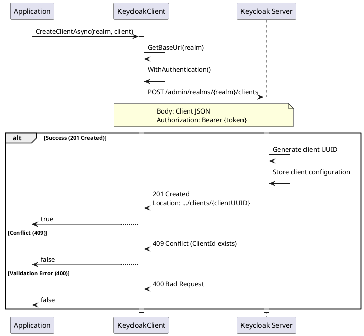

# Client CRUD Operations

> **Document Metadata**
> Last Updated: 2026-01-20 19:30:00 UTC
> Git Commit: `9bc2d34` (9bc2d34a37e88fae053f63977e0bfbd02a61441d)
> Library Version: 2.0.2

This document covers the Create, Read, Update, and Delete operations for managing Keycloak clients.

## Table of Contents

- [Create Client](#create-client)
- [Create Client and Retrieve ID](#create-client-and-retrieve-id)
- [Get Clients](#get-clients)
- [Get Client by ID](#get-client-by-id)
- [Update Client](#update-client)
- [Delete Client](#delete-client)

## Create Client

Creates a new client in the specified realm.

```csharp
var client = new Client
{
    ClientId = "my-application",
    Name = "My Application",
    Enabled = true,
    PublicClient = false,
    ServiceAccountsEnabled = true,
    StandardFlowEnabled = true,
    DirectAccessGrantsEnabled = true,
    RedirectUris = new List<string>
    {
        "https://myapp.com/*",
        "http://localhost:3000/*"
    },
    WebOrigins = new List<string> { "*" },
    Protocol = "openid-connect"
};

bool success = await keycloakClient.CreateClientAsync("master", client);
```

**Sequence Diagram:**



**Returns:** `bool` - `true` if client was created successfully

**Location:** `/src/Keycloak.ApiClient.Net/Clients/KeycloakClient.cs:19`

## Create Client and Retrieve ID

Creates a client and returns the generated client UUID.

```csharp
string clientUUID = await keycloakClient.CreateClientAndRetrieveClientIdAsync("master", client);
// clientUUID: "f4e7d8c9-1234-5678-9abc-def012345678"
```

**Note:** This returns the internal UUID, not the `clientId` (which is what you specified).

**Returns:** `string` - The created client's UUID extracted from the Location header

**Location:** `/src/Keycloak.ApiClient.Net/Clients/KeycloakClient.cs:25`

## Get Clients

Retrieves clients with optional filtering.

```csharp
// Get all clients
var clients = await keycloakClient.GetClientsAsync("master");

// Filter by clientId
var clients = await keycloakClient.GetClientsAsync(
    realm: "master",
    clientId: "my-application"
);

// Get only viewable clients
var clients = await keycloakClient.GetClientsAsync(
    realm: "master",
    viewableOnly: true
);
```

**Parameters:**
- `realm` (required) - The realm name
- `clientId` - Filter by client ID (application identifier, not UUID)
- `viewableOnly` - Return only clients user has view permissions for

**Returns:** `IEnumerable<Client>`

**Location:** `/src/Keycloak.ApiClient.Net/Clients/KeycloakClient.cs:43`

## Get Client by ID

Retrieves a specific client by its UUID.

```csharp
Client client = await keycloakClient.GetClientAsync("master", clientUUID);
```

**Returns:** `Client`

**Location:** `/src/Keycloak.ApiClient.Net/Clients/KeycloakClient.cs:58`

## Update Client

Updates an existing client's configuration.

```csharp
client.Enabled = false;
client.RedirectUris.Add("https://newdomain.com/*");

bool success = await keycloakClient.UpdateClientAsync("master", clientUUID, client);
```

**Returns:** `bool` - `true` if update was successful

**Location:** `/src/Keycloak.ApiClient.Net/Clients/KeycloakClient.cs:63`

## Delete Client

Deletes a client from the realm.

```csharp
bool success = await keycloakClient.DeleteClientAsync("master", clientUUID);
```

**Returns:** `bool` - `true` if deletion was successful

**Location:** `/src/Keycloak.ApiClient.Net/Clients/KeycloakClient.cs:72`
