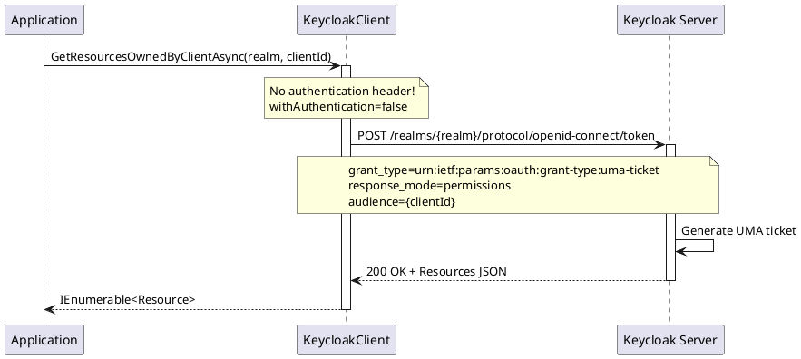

# Resource Management

> **Document Metadata**
> Last Updated: 2026-01-20 19:30:00 UTC
> Git Commit: `9bc2d34` (9bc2d34a37e88fae053f63977e0bfbd02a61441d)
> Library Version: 2.0.2

This document covers UMA (User-Managed Access) resource management for Keycloak clients.

## Table of Contents

- [Get Resources Owned by Client](#get-resources-owned-by-client)

## Get Resources Owned by Client

Retrieves resources owned by a client (UMA - User-Managed Access).

```csharp
IEnumerable<Resource> resources =
    await keycloakClient.GetResourcesOwnedByClientAsync("master", clientId);

foreach (var resource in resources)
{
    Console.WriteLine($"Resource: {resource.Name}");
}
```

**Sequence Diagram:**



**Note:** This endpoint uses a different authentication flow (UMA ticket) rather than the standard admin authentication.

**Returns:** `IEnumerable<Resource>`

**Location:** `/src/Keycloak.ApiClient.Net/Clients/KeycloakClient.cs:306`
