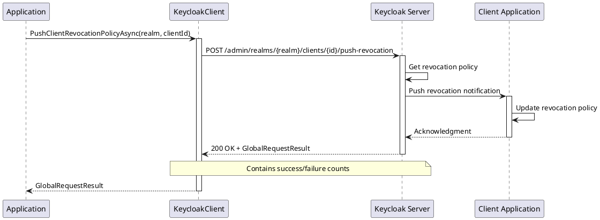

# Revocation and Registration

> **Document Metadata**
> Last Updated: 2026-01-20 19:30:00 UTC
> Git Commit: `9bc2d34` (9bc2d34a37e88fae053f63977e0bfbd02a61441d)
> Library Version: 2.0.2

This document covers client revocation policies and registration token management in Keycloak.

## Table of Contents

- [Push Client Revocation Policy](#push-client-revocation-policy)
- [Generate Client Registration Access Token](#generate-client-registration-access-token)

## Push Client Revocation Policy

Pushes the revocation policy to the client.

```csharp
GlobalRequestResult result =
    await keycloakClient.PushClientRevocationPolicyAsync("master", clientUUID);
```

**Sequence Diagram:**



**Returns:** `GlobalRequestResult`

**Location:** `/src/Keycloak.ApiClient.Net/Clients/KeycloakClient.cs:258`

## Generate Client Registration Access Token

Generates a new registration access token for the client.

```csharp
Client updatedClient =
    await keycloakClient.GenerateClientRegistrationAccessTokenAsync("master", clientUUID);

Console.WriteLine($"New Registration Token: {updatedClient.RegistrationAccessToken}");
```

**Returns:** `Client` with the new registration access token

**Location:** `/src/Keycloak.ApiClient.Net/Clients/KeycloakClient.cs:264`
