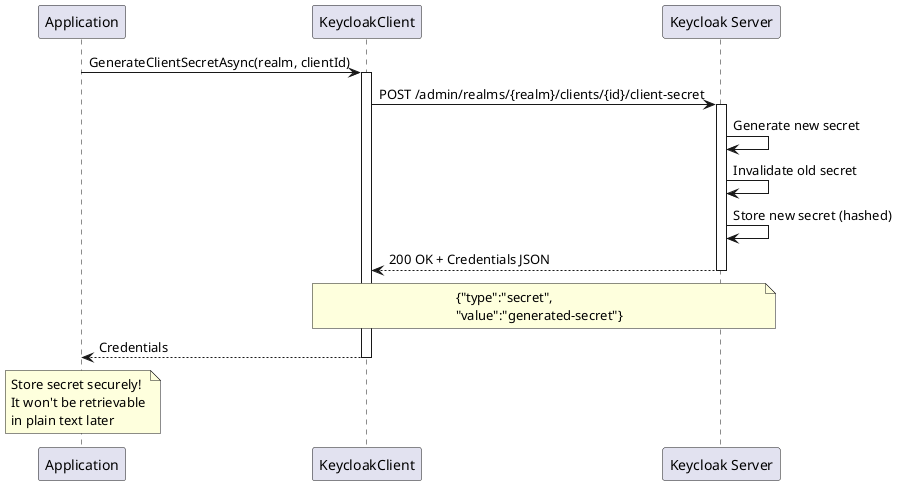

# Client Secret Management

> **Document Metadata**
> Last Updated: 2026-01-20 19:30:00 UTC
> Git Commit: `9bc2d34` (9bc2d34a37e88fae053f63977e0bfbd02a61441d)
> Library Version: 2.0.2

This document covers the management of client secrets for confidential clients in Keycloak.

## Table of Contents

- [Generate Client Secret](#generate-client-secret)
- [Get Client Secret](#get-client-secret)

## Generate Client Secret

Generates a new secret for a confidential client.

```csharp
Credentials credentials = await keycloakClient.GenerateClientSecretAsync("master", clientUUID);
Console.WriteLine($"New Secret: {credentials.Value}");
```

**Sequence Diagram:**



**Returns:** `Credentials` containing the new secret

**Security Note:** Store the secret securely immediately. It cannot be retrieved in plain text later.

**Location:** `/src/Keycloak.ApiClient.Net/Clients/KeycloakClient.cs:81`

## Get Client Secret

Retrieves the current client secret (if available).

```csharp
Credentials credentials = await keycloakClient.GetClientSecretAsync("master", clientUUID);
Console.WriteLine($"Secret: {credentials.Value}");
```

**Returns:** `Credentials` containing the secret

**Location:** `/src/Keycloak.ApiClient.Net/Clients/KeycloakClient.cs:87`
