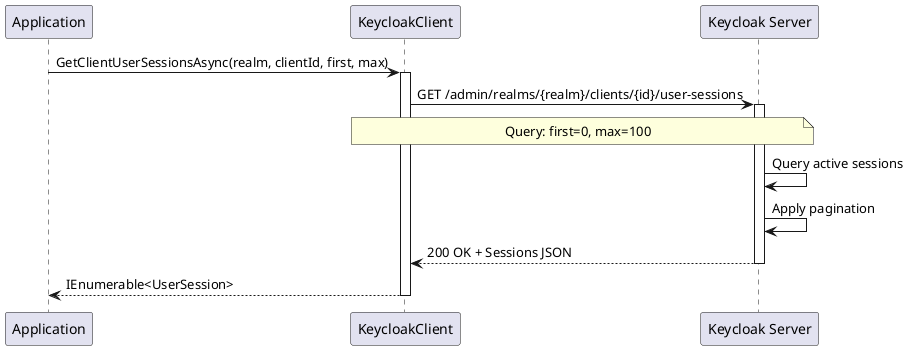

# Session and Statistics Management

> **Document Metadata**
> Last Updated: 2026-01-20 19:30:00 UTC
> Git Commit: `9bc2d34` (9bc2d34a37e88fae053f63977e0bfbd02a61441d)
> Library Version: 2.0.2

This document covers the management and monitoring of client sessions and statistics in Keycloak.

## Table of Contents

- [Get Client Session Count](#get-client-session-count)
- [Get Client User Sessions](#get-client-user-sessions)
- [Get Client Offline Session Count](#get-client-offline-session-count)
- [Get Client Offline Sessions](#get-client-offline-sessions)

## Get Client Session Count

Gets the count of active sessions for a client.

```csharp
long sessionCount = await keycloakClient.GetClientSessionCountAsync("master", clientUUID);
Console.WriteLine($"Active sessions: {sessionCount}");
```

**Returns:** `long` - Number of active sessions

**Location:** `/src/Keycloak.ApiClient.Net/Clients/KeycloakClient.cs:276`

## Get Client User Sessions

Retrieves active user sessions for a client.

```csharp
IEnumerable<UserSession> sessions = await keycloakClient.GetClientUserSessionsAsync(
    realm: "master",
    clientId: clientUUID,
    first: 0,   // Offset
    max: 100    // Limit
);

foreach (var session in sessions)
{
    Console.WriteLine($"User: {session.Username}, Start: {session.Start}");
}
```

**Sequence Diagram:**



**Returns:** `IEnumerable<UserSession>`

**Location:** `/src/Keycloak.ApiClient.Net/Clients/KeycloakClient.cs:291`

## Get Client Offline Session Count

Gets the count of offline sessions for a client.

```csharp
long offlineCount = await keycloakClient.GetClientOfflineSessionCountAsync("master", clientUUID);
```

**Returns:** `long` - Number of offline sessions

**Location:** `/src/Keycloak.ApiClient.Net/Clients/KeycloakClient.cs:210`

## Get Client Offline Sessions

Retrieves offline sessions for a client.

```csharp
IEnumerable<UserSession> offlineSessions =
    await keycloakClient.GetClientOfflineSessionsAsync(
        realm: "master",
        clientId: clientUUID,
        first: 0,
        max: 100
    );
```

**Returns:** `IEnumerable<UserSession>`

**Location:** `/src/Keycloak.ApiClient.Net/Clients/KeycloakClient.cs:220`
