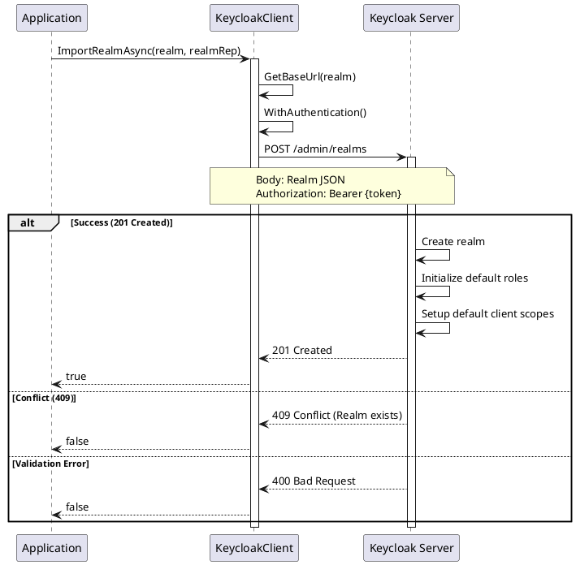
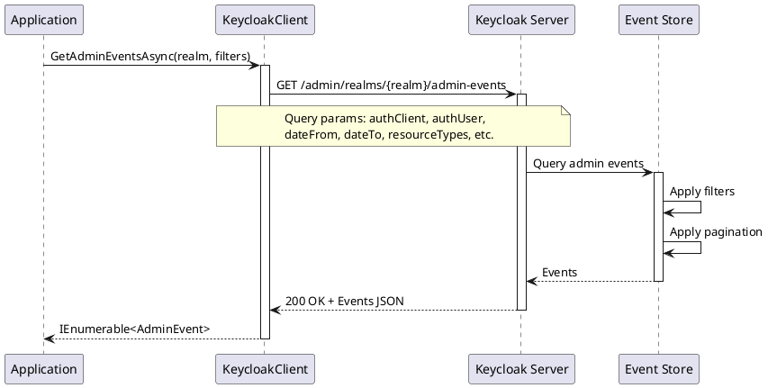
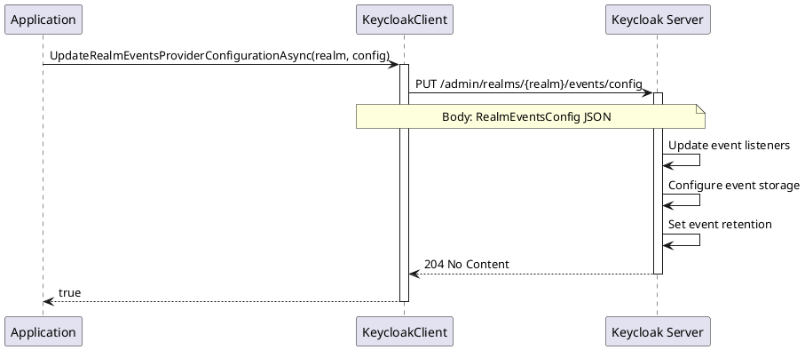
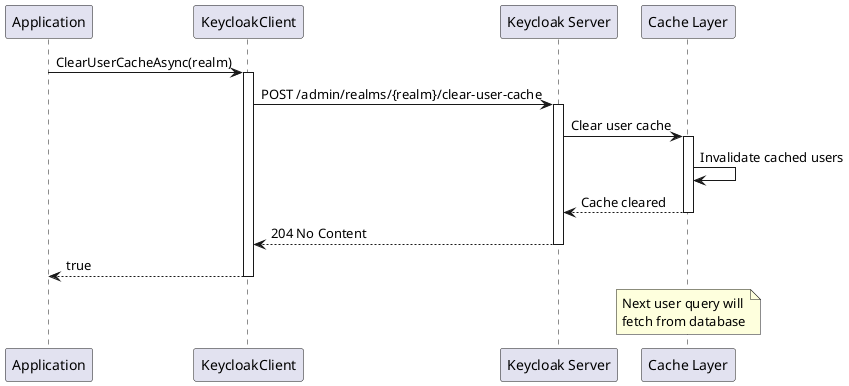
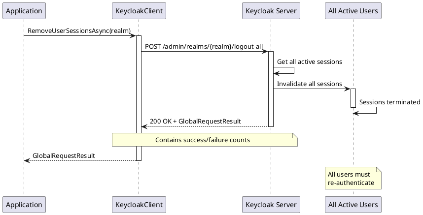
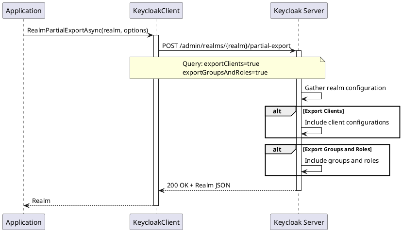
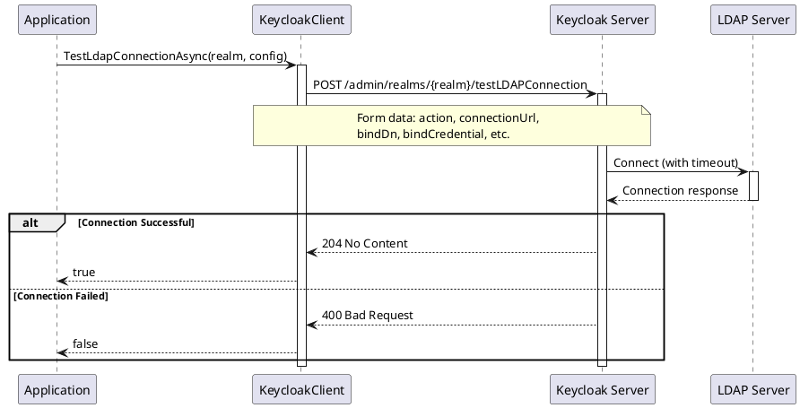

# Realm Administration - Operations

> **Document Metadata**
> Last Updated: 2026-01-20 19:30:00 UTC
> Git Commit: `9bc2d34` (9bc2d34a37e88fae053f63977e0bfbd02a61441d)
> Library Version: 2.0.2

## Overview

The Realm Administration API provides comprehensive operations for managing Keycloak realms. A realm is a space where you manage users, credentials, roles, and groups. Each realm is isolated from one another and can only manage and authenticate users that it controls.

## Table of Contents

- [Key Features](#key-features)
- [Realm Model](#realm-model)
- [Realm CRUD Operations](#realm-crud-operations)
  - [Import Realm](#import-realm)
  - [Get Realms](#get-realms)
  - [Get Realm](#get-realm)
  - [Update Realm](#update-realm)
  - [Delete Realm](#delete-realm)
- [Event Management](#event-management)
  - [Get Admin Events](#get-admin-events)
  - [Delete Admin Events](#delete-admin-events)
  - [Get User Events](#get-user-events)
  - [Delete User Events](#delete-user-events)
  - [Get Events Configuration](#get-events-configuration)
  - [Update Events Configuration](#update-events-configuration)
- [Cache Management](#cache-management)
  - [Clear Keys Cache](#clear-keys-cache)
  - [Clear Realm Cache](#clear-realm-cache)
  - [Clear User Cache](#clear-user-cache)
- [Session Management](#session-management)
  - [Get Client Session Statistics](#get-client-session-statistics)
  - [Remove All User Sessions](#remove-all-user-sessions)
  - [Delete User Session](#delete-user-session)
- [Default Client Scopes](#default-client-scopes)
  - [Get Realm Default Client Scopes](#get-realm-default-client-scopes)
  - [Add Realm Default Client Scope](#add-realm-default-client-scope)
  - [Remove Realm Default Client Scope](#remove-realm-default-client-scope)
  - [Get Realm Optional Client Scopes](#get-realm-optional-client-scopes)
  - [Add Realm Optional Client Scope](#add-realm-optional-client-scope)
  - [Remove Realm Optional Client Scope](#remove-realm-optional-client-scope)
- [Default Groups](#default-groups)
  - [Get Realm Default Groups](#get-realm-default-groups)
  - [Add Default Group](#add-default-group)
  - [Remove Default Group](#remove-default-group)
  - [Get Group By Path](#get-group-by-path)
- [Import/Export Operations](#importexport-operations)
  - [Partial Realm Export](#partial-realm-export)
  - [Partial Realm Import](#partial-realm-import)
- [Testing Operations](#testing-operations)
  - [Test LDAP Connection](#test-ldap-connection)
  - [Test SMTP Connection](#test-smtp-connection)
- [Revocation Policy](#revocation-policy)
  - [Push Revocation Policy](#push-revocation-policy)
- [User Management Permissions](#user-management-permissions)
  - [Get Users Management Permissions](#get-users-management-permissions)
  - [Update Users Management Permissions](#update-users-management-permissions)
- [Client Description Converter](#client-description-converter)
  - [Convert Client Description](#convert-client-description)
- [Complete Example: Realm Setup](#complete-example-realm-setup)
- [Best Practices](#best-practices)
- [Error Codes](#error-codes)
- [Related Resources](#related-resources)

## Key Features

- Realm CRUD operations
- Event management (admin and user events)
- Cache management (users, keys, realm)
- Import and export functionality
- Client session statistics
- Default client scopes and groups
- LDAP and SMTP testing
- User management permissions
- Event configuration

## Realm Model

The core `Realm` model includes:

```csharp
public class Realm
{
    public string Id { get; set; }
    public string Realm { get; set; }
    public string DisplayName { get; set; }
    public string DisplayNameHtml { get; set; }
    public bool? Enabled { get; set; }
    public int? SsoSessionIdleTimeout { get; set; }
    public int? SsoSessionMaxLifespan { get; set; }
    public int? AccessTokenLifespan { get; set; }
    public int? AccessCodeLifespan { get; set; }
    public bool? RegistrationAllowed { get; set; }
    public bool? RegistrationEmailAsUsername { get; set; }
    public bool? RememberMe { get; set; }
    public bool? VerifyEmail { get; set; }
    public bool? LoginWithEmailAllowed { get; set; }
    public bool? DuplicateEmailsAllowed { get; set; }
    public bool? ResetPasswordAllowed { get; set; }
    public Dictionary<string, string> SmtpServer { get; set; }
    public BrowserSecurityHeaders BrowserSecurityHeaders { get; set; }
    // Additional properties...
}
```

## Realm CRUD Operations

### Import Realm

Creates a new realm by importing a realm configuration.

```csharp
var realm = new Realm
{
    Realm = "my-company",
    DisplayName = "My Company",
    Enabled = true,
    SsoSessionIdleTimeout = 1800,  // 30 minutes
    SsoSessionMaxLifespan = 36000,  // 10 hours
    AccessTokenLifespan = 300,      // 5 minutes
    RegistrationAllowed = true,
    RegistrationEmailAsUsername = false,
    RememberMe = true,
    VerifyEmail = true,
    LoginWithEmailAllowed = true,
    ResetPasswordAllowed = true
};

bool success = await client.ImportRealmAsync("master", realm);
```

**Sequence Diagram:**



**Returns:** `bool` - `true` if realm was imported successfully

**Location:** `/src/Keycloak.ApiClient.Net/RealmsAdmin/KeycloakClient.cs:16`

### Get Realms

Retrieves all realms accessible to the authenticated user.

```csharp
IEnumerable<Realm> realms = await client.GetRealmsAsync("master");

foreach (var realm in realms)
{
    Console.WriteLine($"Realm: {realm.Realm}, Enabled: {realm.Enabled}");
}
```

**Returns:** `IEnumerable<Realm>`

**Location:** `/src/Keycloak.ApiClient.Net/RealmsAdmin/KeycloakClient.cs:25`

### Get Realm

Retrieves a specific realm's configuration.

```csharp
Realm realm = await client.GetRealmAsync("my-company");
Console.WriteLine($"Display Name: {realm.DisplayName}");
Console.WriteLine($"SSO Idle Timeout: {realm.SsoSessionIdleTimeout}");
```

**Returns:** `Realm`

**Location:** `/src/Keycloak.ApiClient.Net/RealmsAdmin/KeycloakClient.cs:30`

### Update Realm

Updates an existing realm's configuration.

```csharp
realm.DisplayName = "My Updated Company";
realm.RegistrationAllowed = false;
realm.AccessTokenLifespan = 600; // 10 minutes

bool success = await client.UpdateRealmAsync("my-company", realm);
```

**Returns:** `bool` - `true` if update was successful

**Location:** `/src/Keycloak.ApiClient.Net/RealmsAdmin/KeycloakClient.cs:35`

### Delete Realm

Deletes a realm and all its data.

```csharp
bool success = await client.DeleteRealmAsync("my-company");
```

**Warning:** This permanently deletes all users, clients, roles, and other data in the realm.

**Returns:** `bool` - `true` if deletion was successful

**Location:** `/src/Keycloak.ApiClient.Net/RealmsAdmin/KeycloakClient.cs:44`

## Event Management

### Get Admin Events

Retrieves administrative events (admin actions in the Admin Console or API).

```csharp
// Get all admin events
var events = await client.GetAdminEventsAsync("my-company");

// Filter by date range
var events = await client.GetAdminEventsAsync(
    realm: "my-company",
    dateFrom: "2024-01-01",
    dateTo: "2024-01-31",
    first: 0,
    max: 100
);

// Filter by resource and operation
var events = await client.GetAdminEventsAsync(
    realm: "my-company",
    resourceTypes: new[] { "USER", "CLIENT" },
    operationTypes: new[] { "CREATE", "UPDATE", "DELETE" },
    authUser: "admin",
    authRealm: "master"
);
```

**Sequence Diagram:**



**Parameters:**
- `realm` (required) - The realm name
- `authClient` - Filter by client that performed the action
- `authIpAddress` - Filter by IP address
- `authRealm` - Filter by realm of the admin
- `authUser` - Filter by admin user
- `dateFrom` - Start date (format: yyyy-MM-dd or epoch timestamp)
- `dateTo` - End date
- `first` - Offset for pagination
- `max` - Maximum results
- `operationTypes` - Filter by operation types (CREATE, UPDATE, DELETE, ACTION)
- `resourcePath` - Filter by resource path
- `resourceTypes` - Filter by resource types (USER, CLIENT, REALM, etc.)

**Returns:** `IEnumerable<AdminEvent>`

**Location:** `/src/Keycloak.ApiClient.Net/RealmsAdmin/KeycloakClient.cs:53`

### Delete Admin Events

Clears all admin events from the realm.

```csharp
bool success = await client.DeleteAdminEventsAsync("my-company");
```

**Returns:** `bool` - `true` if events were deleted

**Location:** `/src/Keycloak.ApiClient.Net/RealmsAdmin/KeycloakClient.cs:79`

### Get User Events

Retrieves user events (login, logout, code-to-token, etc.).

```csharp
// Get all user events
var events = await client.GetEventsAsync("my-company");

// Filter by event type and user
var events = await client.GetEventsAsync(
    realm: "my-company",
    type: "LOGIN",
    user: userId,
    dateFrom: "2024-01-01",
    first: 0,
    max: 100
);

// Filter by client and IP
var events = await client.GetEventsAsync(
    realm: "my-company",
    client: clientId,
    ipAddress: "192.168.1.1"
);
```

**Common Event Types:**
- `LOGIN` - User login
- `LOGIN_ERROR` - Failed login attempt
- `LOGOUT` - User logout
- `CODE_TO_TOKEN` - Authorization code exchange
- `REFRESH_TOKEN` - Token refresh
- `REGISTER` - User registration

**Returns:** `IEnumerable<Event>`

**Location:** `/src/Keycloak.ApiClient.Net/RealmsAdmin/KeycloakClient.cs:195`

### Delete User Events

Clears all user events from the realm.

```csharp
bool success = await client.DeleteEventsAsync("my-company");
```

**Returns:** `bool` - `true` if events were deleted

**Location:** `/src/Keycloak.ApiClient.Net/RealmsAdmin/KeycloakClient.cs:217`

### Get Events Configuration

Retrieves the events provider configuration.

```csharp
RealmEventsConfig config = await client.GetRealmEventsProviderConfigurationAsync("my-company");

Console.WriteLine($"Events Enabled: {config.EventsEnabled}");
Console.WriteLine($"Admin Events Enabled: {config.AdminEventsDetailsEnabled}");
```

**Returns:** `RealmEventsConfig`

**Location:** `/src/Keycloak.ApiClient.Net/RealmsAdmin/KeycloakClient.cs:226`

### Update Events Configuration

Updates the events provider configuration.

```csharp
var config = new RealmEventsConfig
{
    EventsEnabled = true,
    EventsExpiration = 2592000,  // 30 days in seconds
    EventsListeners = new List<string> { "jboss-logging" },
    EnabledEventTypes = new List<string>
    {
        "LOGIN", "LOGOUT", "LOGIN_ERROR", "REGISTER"
    },
    AdminEventsEnabled = true,
    AdminEventsDetailsEnabled = true
};

bool success = await client.UpdateRealmEventsProviderConfigurationAsync("my-company", config);
```

**Sequence Diagram:**



**Returns:** `bool` - `true` if configuration was updated

**Location:** `/src/Keycloak.ApiClient.Net/RealmsAdmin/KeycloakClient.cs:231`

## Cache Management

### Clear Keys Cache

Clears the realm's public key cache.

```csharp
bool success = await client.ClearKeysCacheAsync("my-company");
```

**Use Case:** Force refresh of cached public keys after key rotation.

**Returns:** `bool` - `true` if cache was cleared

**Location:** `/src/Keycloak.ApiClient.Net/RealmsAdmin/KeycloakClient.cs:88`

### Clear Realm Cache

Clears the realm cache.

```csharp
bool success = await client.ClearRealmCacheAsync("my-company");
```

**Use Case:** Force reload of realm configuration after updates.

**Returns:** `bool` - `true` if cache was cleared

**Location:** `/src/Keycloak.ApiClient.Net/RealmsAdmin/KeycloakClient.cs:97`

### Clear User Cache

Clears the user cache.

```csharp
bool success = await client.ClearUserCacheAsync("my-company");
```

**Sequence Diagram:**



**Use Case:** Force refresh of cached user data after external changes.

**Returns:** `bool` - `true` if cache was cleared

**Location:** `/src/Keycloak.ApiClient.Net/RealmsAdmin/KeycloakClient.cs:106`

## Session Management

### Get Client Session Statistics

Retrieves session statistics for all clients in the realm.

```csharp
IEnumerable<IDictionary<string, object>> stats =
    await client.GetClientSessionStatsAsync("my-company");

foreach (var stat in stats)
{
    Console.WriteLine($"Client: {stat["clientId"]}");
    Console.WriteLine($"Active: {stat["active"]}");
    Console.WriteLine($"Offline: {stat["offline"]}");
}
```

**Returns:** `IEnumerable<IDictionary<string, object>>`

**Location:** `/src/Keycloak.ApiClient.Net/RealmsAdmin/KeycloakClient.cs:121`

### Remove All User Sessions

Logs out all users in the realm by removing all sessions.

```csharp
GlobalRequestResult result = await client.RemoveUserSessionsAsync("my-company");

Console.WriteLine($"Successful: {result.SuccessRequests}");
Console.WriteLine($"Failed: {result.FailedRequests}");
```

**Sequence Diagram:**



**Returns:** `GlobalRequestResult`

**Location:** `/src/Keycloak.ApiClient.Net/RealmsAdmin/KeycloakClient.cs:245`

### Delete User Session

Deletes a specific user session.

```csharp
bool success = await client.DeleteUserSessionAsync("my-company", sessionId);
```

**Returns:** `bool` - `true` if session was deleted

**Location:** `/src/Keycloak.ApiClient.Net/RealmsAdmin/KeycloakClient.cs:282`

## Default Client Scopes

### Get Realm Default Client Scopes

Retrieves default client scopes for the realm.

```csharp
IEnumerable<ClientScope> scopes = await client.GetRealmDefaultClientScopesAsync("my-company");

foreach (var scope in scopes)
{
    Console.WriteLine($"Scope: {scope.Name}, Protocol: {scope.Protocol}");
}
```

**Returns:** `IEnumerable<ClientScope>`

**Location:** `/src/Keycloak.ApiClient.Net/RealmsAdmin/KeycloakClient.cs:126`

### Add Realm Default Client Scope

Adds a client scope as a default for all new clients.

```csharp
bool success = await client.UpdateRealmDefaultClientScopeAsync("my-company", clientScopeId);
```

**Returns:** `bool` - `true` if scope was added

**Location:** `/src/Keycloak.ApiClient.Net/RealmsAdmin/KeycloakClient.cs:131`

### Remove Realm Default Client Scope

Removes a default client scope from the realm.

```csharp
bool success = await client.DeleteRealmDefaultClientScopeAsync("my-company", clientScopeId);
```

**Returns:** `bool` - `true` if scope was removed

**Location:** `/src/Keycloak.ApiClient.Net/RealmsAdmin/KeycloakClient.cs:140`

### Get Realm Optional Client Scopes

Retrieves optional client scopes for the realm.

```csharp
IEnumerable<ClientScope> scopes = await client.GetRealmOptionalClientScopesAsync("my-company");
```

**Returns:** `IEnumerable<ClientScope>`

**Location:** `/src/Keycloak.ApiClient.Net/RealmsAdmin/KeycloakClient.cs:172`

### Add Realm Optional Client Scope

Adds a client scope as optional for all new clients.

```csharp
bool success = await client.UpdateRealmOptionalClientScopeAsync("my-company", clientScopeId);
```

**Returns:** `bool` - `true` if scope was added

**Location:** `/src/Keycloak.ApiClient.Net/RealmsAdmin/KeycloakClient.cs:177`

### Remove Realm Optional Client Scope

Removes an optional client scope from the realm.

```csharp
bool success = await client.DeleteRealmOptionalClientScopeAsync("my-company", clientScopeId);
```

**Returns:** `bool` - `true` if scope was removed

**Location:** `/src/Keycloak.ApiClient.Net/RealmsAdmin/KeycloakClient.cs:186`

## Default Groups

### Get Realm Default Groups

Retrieves the default groups hierarchy for the realm.

```csharp
IEnumerable<Group> groups = await client.GetRealmGroupHierarchyAsync("my-company");

foreach (var group in groups)
{
    Console.WriteLine($"Group: {group.Name}");
}
```

**Returns:** `IEnumerable<Group>`

**Location:** `/src/Keycloak.ApiClient.Net/RealmsAdmin/KeycloakClient.cs:149`

### Add Default Group

Adds a group as a default group (new users automatically join).

```csharp
bool success = await client.UpdateRealmGroupAsync("my-company", groupId);
```

**Returns:** `bool` - `true` if group was added as default

**Location:** `/src/Keycloak.ApiClient.Net/RealmsAdmin/KeycloakClient.cs:154`

### Remove Default Group

Removes a group from default groups.

```csharp
bool success = await client.DeleteRealmGroupAsync("my-company", groupId);
```

**Returns:** `bool` - `true` if group was removed from defaults

**Location:** `/src/Keycloak.ApiClient.Net/RealmsAdmin/KeycloakClient.cs:163`

### Get Group By Path

Retrieves a group by its path.

```csharp
Group group = await client.GetRealmGroupByPathAsync("my-company", "/top-level/sub-group");
```

**Returns:** `Group`

**Location:** `/src/Keycloak.ApiClient.Net/RealmsAdmin/KeycloakClient.cs:240`

## Import/Export Operations

### Partial Realm Export

Exports a realm's configuration (optionally including clients, groups, and roles).

```csharp
Realm exportedRealm = await client.RealmPartialExportAsync(
    realm: "my-company",
    exportClients: true,
    exportGroupsAndRoles: true
);

// Save to file
string json = JsonConvert.SerializeObject(exportedRealm, Formatting.Indented);
File.WriteAllText("realm-export.json", json);
```

**Sequence Diagram:**



**Returns:** `Realm` object containing the export data

**Location:** `/src/Keycloak.ApiClient.Net/RealmsAdmin/KeycloakClient.cs:251`

### Partial Realm Import

Imports resources into an existing realm.

```csharp
var partialImport = new PartialImport
{
    IfResourceExists = "SKIP", // or "OVERWRITE", "FAIL"
    Users = new List<User> { /* users to import */ },
    Clients = new List<Client> { /* clients to import */ },
    Groups = new List<Group> { /* groups to import */ },
    Roles = new Roles { /* roles to import */ }
};

bool success = await client.RealmPartialImportAsync("my-company", partialImport);
```

**IfResourceExists Options:**
- `SKIP` - Skip existing resources
- `OVERWRITE` - Overwrite existing resources
- `FAIL` - Fail if resource exists

**Returns:** `bool` - `true` if import was successful

**Location:** `/src/Keycloak.ApiClient.Net/RealmsAdmin/KeycloakClient.cs:267`

## Testing Operations

### Test LDAP Connection

Tests connection to an LDAP server.

```csharp
bool success = await client.TestLdapConnectionAsync(
    realm: "my-company",
    action: "testConnection",
    connectionUrl: "ldap://ldap.example.com:389",
    bindDn: "cn=admin,dc=example,dc=com",
    bindCredential: "admin-password",
    connectionTimeout: "5000",
    useTruststoreSpi: "ldapsOnly"
);

if (success)
{
    Console.WriteLine("LDAP connection successful");
}
```

**Sequence Diagram:**



**Returns:** `bool` - `true` if LDAP connection was successful

**Location:** `/src/Keycloak.ApiClient.Net/RealmsAdmin/KeycloakClient.cs:291`

### Test SMTP Connection

Tests connection to an SMTP server.

```csharp
bool success = await client.TestSmtpConnectionAsync("my-company", smtpConfig);

if (success)
{
    Console.WriteLine("SMTP connection successful");
}
```

**Returns:** `bool` - `true` if SMTP connection was successful

**Location:** `/src/Keycloak.ApiClient.Net/RealmsAdmin/KeycloakClient.cs:308`

## Revocation Policy

### Push Revocation Policy

Pushes the realm's revocation policy to all clients.

```csharp
GlobalRequestResult result = await client.PushRealmRevocationPolicyAsync("my-company");

Console.WriteLine($"Successful pushes: {result.SuccessRequests}");
Console.WriteLine($"Failed pushes: {result.FailedRequests}");
```

**Returns:** `GlobalRequestResult`

**Location:** `/src/Keycloak.ApiClient.Net/RealmsAdmin/KeycloakClient.cs:276`

## User Management Permissions

### Get Users Management Permissions

Retrieves user management permissions for the realm.

```csharp
ManagementPermission permissions =
    await client.GetRealmUsersManagementPermissionsAsync("my-company");

Console.WriteLine($"Permissions Enabled: {permissions.Enabled}");
```

**Note:** This method is marked as `[Obsolete]`

**Location:** `/src/Keycloak.ApiClient.Net/RealmsAdmin/KeycloakClient.cs:318`

### Update Users Management Permissions

Updates user management permissions for the realm.

```csharp
var permissions = new ManagementPermission
{
    Enabled = true
};

ManagementPermission result =
    await client.UpdateRealmUsersManagementPermissionsAsync("my-company", permissions);
```

**Returns:** `ManagementPermission`

**Location:** `/src/Keycloak.ApiClient.Net/RealmsAdmin/KeycloakClient.cs:323`

## Client Description Converter

### Convert Client Description

Converts client description to Keycloak client representation.

```csharp
string samlMetadata = @"<EntityDescriptor ... >";
Client client = await keycloakClient.BasePathForImportingClientsAsync("my-company", samlMetadata);

Console.WriteLine($"Converted Client ID: {client.ClientId}");
```

**Use Case:** Import SAML or OIDC clients from metadata/descriptor files.

**Returns:** `Client`

**Location:** `/src/Keycloak.ApiClient.Net/RealmsAdmin/KeycloakClient.cs:115`

## Complete Example: Realm Setup

```csharp
using Keycloak.ApiClient.Net;
using Keycloak.ApiClient.Net.Models.RealmsAdmin;

public class RealmAdministration
{
    private readonly KeycloakClient _client;

    public RealmAdministration(string url, string username, string password)
    {
        _client = new KeycloakClient(url, username, password);
    }

    public async Task SetupRealmExample()
    {
        // 1. Create new realm
        var realm = new Realm
        {
            Realm = "my-company",
            DisplayName = "My Company",
            Enabled = true,
            SsoSessionIdleTimeout = 1800,
            SsoSessionMaxLifespan = 36000,
            AccessTokenLifespan = 300,
            RegistrationAllowed = true,
            RememberMe = true,
            VerifyEmail = true,
            LoginWithEmailAllowed = true,
            ResetPasswordAllowed = true,
            SmtpServer = new Dictionary<string, string>
            {
                ["host"] = "smtp.gmail.com",
                ["port"] = "587",
                ["from"] = "noreply@mycompany.com",
                ["auth"] = "true",
                ["starttls"] = "true",
                ["user"] = "smtp-user",
                ["password"] = "smtp-password"
            }
        };

        await _client.ImportRealmAsync("master", realm);
        Console.WriteLine("Realm created");

        // 2. Configure event logging
        var eventConfig = new RealmEventsConfig
        {
            EventsEnabled = true,
            EventsExpiration = 2592000, // 30 days
            EventsListeners = new List<string> { "jboss-logging" },
            EnabledEventTypes = new List<string>
            {
                "LOGIN", "LOGOUT", "LOGIN_ERROR", "REGISTER"
            },
            AdminEventsEnabled = true,
            AdminEventsDetailsEnabled = true
        };

        await _client.UpdateRealmEventsProviderConfigurationAsync("my-company", eventConfig);
        Console.WriteLine("Event logging configured");

        // 3. Test SMTP configuration
        bool smtpWorks = await _client.TestSmtpConnectionAsync("my-company", "test@example.com");
        Console.WriteLine($"SMTP test: {(smtpWorks ? "Success" : "Failed")}");

        // 4. Get session statistics
        var stats = await _client.GetClientSessionStatsAsync("my-company");
        Console.WriteLine($"Total client sessions: {stats.Count()}");

        // 5. Export realm configuration
        var export = await _client.RealmPartialExportAsync(
            "my-company",
            exportClients: true,
            exportGroupsAndRoles: true
        );
        Console.WriteLine("Realm exported for backup");

        // 6. Monitor admin events
        var adminEvents = await _client.GetAdminEventsAsync(
            realm: "my-company",
            first: 0,
            max: 10
        );

        foreach (var evt in adminEvents)
        {
            Console.WriteLine($"Admin action: {evt.OperationType} on {evt.ResourceType}");
        }
    }
}
```

## Best Practices

1. **Realm Configuration**
   - Set appropriate session timeouts
   - Enable email verification for security
   - Configure SMTP for email functionality
   - Use strong password policies

2. **Event Logging**
   - Enable both user and admin events
   - Set appropriate event expiration
   - Monitor failed login attempts
   - Review admin events regularly

3. **Cache Management**
   - Clear caches after bulk updates
   - Monitor cache performance
   - Clear user cache after external updates

4. **Session Management**
   - Monitor session counts for anomalies
   - Implement appropriate timeouts
   - Use logout-all sparingly

5. **Import/Export**
   - Regular backup exports
   - Test imports in non-production first
   - Use version control for realm configs
   - Document custom configurations

6. **Testing**
   - Test LDAP/SMTP before production use
   - Validate configurations in staging
   - Monitor connection timeouts

## Error Codes

| HTTP Code | Meaning | Common Causes |
|-----------|---------|---------------|
| 400 | Bad Request | Invalid realm configuration, malformed data |
| 401 | Unauthorized | Invalid or expired authentication token |
| 403 | Forbidden | Insufficient permissions |
| 404 | Not Found | Realm doesn't exist |
| 409 | Conflict | Realm already exists |
| 500 | Server Error | Keycloak internal error, LDAP/SMTP connection issues |

## Related Resources

- [Keycloak Realm API Documentation](https://www.keycloak.org/docs-api/latest/rest-api/index.html#_realms_admin_resource)
- [Keycloak Events](https://www.keycloak.org/docs/latest/server_admin/#auditing-and-events)
- [Authentication Documentation](./authentication-core.md)
- [User Management Documentation](./user-management-operations.md)
