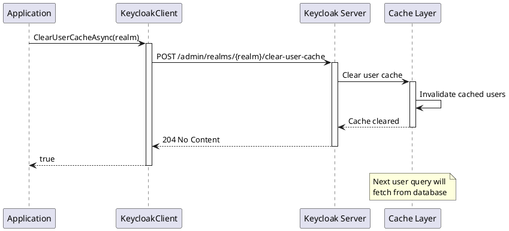

# Cache Management

> **Document Metadata**
> Last Updated: 2026-01-20 19:30:00 UTC
> Git Commit: `9bc2d34` (9bc2d34a37e88fae053f63977e0bfbd02a61441d)
> Library Version: 2.0.2

## Overview

Cache Management operations allow you to clear various caches in Keycloak to ensure data consistency and force reloading of configurations. This includes clearing keys cache, realm cache, and user cache.

## Clear Keys Cache

Clears the realm's public key cache.

```csharp
bool success = await client.ClearKeysCacheAsync("my-company");
```

**Use Case:** Force refresh of cached public keys after key rotation.

**Returns:** `bool` - `true` if cache was cleared

**Location:** `/src/Keycloak.ApiClient.Net/RealmsAdmin/KeycloakClient.cs:88`

## Clear Realm Cache

Clears the realm cache.

```csharp
bool success = await client.ClearRealmCacheAsync("my-company");
```

**Use Case:** Force reload of realm configuration after updates.

**Returns:** `bool` - `true` if cache was cleared

**Location:** `/src/Keycloak.ApiClient.Net/RealmsAdmin/KeycloakClient.cs:97`

## Clear User Cache

Clears the user cache.

```csharp
bool success = await client.ClearUserCacheAsync("my-company");
```

**Sequence Diagram:**



**Use Case:** Force refresh of cached user data after external changes.

**Returns:** `bool` - `true` if cache was cleared

**Location:** `/src/Keycloak.ApiClient.Net/RealmsAdmin/KeycloakClient.cs:106`
