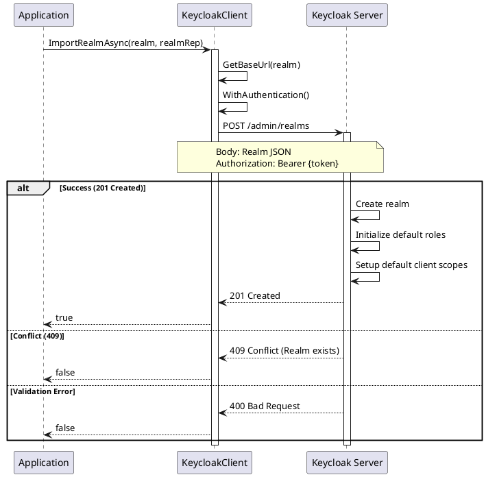

# Realm CRUD Operations

> **Document Metadata**
> Last Updated: 2026-01-20 19:30:00 UTC
> Git Commit: `9bc2d34` (9bc2d34a37e88fae053f63977e0bfbd02a61441d)
> Library Version: 2.0.2

## Overview

Realm CRUD operations provide the fundamental functionality to create, read, update, and delete Keycloak realms. These operations are essential for managing the lifecycle of realms in your Keycloak instance.

## Import Realm

Creates a new realm by importing a realm configuration.

```csharp
var realm = new Realm
{
    Realm = "my-company",
    DisplayName = "My Company",
    Enabled = true,
    SsoSessionIdleTimeout = 1800,  // 30 minutes
    SsoSessionMaxLifespan = 36000,  // 10 hours
    AccessTokenLifespan = 300,      // 5 minutes
    RegistrationAllowed = true,
    RegistrationEmailAsUsername = false,
    RememberMe = true,
    VerifyEmail = true,
    LoginWithEmailAllowed = true,
    ResetPasswordAllowed = true
};

bool success = await client.ImportRealmAsync("master", realm);
```

**Sequence Diagram:**



**Returns:** `bool` - `true` if realm was imported successfully

**Location:** `/src/Keycloak.ApiClient.Net/RealmsAdmin/KeycloakClient.cs:16`

## Get Realms

Retrieves all realms accessible to the authenticated user.

```csharp
IEnumerable<Realm> realms = await client.GetRealmsAsync("master");

foreach (var realm in realms)
{
    Console.WriteLine($"Realm: {realm.Realm}, Enabled: {realm.Enabled}");
}
```

**Returns:** `IEnumerable<Realm>`

**Location:** `/src/Keycloak.ApiClient.Net/RealmsAdmin/KeycloakClient.cs:25`

## Get Realm

Retrieves a specific realm's configuration.

```csharp
Realm realm = await client.GetRealmAsync("my-company");
Console.WriteLine($"Display Name: {realm.DisplayName}");
Console.WriteLine($"SSO Idle Timeout: {realm.SsoSessionIdleTimeout}");
```

**Returns:** `Realm`

**Location:** `/src/Keycloak.ApiClient.Net/RealmsAdmin/KeycloakClient.cs:30`

## Update Realm

Updates an existing realm's configuration.

```csharp
realm.DisplayName = "My Updated Company";
realm.RegistrationAllowed = false;
realm.AccessTokenLifespan = 600; // 10 minutes

bool success = await client.UpdateRealmAsync("my-company", realm);
```

**Returns:** `bool` - `true` if update was successful

**Location:** `/src/Keycloak.ApiClient.Net/RealmsAdmin/KeycloakClient.cs:35`

## Delete Realm

Deletes a realm and all its data.

```csharp
bool success = await client.DeleteRealmAsync("my-company");
```

**Warning:** This permanently deletes all users, clients, roles, and other data in the realm.

**Returns:** `bool` - `true` if deletion was successful

**Location:** `/src/Keycloak.ApiClient.Net/RealmsAdmin/KeycloakClient.cs:44`
