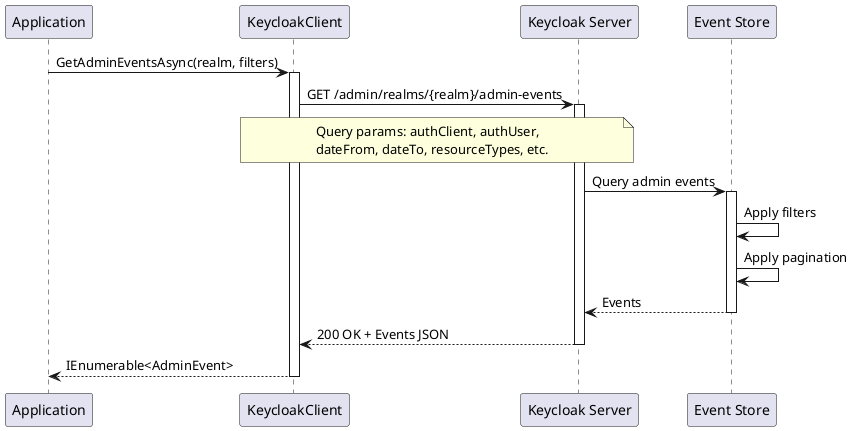
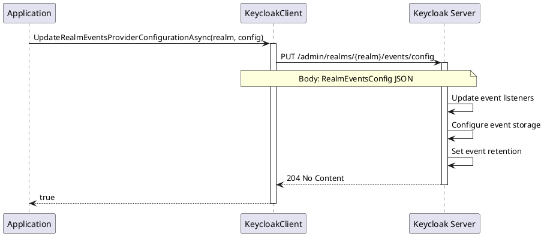

# Event Management

> **Document Metadata**
> Last Updated: 2026-01-20 19:30:00 UTC
> Git Commit: `9bc2d34` (9bc2d34a37e88fae053f63977e0bfbd02a61441d)
> Library Version: 2.0.2

## Overview

Event Management provides comprehensive tracking of administrative actions and user activities within a realm. This includes admin events (administrative actions in the Admin Console or API) and user events (login, logout, registration, etc.).

## Get Admin Events

Retrieves administrative events (admin actions in the Admin Console or API).

```csharp
// Get all admin events
var events = await client.GetAdminEventsAsync("my-company");

// Filter by date range
var events = await client.GetAdminEventsAsync(
    realm: "my-company",
    dateFrom: "2024-01-01",
    dateTo: "2024-01-31",
    first: 0,
    max: 100
);

// Filter by resource and operation
var events = await client.GetAdminEventsAsync(
    realm: "my-company",
    resourceTypes: new[] { "USER", "CLIENT" },
    operationTypes: new[] { "CREATE", "UPDATE", "DELETE" },
    authUser: "admin",
    authRealm: "master"
);
```

**Sequence Diagram:**



**Parameters:**
- `realm` (required) - The realm name
- `authClient` - Filter by client that performed the action
- `authIpAddress` - Filter by IP address
- `authRealm` - Filter by realm of the admin
- `authUser` - Filter by admin user
- `dateFrom` - Start date (format: yyyy-MM-dd or epoch timestamp)
- `dateTo` - End date
- `first` - Offset for pagination
- `max` - Maximum results
- `operationTypes` - Filter by operation types (CREATE, UPDATE, DELETE, ACTION)
- `resourcePath` - Filter by resource path
- `resourceTypes` - Filter by resource types (USER, CLIENT, REALM, etc.)

**Returns:** `IEnumerable<AdminEvent>`

**Location:** `/src/Keycloak.ApiClient.Net/RealmsAdmin/KeycloakClient.cs:53`

## Delete Admin Events

Clears all admin events from the realm.

```csharp
bool success = await client.DeleteAdminEventsAsync("my-company");
```

**Returns:** `bool` - `true` if events were deleted

**Location:** `/src/Keycloak.ApiClient.Net/RealmsAdmin/KeycloakClient.cs:79`

## Get User Events

Retrieves user events (login, logout, code-to-token, etc.).

```csharp
// Get all user events
var events = await client.GetEventsAsync("my-company");

// Filter by event type and user
var events = await client.GetEventsAsync(
    realm: "my-company",
    type: "LOGIN",
    user: userId,
    dateFrom: "2024-01-01",
    first: 0,
    max: 100
);

// Filter by client and IP
var events = await client.GetEventsAsync(
    realm: "my-company",
    client: clientId,
    ipAddress: "192.168.1.1"
);
```

**Common Event Types:**
- `LOGIN` - User login
- `LOGIN_ERROR` - Failed login attempt
- `LOGOUT` - User logout
- `CODE_TO_TOKEN` - Authorization code exchange
- `REFRESH_TOKEN` - Token refresh
- `REGISTER` - User registration

**Returns:** `IEnumerable<Event>`

**Location:** `/src/Keycloak.ApiClient.Net/RealmsAdmin/KeycloakClient.cs:195`

## Delete User Events

Clears all user events from the realm.

```csharp
bool success = await client.DeleteEventsAsync("my-company");
```

**Returns:** `bool` - `true` if events were deleted

**Location:** `/src/Keycloak.ApiClient.Net/RealmsAdmin/KeycloakClient.cs:217`

## Get Events Configuration

Retrieves the events provider configuration.

```csharp
RealmEventsConfig config = await client.GetRealmEventsProviderConfigurationAsync("my-company");

Console.WriteLine($"Events Enabled: {config.EventsEnabled}");
Console.WriteLine($"Admin Events Enabled: {config.AdminEventsDetailsEnabled}");
```

**Returns:** `RealmEventsConfig`

**Location:** `/src/Keycloak.ApiClient.Net/RealmsAdmin/KeycloakClient.cs:226`

## Update Events Configuration

Updates the events provider configuration.

```csharp
var config = new RealmEventsConfig
{
    EventsEnabled = true,
    EventsExpiration = 2592000,  // 30 days in seconds
    EventsListeners = new List<string> { "jboss-logging" },
    EnabledEventTypes = new List<string>
    {
        "LOGIN", "LOGOUT", "LOGIN_ERROR", "REGISTER"
    },
    AdminEventsEnabled = true,
    AdminEventsDetailsEnabled = true
};

bool success = await client.UpdateRealmEventsProviderConfigurationAsync("my-company", config);
```

**Sequence Diagram:**



**Returns:** `bool` - `true` if configuration was updated

**Location:** `/src/Keycloak.ApiClient.Net/RealmsAdmin/KeycloakClient.cs:231`
