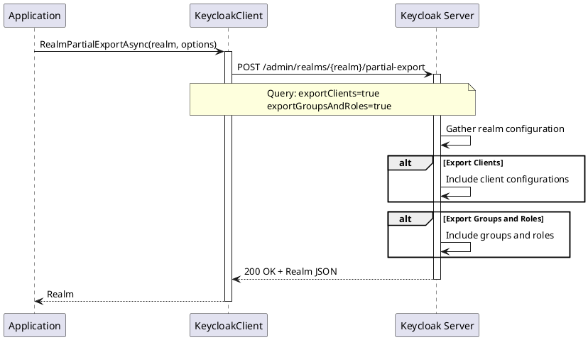

# Import/Export Operations

> **Document Metadata**
> Last Updated: 2026-01-20 19:30:00 UTC
> Git Commit: `9bc2d34` (9bc2d34a37e88fae053f63977e0bfbd02a61441d)
> Library Version: 2.0.2

## Overview

Import/Export Operations allow you to backup and restore realm configurations, migrate realms between environments, and bulk import resources into existing realms.

## Partial Realm Export

Exports a realm's configuration (optionally including clients, groups, and roles).

```csharp
Realm exportedRealm = await client.RealmPartialExportAsync(
    realm: "my-company",
    exportClients: true,
    exportGroupsAndRoles: true
);

// Save to file
string json = JsonConvert.SerializeObject(exportedRealm, Formatting.Indented);
File.WriteAllText("realm-export.json", json);
```

**Sequence Diagram:**



**Returns:** `Realm` object containing the export data

**Location:** `/src/Keycloak.ApiClient.Net/RealmsAdmin/KeycloakClient.cs:251`

## Partial Realm Import

Imports resources into an existing realm.

```csharp
var partialImport = new PartialImport
{
    IfResourceExists = "SKIP", // or "OVERWRITE", "FAIL"
    Users = new List<User> { /* users to import */ },
    Clients = new List<Client> { /* clients to import */ },
    Groups = new List<Group> { /* groups to import */ },
    Roles = new Roles { /* roles to import */ }
};

bool success = await client.RealmPartialImportAsync("my-company", partialImport);
```

**IfResourceExists Options:**
- `SKIP` - Skip existing resources
- `OVERWRITE` - Overwrite existing resources
- `FAIL` - Fail if resource exists

**Returns:** `bool` - `true` if import was successful

**Location:** `/src/Keycloak.ApiClient.Net/RealmsAdmin/KeycloakClient.cs:267`
