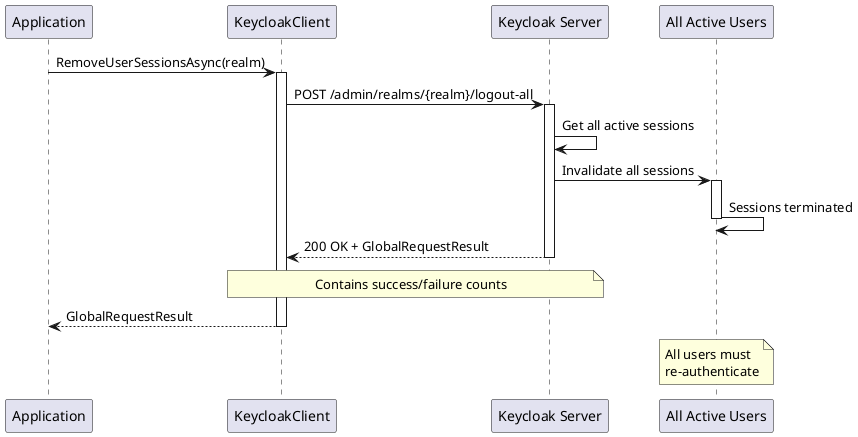

# Session Management

> **Document Metadata**
> Last Updated: 2026-01-20 19:30:00 UTC
> Git Commit: `9bc2d34` (9bc2d34a37e88fae053f63977e0bfbd02a61441d)
> Library Version: 2.0.2

## Overview

Session Management provides operations to monitor and control user sessions within a realm. This includes viewing session statistics, removing all sessions, and deleting specific user sessions.

## Get Client Session Statistics

Retrieves session statistics for all clients in the realm.

```csharp
IEnumerable<IDictionary<string, object>> stats =
    await client.GetClientSessionStatsAsync("my-company");

foreach (var stat in stats)
{
    Console.WriteLine($"Client: {stat["clientId"]}");
    Console.WriteLine($"Active: {stat["active"]}");
    Console.WriteLine($"Offline: {stat["offline"]}");
}
```

**Returns:** `IEnumerable<IDictionary<string, object>>`

**Location:** `/src/Keycloak.ApiClient.Net/RealmsAdmin/KeycloakClient.cs:121`

## Remove All User Sessions

Logs out all users in the realm by removing all sessions.

```csharp
GlobalRequestResult result = await client.RemoveUserSessionsAsync("my-company");

Console.WriteLine($"Successful: {result.SuccessRequests}");
Console.WriteLine($"Failed: {result.FailedRequests}");
```

**Sequence Diagram:**



**Returns:** `GlobalRequestResult`

**Location:** `/src/Keycloak.ApiClient.Net/RealmsAdmin/KeycloakClient.cs:245`

## Delete User Session

Deletes a specific user session.

```csharp
bool success = await client.DeleteUserSessionAsync("my-company", sessionId);
```

**Returns:** `bool` - `true` if session was deleted

**Location:** `/src/Keycloak.ApiClient.Net/RealmsAdmin/KeycloakClient.cs:282`
