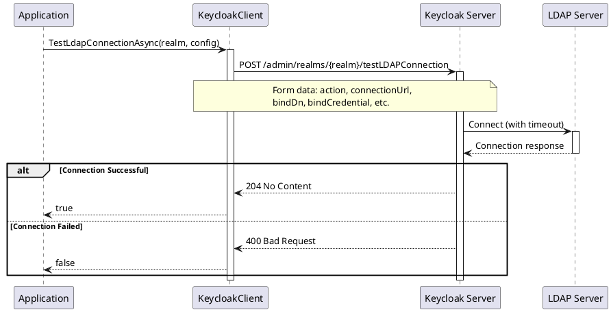

# Testing Operations

> **Document Metadata**
> Last Updated: 2026-01-20 19:30:00 UTC
> Git Commit: `9bc2d34` (9bc2d34a37e88fae053f63977e0bfbd02a61441d)
> Library Version: 2.0.2

## Overview

Testing Operations provide functionality to validate external service connections before enabling them in production. This includes testing LDAP server connections and SMTP email server configurations.

## Test LDAP Connection

Tests connection to an LDAP server.

```csharp
bool success = await client.TestLdapConnectionAsync(
    realm: "my-company",
    action: "testConnection",
    connectionUrl: "ldap://ldap.example.com:389",
    bindDn: "cn=admin,dc=example,dc=com",
    bindCredential: "admin-password",
    connectionTimeout: "5000",
    useTruststoreSpi: "ldapsOnly"
);

if (success)
{
    Console.WriteLine("LDAP connection successful");
}
```

**Sequence Diagram:**



**Returns:** `bool` - `true` if LDAP connection was successful

**Location:** `/src/Keycloak.ApiClient.Net/RealmsAdmin/KeycloakClient.cs:291`

## Test SMTP Connection

Tests connection to an SMTP server.

```csharp
bool success = await client.TestSmtpConnectionAsync("my-company", smtpConfig);

if (success)
{
    Console.WriteLine("SMTP connection successful");
}
```

**Returns:** `bool` - `true` if SMTP connection was successful

**Location:** `/src/Keycloak.ApiClient.Net/RealmsAdmin/KeycloakClient.cs:308`
