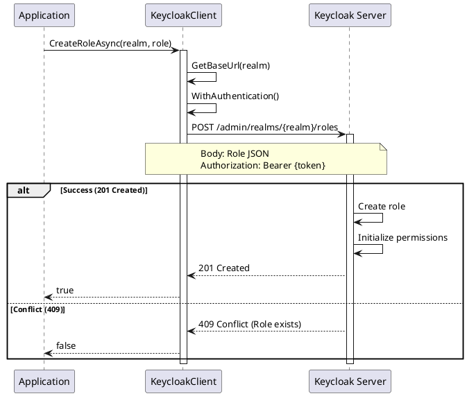
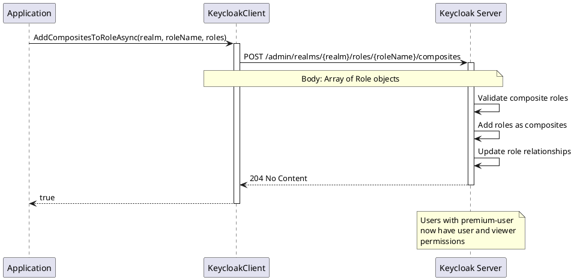
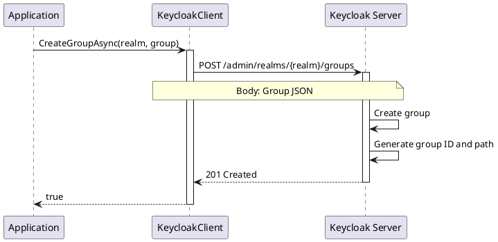
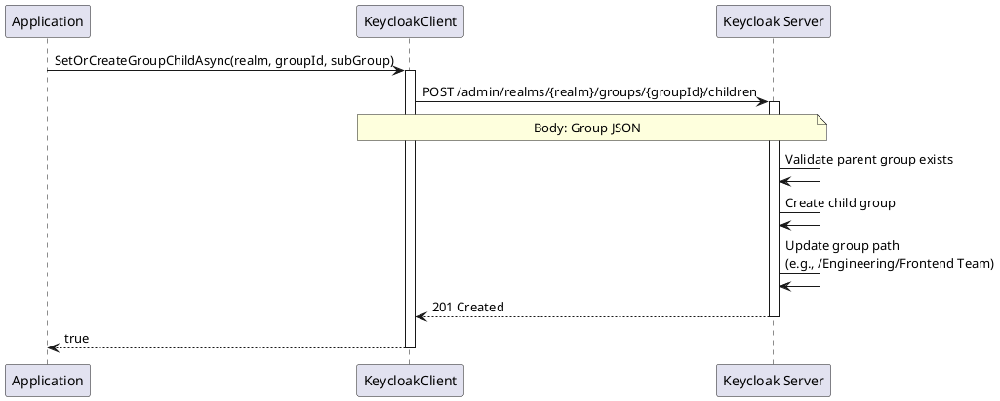
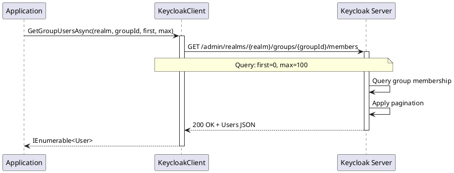

# Role and Group Management - Operations

> **Document Metadata**
> Last Updated: 2026-01-20 19:30:00 UTC
> Git Commit: `9bc2d34` (9bc2d34a37e88fae053f63977e0bfbd02a61441d)
> Library Version: 2.0.2

## Overview

The Role and Group Management APIs provide comprehensive operations for managing authorization through roles and organizing users through groups in Keycloak. Roles define permissions and access levels, while groups provide a way to organize users and assign common attributes or roles.

## Table of Contents

- [Key Concepts](#key-concepts)
  - [Roles](#roles)
  - [Groups](#groups)
- [Role Management](#role-management)
  - [Role Model](#role-model)
- [Realm Role Operations](#realm-role-operations)
  - [Create Realm Role](#create-realm-role)
  - [Get Realm Roles](#get-realm-roles)
  - [Get Realm Role by Name](#get-realm-role-by-name)
  - [Update Realm Role](#update-realm-role)
  - [Delete Realm Role](#delete-realm-role)
- [Client Role Operations](#client-role-operations)
  - [Create Client Role](#create-client-role)
  - [Get Client Roles](#get-client-roles)
  - [Get Client Role by Name](#get-client-role-by-name)
  - [Update Client Role](#update-client-role)
  - [Delete Client Role](#delete-client-role)
- [Composite Role Operations](#composite-role-operations)
  - [Add Composites to Realm Role](#add-composites-to-realm-role)
  - [Get Role Composites](#get-role-composites)
  - [Remove Composites from Role](#remove-composites-from-role)
  - [Get Application Roles for Composite](#get-application-roles-for-composite)
  - [Get Realm Roles for Composite](#get-realm-roles-for-composite)
- [Role Associations](#role-associations)
  - [Get Groups with Role](#get-groups-with-role)
  - [Get Users with Role](#get-users-with-role)
- [Role Authorization Permissions](#role-authorization-permissions)
  - [Get Role Authorization Permissions](#get-role-authorization-permissions)
  - [Set Role Authorization Permissions](#set-role-authorization-permissions)
- [Group Management](#group-management-1)
  - [Group Model](#group-model)
- [Group CRUD Operations](#group-crud-operations)
  - [Create Group](#create-group)
  - [Get Group Hierarchy](#get-group-hierarchy)
  - [Get Groups Count](#get-groups-count)
  - [Get Group by ID](#get-group-by-id)
  - [Update Group](#update-group)
  - [Delete Group](#delete-group)
- [Group Hierarchy Operations](#group-hierarchy-operations)
  - [Create Child Group](#create-child-group)
- [Group Members](#group-members)
  - [Get Group Members](#get-group-members)
- [Group Permissions](#group-permissions)
  - [Get Group Authorization Permissions](#get-group-authorization-permissions)
  - [Set Group Authorization Permissions](#set-group-authorization-permissions)
- [Complete Example: Role and Group Setup](#complete-example-role-and-group-setup)
- [Best Practices](#best-practices)
  - [Roles](#roles-1)
  - [Groups](#groups-1)
- [Common Patterns](#common-patterns)
  - [Role-Based Access Control (RBAC)](#role-based-access-control-rbac)
  - [Organizational Structure](#organizational-structure)
- [Error Codes](#error-codes)
- [Related Resources](#related-resources)

## Key Concepts

### Roles
- **Realm Roles**: Global roles available across all clients in a realm
- **Client Roles**: Specific to a particular client application
- **Composite Roles**: Roles that contain other roles
- **Role Mappings**: Assignment of roles to users or groups

### Groups
- **Hierarchical Structure**: Groups can have parent-child relationships
- **Attributes**: Groups can have custom attributes
- **Role Inheritance**: Users inherit roles from their groups
- **Member Management**: Users can belong to multiple groups

## Role Management

### Role Model

```csharp
public class Role
{
    public string Id { get; set; }
    public string Name { get; set; }
    public string Description { get; set; }
    public bool? Composite { get; set; }
    public bool? ClientRole { get; set; }
    public string ContainerId { get; set; }
    public Dictionary<string, object> Attributes { get; set; }
}
```

## Realm Role Operations

### Create Realm Role

Creates a new realm-level role.

```csharp
var role = new Role
{
    Name = "premium-user",
    Description = "Premium subscription users",
    Composite = false,
    Attributes = new Dictionary<string, object>
    {
        ["priority"] = new[] { "high" }
    }
};

bool success = await client.CreateRoleAsync("my-company", role);
```

**Sequence Diagram:**



**Returns:** `bool` - `true` if role was created successfully

**Location:** `/src/Keycloak.ApiClient.Net/Roles/KeycloakClient.cs:139`

### Get Realm Roles

Retrieves realm roles with optional filtering and pagination.

```csharp
// Get all realm roles
var roles = await client.GetRolesAsync("my-company");

// Search and paginate
var roles = await client.GetRolesAsync(
    realm: "my-company",
    search: "admin",
    first: 0,
    max: 20
);

foreach (var role in roles)
{
    Console.WriteLine($"Role: {role.Name}, Composite: {role.Composite}");
}
```

**Parameters:**
- `realm` (required) - The realm name
- `first` - Offset for pagination
- `max` - Maximum results to return
- `search` - Search term for role names

**Returns:** `IEnumerable<Role>`

**Location:** `/src/Keycloak.ApiClient.Net/Roles/KeycloakClient.cs:148`

### Get Realm Role by Name

Retrieves a specific realm role by its name.

```csharp
Role role = await client.GetRoleByNameAsync("my-company", "premium-user");

Console.WriteLine($"Role ID: {role.Id}");
Console.WriteLine($"Description: {role.Description}");
```

**Returns:** `Role`

**Location:** `/src/Keycloak.ApiClient.Net/Roles/KeycloakClient.cs:164`

### Update Realm Role

Updates an existing realm role.

```csharp
role.Description = "Premium users with full access";
role.Attributes["priority"] = new[] { "very-high" };

bool success = await client.UpdateRoleByNameAsync("my-company", "premium-user", role);
```

**Returns:** `bool` - `true` if update was successful

**Location:** `/src/Keycloak.ApiClient.Net/Roles/KeycloakClient.cs:169`

### Delete Realm Role

Deletes a realm role.

```csharp
bool success = await client.DeleteRoleByNameAsync("my-company", "premium-user");
```

**Returns:** `bool` - `true` if deletion was successful

**Location:** `/src/Keycloak.ApiClient.Net/Roles/KeycloakClient.cs:178`

## Client Role Operations

### Create Client Role

Creates a new client-specific role.

```csharp
var role = new Role
{
    Name = "report-viewer",
    Description = "Can view reports in the application",
    Composite = false
};

bool success = await client.CreateRoleAsync("my-company", clientId, role);
```

**Returns:** `bool` - `true` if role was created successfully

**Location:** `/src/Keycloak.ApiClient.Net/Roles/KeycloakClient.cs:15`

### Get Client Roles

Retrieves roles for a specific client.

```csharp
var clientRoles = await client.GetRolesAsync(
    realm: "my-company",
    clientId: clientId,
    search: "admin",
    first: 0,
    max: 20
);

foreach (var role in clientRoles)
{
    Console.WriteLine($"Client Role: {role.Name}");
}
```

**Returns:** `IEnumerable<Role>`

**Location:** `/src/Keycloak.ApiClient.Net/Roles/KeycloakClient.cs:24`

### Get Client Role by Name

Retrieves a specific client role by its name.

```csharp
Role role = await client.GetRoleByNameAsync("my-company", clientId, "report-viewer");
```

**Returns:** `Role`

**Location:** `/src/Keycloak.ApiClient.Net/Roles/KeycloakClient.cs:40`

### Update Client Role

Updates an existing client role.

```csharp
role.Description = "Updated description";
bool success = await client.UpdateRoleByNameAsync("my-company", clientId, "report-viewer", role);
```

**Returns:** `bool` - `true` if update was successful

**Location:** `/src/Keycloak.ApiClient.Net/Roles/KeycloakClient.cs:45`

### Delete Client Role

Deletes a client role.

```csharp
bool success = await client.DeleteRoleByNameAsync("my-company", clientId, "report-viewer");
```

**Returns:** `bool` - `true` if deletion was successful

**Location:** `/src/Keycloak.ApiClient.Net/Roles/KeycloakClient.cs:54`

## Composite Role Operations

### Add Composites to Realm Role

Adds child roles to a composite realm role.

```csharp
// Get the roles to add as composites
var userRole = await client.GetRoleByNameAsync("my-company", "user");
var viewerRole = await client.GetRoleByNameAsync("my-company", "viewer");

var compositeRoles = new List<Role> { userRole, viewerRole };

bool success = await client.AddCompositesToRoleAsync(
    "my-company",
    "premium-user",
    compositeRoles
);
```

**Sequence Diagram:**



**Returns:** `bool` - `true` if composites were added successfully

**Location:** `/src/Keycloak.ApiClient.Net/Roles/KeycloakClient.cs:187` (realm) and `:63` (client)

### Get Role Composites

Retrieves all composite roles for a role.

```csharp
// Realm role composites
var composites = await client.GetRoleCompositesAsync("my-company", "premium-user");

// Client role composites
var composites = await client.GetRoleCompositesAsync("my-company", clientId, "admin");

foreach (var composite in composites)
{
    Console.WriteLine($"Composite Role: {composite.Name}");
}
```

**Returns:** `IEnumerable<Role>`

**Location:** `/src/Keycloak.ApiClient.Net/Roles/KeycloakClient.cs:196` (realm) and `:72` (client)

### Remove Composites from Role

Removes child roles from a composite role.

```csharp
var rolesToRemove = new List<Role> { viewerRole };

bool success = await client.RemoveCompositesFromRoleAsync(
    "my-company",
    "premium-user",
    rolesToRemove
);
```

**Returns:** `bool` - `true` if composites were removed successfully

**Location:** `/src/Keycloak.ApiClient.Net/Roles/KeycloakClient.cs:201` (realm) and `:77` (client)

### Get Application Roles for Composite

Gets client-specific roles within a composite role.

```csharp
// Realm role
var appRoles = await client.GetApplicationRolesForCompositeAsync(
    "my-company",
    "premium-user",
    forClientId
);

// Client role
var appRoles = await client.GetApplicationRolesForCompositeAsync(
    "my-company",
    clientId,
    "admin",
    forClientId
);
```

**Returns:** `IEnumerable<Role>`

**Location:** `/src/Keycloak.ApiClient.Net/Roles/KeycloakClient.cs:210` (realm) and `:86` (client)

### Get Realm Roles for Composite

Gets realm roles within a composite role.

```csharp
// Realm role
var realmRoles = await client.GetRealmRolesForCompositeAsync("my-company", "premium-user");

// Client role
var realmRoles = await client.GetRealmRolesForCompositeAsync(
    "my-company",
    clientId,
    "admin"
);
```

**Returns:** `IEnumerable<Role>`

**Location:** `/src/Keycloak.ApiClient.Net/Roles/KeycloakClient.cs:215` (realm) and `:91` (client)

## Role Associations

### Get Groups with Role

Retrieves groups that have a specific role assigned.

```csharp
var groups = await client.GetGroupsWithRoleNameAsync(
    realm: "my-company",
    roleName: "premium-user",
    first: 0,
    max: 100,
    full: true
);
```

**Note:** This method is marked as `[Obsolete("Not working yet")]`

**Location:** `/src/Keycloak.ApiClient.Net/Roles/KeycloakClient.cs:221` (realm) and `:97` (client)

### Get Users with Role

Retrieves users that have a specific role assigned.

```csharp
// Realm role
var users = await client.GetUsersWithRoleNameAsync(
    realm: "my-company",
    roleName: "premium-user",
    first: 0,
    max: 100
);

// Client role
var users = await client.GetUsersWithRoleNameAsync(
    realm: "my-company",
    clientId: clientId,
    roleName: "report-viewer",
    first: 0,
    max: 100
);

foreach (var user in users)
{
    Console.WriteLine($"User: {user.Username}");
}
```

**Returns:** `IEnumerable<User>`

**Location:** `/src/Keycloak.ApiClient.Net/Roles/KeycloakClient.cs:249` (realm) and `:124` (client)

## Role Authorization Permissions

### Get Role Authorization Permissions

Retrieves authorization permissions for a role.

```csharp
ManagementPermission permissions =
    await client.GetRoleAuthorizationPermissionsInitializedAsync(
        "my-company",
        "premium-user"
    );
```

**Note:** This method is marked as `[Obsolete("501 Not Implemented")]`

**Location:** `/src/Keycloak.ApiClient.Net/Roles/KeycloakClient.cs:238` (realm) and `:113` (client)

### Set Role Authorization Permissions

Initializes or updates authorization permissions for a role.

```csharp
var permissions = new ManagementPermission
{
    Enabled = true
};

ManagementPermission result =
    await client.SetRoleAuthorizationPermissionsInitializedAsync(
        "my-company",
        "premium-user",
        permissions
    );
```

**Returns:** `ManagementPermission`

**Location:** `/src/Keycloak.ApiClient.Net/Roles/KeycloakClient.cs:243` (realm) and `:118` (client)

## Group Management

### Group Model

```csharp
public class Group
{
    public string Id { get; set; }
    public string Name { get; set; }
    public string Path { get; set; }
    public List<Group> SubGroups { get; set; }
    public Dictionary<string, object> Attributes { get; set; }
    public List<string> RealmRoles { get; set; }
    public Dictionary<string, object> ClientRoles { get; set; }
}
```

## Group CRUD Operations

### Create Group

Creates a new group in the realm.

```csharp
var group = new Group
{
    Name = "Engineering",
    Attributes = new Dictionary<string, object>
    {
        ["department"] = new[] { "IT" },
        ["location"] = new[] { "New York" }
    }
};

bool success = await client.CreateGroupAsync("my-company", group);
```

**Sequence Diagram:**



**Returns:** `bool` - `true` if group was created successfully

**Location:** `/src/Keycloak.ApiClient.Net/Groups/KeycloakClient.cs:15`

### Get Group Hierarchy

Retrieves groups with their hierarchical structure.

```csharp
// Get all groups
var groups = await client.GetGroupHierarchyAsync("my-company");

// Search and paginate
var groups = await client.GetGroupHierarchyAsync(
    realm: "my-company",
    search: "Engineering",
    first: 0,
    max: 20
);

foreach (var group in groups)
{
    Console.WriteLine($"Group: {group.Name}, Path: {group.Path}");
    if (group.SubGroups != null)
    {
        foreach (var subGroup in group.SubGroups)
        {
            Console.WriteLine($"  - Subgroup: {subGroup.Name}");
        }
    }
}
```

**Parameters:**
- `realm` (required) - The realm name
- `first` - Offset for pagination
- `max` - Maximum results to return
- `search` - Search term for group names

**Returns:** `IEnumerable<Group>` with hierarchical structure

**Location:** `/src/Keycloak.ApiClient.Net/Groups/KeycloakClient.cs:24`

### Get Groups Count

Gets the total count of groups.

```csharp
long groupCount = await client.GetGroupsCountAsync(
    realm: "my-company",
    search: "Engineering",
    top: true  // Count only top-level groups
);

Console.WriteLine($"Total groups: {groupCount}");
```

**Returns:** `long` - Number of groups

**Location:** `/src/Keycloak.ApiClient.Net/Groups/KeycloakClient.cs:41`

### Get Group by ID

Retrieves a specific group by its ID.

```csharp
Group group = await client.GetGroupAsync("my-company", groupId);

Console.WriteLine($"Group: {group.Name}");
Console.WriteLine($"Path: {group.Path}");
Console.WriteLine($"Members: {group.Attributes?["memberCount"]}");
```

**Returns:** `Group`

**Location:** `/src/Keycloak.ApiClient.Net/Groups/KeycloakClient.cs:58`

### Update Group

Updates an existing group.

```csharp
group.Name = "Engineering Department";
group.Attributes["location"] = new[] { "San Francisco" };

bool success = await client.UpdateGroupAsync("my-company", groupId, group);
```

**Returns:** `bool` - `true` if update was successful

**Location:** `/src/Keycloak.ApiClient.Net/Groups/KeycloakClient.cs:68`

### Delete Group

Deletes a group and all its subgroups.

```csharp
bool success = await client.DeleteGroupAsync("my-company", groupId);
```

**Warning:** This also deletes all subgroups within the group.

**Returns:** `bool` - `true` if deletion was successful

**Location:** `/src/Keycloak.ApiClient.Net/Groups/KeycloakClient.cs:77`

## Group Hierarchy Operations

### Create Child Group

Creates a subgroup within an existing group.

```csharp
var subGroup = new Group
{
    Name = "Frontend Team",
    Attributes = new Dictionary<string, object>
    {
        ["team"] = new[] { "frontend" }
    }
};

bool success = await client.SetOrCreateGroupChildAsync("my-company", parentGroupId, subGroup);
```

**Sequence Diagram:**



**Returns:** `bool` - `true` if child group was created successfully

**Location:** `/src/Keycloak.ApiClient.Net/Groups/KeycloakClient.cs:86`

## Group Members

### Get Group Members

Retrieves users that are members of a group.

```csharp
var members = await client.GetGroupUsersAsync(
    realm: "my-company",
    groupId: groupId,
    first: 0,
    max: 100
);

foreach (var user in members)
{
    Console.WriteLine($"Member: {user.Username} ({user.Email})");
}
```

**Sequence Diagram:**



**Returns:** `IEnumerable<User>`

**Location:** `/src/Keycloak.ApiClient.Net/Groups/KeycloakClient.cs:107`

## Group Permissions

### Get Group Authorization Permissions

Retrieves authorization permissions for a group.

```csharp
ManagementPermission permissions =
    await client.GetGroupClientAuthorizationPermissionsInitializedAsync(
        "my-company",
        groupId
    );

Console.WriteLine($"Permissions Enabled: {permissions.Enabled}");
```

**Returns:** `ManagementPermission`

**Location:** `/src/Keycloak.ApiClient.Net/Groups/KeycloakClient.cs:95`

### Set Group Authorization Permissions

Initializes or updates authorization permissions for a group.

```csharp
var permissions = new ManagementPermission
{
    Enabled = true
};

ManagementPermission result =
    await client.SetGroupClientAuthorizationPermissionsInitializedAsync(
        "my-company",
        groupId,
        permissions
    );
```

**Returns:** `ManagementPermission`

**Location:** `/src/Keycloak.ApiClient.Net/Groups/KeycloakClient.cs:100`

## Complete Example: Role and Group Setup

```csharp
using Keycloak.ApiClient.Net;
using Keycloak.ApiClient.Net.Models.Roles;
using Keycloak.ApiClient.Net.Models.Groups;

public class RoleGroupManagement
{
    private readonly KeycloakClient _client;

    public RoleGroupManagement(string url, string username, string password)
    {
        _client = new KeycloakClient(url, username, password);
    }

    public async Task SetupRolesAndGroupsExample()
    {
        string realm = "my-company";

        // 1. Create realm roles
        var userRole = new Role
        {
            Name = "user",
            Description = "Basic user role"
        };
        await _client.CreateRoleAsync(realm, userRole);

        var premiumRole = new Role
        {
            Name = "premium-user",
            Description = "Premium subscription users",
            Composite = true
        };
        await _client.CreateRoleAsync(realm, premiumRole);

        var adminRole = new Role
        {
            Name = "admin",
            Description = "Administrator role",
            Composite = true
        };
        await _client.CreateRoleAsync(realm, adminRole);

        Console.WriteLine("Roles created");

        // 2. Create composite role relationships
        var baseUserRole = await _client.GetRoleByNameAsync(realm, "user");
        var compositeRoles = new List<Role> { baseUserRole };

        await _client.AddCompositesToRoleAsync(realm, "premium-user", compositeRoles);
        Console.WriteLine("Premium-user role now includes user role");

        var premiumUserRole = await _client.GetRoleByNameAsync(realm, "premium-user");
        var adminComposites = new List<Role> { premiumUserRole };

        await _client.AddCompositesToRoleAsync(realm, "admin", adminComposites);
        Console.WriteLine("Admin role now includes premium-user and user roles");

        // 3. Create group hierarchy
        var engineeringGroup = new Group
        {
            Name = "Engineering",
            Attributes = new Dictionary<string, object>
            {
                ["department"] = new[] { "IT" }
            }
        };
        await _client.CreateGroupAsync(realm, engineeringGroup);

        // Get the created group to get its ID
        var groups = await _client.GetGroupHierarchyAsync(realm, search: "Engineering");
        var engGroup = groups.FirstOrDefault();

        if (engGroup != null)
        {
            // Create subgroups
            var frontendTeam = new Group
            {
                Name = "Frontend Team"
            };
            await _client.SetOrCreateGroupChildAsync(realm, engGroup.Id, frontendTeam);

            var backendTeam = new Group
            {
                Name = "Backend Team"
            };
            await _client.SetOrCreateGroupChildAsync(realm, engGroup.Id, backendTeam);

            Console.WriteLine("Engineering group with teams created");

            // 4. Get group members
            var members = await _client.GetGroupUsersAsync(realm, engGroup.Id);
            Console.WriteLine($"Engineering group has {members.Count()} members");

            // 5. View role composites
            var adminCompositeRoles = await _client.GetRoleCompositesAsync(realm, "admin");
            Console.WriteLine($"Admin role includes {adminCompositeRoles.Count()} composite roles:");
            foreach (var role in adminCompositeRoles)
            {
                Console.WriteLine($"  - {role.Name}");
            }

            // 6. Find users with specific role
            var adminUsers = await _client.GetUsersWithRoleNameAsync(realm, "admin");
            Console.WriteLine($"Users with admin role: {adminUsers.Count()}");
        }
    }
}
```

## Best Practices

### Roles

1. **Role Naming**
   - Use clear, descriptive names
   - Follow consistent naming conventions
   - Use lowercase with hyphens (e.g., `premium-user`)

2. **Composite Roles**
   - Use composites for role hierarchies
   - Keep composite relationships logical
   - Document role relationships

3. **Role Assignment**
   - Assign roles through groups when possible
   - Use least privilege principle
   - Avoid direct user role assignments for large user bases

4. **Client vs Realm Roles**
   - Use realm roles for cross-application permissions
   - Use client roles for application-specific permissions
   - Keep role count manageable

### Groups

1. **Group Hierarchy**
   - Design logical hierarchies
   - Keep depth reasonable (3-4 levels max)
   - Use meaningful group names

2. **Group Attributes**
   - Use attributes for metadata
   - Keep attribute values consistent
   - Document custom attributes

3. **Group Membership**
   - Add users to groups, not individual roles
   - Use groups for organizational structure
   - Monitor group sizes for performance

4. **Permissions**
   - Enable group permissions when needed
   - Regular audit of group access
   - Document permission policies

## Common Patterns

### Role-Based Access Control (RBAC)

```csharp
// Create role hierarchy
await _client.CreateRoleAsync(realm, new Role { Name = "viewer" });
await _client.CreateRoleAsync(realm, new Role { Name = "editor", Composite = true });
await _client.CreateRoleAsync(realm, new Role { Name = "admin", Composite = true });

// Build hierarchy: admin > editor > viewer
var viewerRole = await _client.GetRoleByNameAsync(realm, "viewer");
await _client.AddCompositesToRoleAsync(realm, "editor", new[] { viewerRole });

var editorRole = await _client.GetRoleByNameAsync(realm, "editor");
await _client.AddCompositesToRoleAsync(realm, "admin", new[] { editorRole });
```

### Organizational Structure

```csharp
// Create departments
var salesGroup = new Group { Name = "Sales" };
var engineeringGroup = new Group { Name = "Engineering" };

await _client.CreateGroupAsync(realm, salesGroup);
await _client.CreateGroupAsync(realm, engineeringGroup);

// Create teams within departments
var groups = await _client.GetGroupHierarchyAsync(realm);
var sales = groups.First(g => g.Name == "Sales");
var engineering = groups.First(g => g.Name == "Engineering");

await _client.SetOrCreateGroupChildAsync(realm, sales.Id, new Group { Name = "EMEA Sales" });
await _client.SetOrCreateGroupChildAsync(realm, sales.Id, new Group { Name = "APAC Sales" });

await _client.SetOrCreateGroupChildAsync(realm, engineering.Id, new Group { Name = "Backend" });
await _client.SetOrCreateGroupChildAsync(realm, engineering.Id, new Group { Name = "Frontend" });
```

## Error Codes

| HTTP Code | Meaning | Common Causes |
|-----------|---------|---------------|
| 400 | Bad Request | Invalid role/group data, circular composite roles |
| 401 | Unauthorized | Invalid or expired authentication token |
| 403 | Forbidden | Insufficient permissions |
| 404 | Not Found | Role/Group ID doesn't exist |
| 409 | Conflict | Role/Group name already exists |
| 500 | Server Error | Keycloak internal error |

## Related Resources

- [Keycloak Roles API Documentation](https://www.keycloak.org/docs-api/latest/rest-api/index.html#_roles_resource)
- [Keycloak Groups API Documentation](https://www.keycloak.org/docs-api/latest/rest-api/index.html#_groups_resource)
- [Role-Based Access Control (RBAC)](https://en.wikipedia.org/wiki/Role-based_access_control)
- [User Management Documentation](./user-management-operations.md)
- [Client Management Documentation](./client-management-operations.md)
