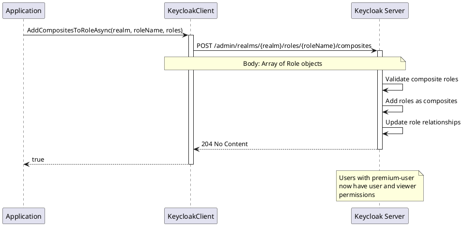

# Composite Role Operations

> **Document Metadata**
> Last Updated: 2026-01-20 19:30:00 UTC
> Git Commit: `9bc2d34` (9bc2d34a37e88fae053f63977e0bfbd02a61441d)
> Library Version: 2.0.2

## Overview

Composite roles are roles that contain other roles, allowing you to build hierarchical permission structures. When a user is assigned a composite role, they automatically inherit all permissions from the roles it contains. This section covers operations for managing composite role relationships.

## Table of Contents

- [Add Composites to Realm Role](#add-composites-to-realm-role)
- [Get Role Composites](#get-role-composites)
- [Remove Composites from Role](#remove-composites-from-role)
- [Get Application Roles for Composite](#get-application-roles-for-composite)
- [Get Realm Roles for Composite](#get-realm-roles-for-composite)

## Add Composites to Realm Role

Adds child roles to a composite realm role.

```csharp
// Get the roles to add as composites
var userRole = await client.GetRoleByNameAsync("my-company", "user");
var viewerRole = await client.GetRoleByNameAsync("my-company", "viewer");

var compositeRoles = new List<Role> { userRole, viewerRole };

bool success = await client.AddCompositesToRoleAsync(
    "my-company",
    "premium-user",
    compositeRoles
);
```

**Sequence Diagram:**



**Returns:** `bool` - `true` if composites were added successfully

**Location:** `/src/Keycloak.ApiClient.Net/Roles/KeycloakClient.cs:187` (realm) and `:63` (client)

## Get Role Composites

Retrieves all composite roles for a role.

```csharp
// Realm role composites
var composites = await client.GetRoleCompositesAsync("my-company", "premium-user");

// Client role composites
var composites = await client.GetRoleCompositesAsync("my-company", clientId, "admin");

foreach (var composite in composites)
{
    Console.WriteLine($"Composite Role: {composite.Name}");
}
```

**Returns:** `IEnumerable<Role>`

**Location:** `/src/Keycloak.ApiClient.Net/Roles/KeycloakClient.cs:196` (realm) and `:72` (client)

## Remove Composites from Role

Removes child roles from a composite role.

```csharp
var rolesToRemove = new List<Role> { viewerRole };

bool success = await client.RemoveCompositesFromRoleAsync(
    "my-company",
    "premium-user",
    rolesToRemove
);
```

**Returns:** `bool` - `true` if composites were removed successfully

**Location:** `/src/Keycloak.ApiClient.Net/Roles/KeycloakClient.cs:201` (realm) and `:77` (client)

## Get Application Roles for Composite

Gets client-specific roles within a composite role.

```csharp
// Realm role
var appRoles = await client.GetApplicationRolesForCompositeAsync(
    "my-company",
    "premium-user",
    forClientId
);

// Client role
var appRoles = await client.GetApplicationRolesForCompositeAsync(
    "my-company",
    clientId,
    "admin",
    forClientId
);
```

**Returns:** `IEnumerable<Role>`

**Location:** `/src/Keycloak.ApiClient.Net/Roles/KeycloakClient.cs:210` (realm) and `:86` (client)

## Get Realm Roles for Composite

Gets realm roles within a composite role.

```csharp
// Realm role
var realmRoles = await client.GetRealmRolesForCompositeAsync("my-company", "premium-user");

// Client role
var realmRoles = await client.GetRealmRolesForCompositeAsync(
    "my-company",
    clientId,
    "admin"
);
```

**Returns:** `IEnumerable<Role>`

**Location:** `/src/Keycloak.ApiClient.Net/Roles/KeycloakClient.cs:215` (realm) and `:91` (client)

## Best Practices

1. **Hierarchy Design**
   - Design logical role hierarchies
   - Keep hierarchies shallow (2-3 levels)
   - Avoid circular dependencies

2. **Composite Role Usage**
   - Use for inheritance of permissions
   - Combine realm and client roles
   - Document composite relationships

3. **Role Composition**
   - Include only necessary roles
   - Avoid redundant compositions
   - Keep composite roles maintainable

4. **Validation**
   - Check for circular references before adding composites
   - Validate role existence before composition
   - Test permission inheritance

## Example: Building Role Hierarchies

```csharp
using Keycloak.ApiClient.Net;
using Keycloak.ApiClient.Net.Models.Roles;

public async Task BuildRoleHierarchy()
{
    var client = new KeycloakClient(url, username, password);
    string realm = "my-company";

    // Create base roles
    await client.CreateRoleAsync(realm, new Role { Name = "viewer" });
    await client.CreateRoleAsync(realm, new Role { Name = "editor", Composite = true });
    await client.CreateRoleAsync(realm, new Role { Name = "admin", Composite = true });

    // Build hierarchy: viewer < editor < admin
    var viewerRole = await client.GetRoleByNameAsync(realm, "viewer");
    await client.AddCompositesToRoleAsync(realm, "editor", new[] { viewerRole });

    var editorRole = await client.GetRoleByNameAsync(realm, "editor");
    await client.AddCompositesToRoleAsync(realm, "admin", new[] { editorRole });

    // Verify hierarchy
    var adminComposites = await client.GetRoleCompositesAsync(realm, "admin");
    Console.WriteLine($"Admin role includes {adminComposites.Count()} composite roles:");
    foreach (var role in adminComposites)
    {
        Console.WriteLine($"  - {role.Name}");
    }
}
```

## Common Patterns

### Three-Tier Permission Model

```csharp
// Create tiered access
await client.CreateRoleAsync(realm, new Role { Name = "read-only" });
await client.CreateRoleAsync(realm, new Role { Name = "standard-user", Composite = true });
await client.CreateRoleAsync(realm, new Role { Name = "power-user", Composite = true });

// Standard user = read-only + write permissions
var readOnly = await client.GetRoleByNameAsync(realm, "read-only");
await client.AddCompositesToRoleAsync(realm, "standard-user", new[] { readOnly });

// Power user = standard user + advanced features
var standardUser = await client.GetRoleByNameAsync(realm, "standard-user");
await client.AddCompositesToRoleAsync(realm, "power-user", new[] { standardUser });
```

### Mixed Realm and Client Roles

```csharp
// Create composite with both realm and client roles
var realmRole = await client.GetRoleByNameAsync(realm, "verified-user");
var clientRole = await client.GetRoleByNameAsync(realm, clientId, "app-access");

var composites = new List<Role> { realmRole, clientRole };
await client.AddCompositesToRoleAsync(realm, "premium-member", composites);
```

## Related Resources

- [Realm Role Operations](./realm-roles.md)
- [Client Role Operations](./client-roles.md)
- [Role Associations](./role-associations.md)
- [Main Documentation](./README.md)
