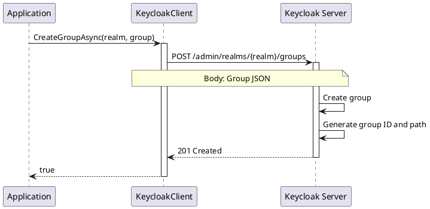

# Group CRUD Operations

> **Document Metadata**
> Last Updated: 2026-01-20 19:30:00 UTC
> Git Commit: `9bc2d34` (9bc2d34a37e88fae053f63977e0bfbd02a61441d)
> Library Version: 2.0.2

## Overview

Groups provide a way to organize users and manage common attributes and role assignments. This section covers basic CRUD (Create, Read, Update, Delete) operations for groups in Keycloak.

## Table of Contents

- [Create Group](#create-group)
- [Get Group Hierarchy](#get-group-hierarchy)
- [Get Groups Count](#get-groups-count)
- [Get Group by ID](#get-group-by-id)
- [Update Group](#update-group)
- [Delete Group](#delete-group)

## Create Group

Creates a new group in the realm.

```csharp
var group = new Group
{
    Name = "Engineering",
    Attributes = new Dictionary<string, object>
    {
        ["department"] = new[] { "IT" },
        ["location"] = new[] { "New York" }
    }
};

bool success = await client.CreateGroupAsync("my-company", group);
```

**Sequence Diagram:**



**Returns:** `bool` - `true` if group was created successfully

**Location:** `/src/Keycloak.ApiClient.Net/Groups/KeycloakClient.cs:15`

## Get Group Hierarchy

Retrieves groups with their hierarchical structure.

```csharp
// Get all groups
var groups = await client.GetGroupHierarchyAsync("my-company");

// Search and paginate
var groups = await client.GetGroupHierarchyAsync(
    realm: "my-company",
    search: "Engineering",
    first: 0,
    max: 20
);

foreach (var group in groups)
{
    Console.WriteLine($"Group: {group.Name}, Path: {group.Path}");
    if (group.SubGroups != null)
    {
        foreach (var subGroup in group.SubGroups)
        {
            Console.WriteLine($"  - Subgroup: {subGroup.Name}");
        }
    }
}
```

**Parameters:**
- `realm` (required) - The realm name
- `first` - Offset for pagination
- `max` - Maximum results to return
- `search` - Search term for group names

**Returns:** `IEnumerable<Group>` with hierarchical structure

**Location:** `/src/Keycloak.ApiClient.Net/Groups/KeycloakClient.cs:24`

## Get Groups Count

Gets the total count of groups.

```csharp
long groupCount = await client.GetGroupsCountAsync(
    realm: "my-company",
    search: "Engineering",
    top: true  // Count only top-level groups
);

Console.WriteLine($"Total groups: {groupCount}");
```

**Parameters:**
- `realm` (required) - The realm name
- `search` - Search term to filter groups
- `top` - If true, count only top-level groups

**Returns:** `long` - Number of groups

**Location:** `/src/Keycloak.ApiClient.Net/Groups/KeycloakClient.cs:41`

## Get Group by ID

Retrieves a specific group by its ID.

```csharp
Group group = await client.GetGroupAsync("my-company", groupId);

Console.WriteLine($"Group: {group.Name}");
Console.WriteLine($"Path: {group.Path}");
Console.WriteLine($"Members: {group.Attributes?["memberCount"]}");
```

**Parameters:**
- `realm` (required) - The realm name
- `groupId` (required) - The unique group identifier

**Returns:** `Group`

**Location:** `/src/Keycloak.ApiClient.Net/Groups/KeycloakClient.cs:58`

## Update Group

Updates an existing group.

```csharp
group.Name = "Engineering Department";
group.Attributes["location"] = new[] { "San Francisco" };

bool success = await client.UpdateGroupAsync("my-company", groupId, group);
```

**Parameters:**
- `realm` (required) - The realm name
- `groupId` (required) - The unique group identifier
- `group` (required) - The updated group object

**Returns:** `bool` - `true` if update was successful

**Location:** `/src/Keycloak.ApiClient.Net/Groups/KeycloakClient.cs:68`

## Delete Group

Deletes a group and all its subgroups.

```csharp
bool success = await client.DeleteGroupAsync("my-company", groupId);
```

**Warning:** This also deletes all subgroups within the group.

**Parameters:**
- `realm` (required) - The realm name
- `groupId` (required) - The unique group identifier

**Returns:** `bool` - `true` if deletion was successful

**Location:** `/src/Keycloak.ApiClient.Net/Groups/KeycloakClient.cs:77`

## Best Practices

1. **Group Naming**
   - Use clear, descriptive names
   - Follow organizational structure
   - Keep names consistent

2. **Group Attributes**
   - Use attributes for metadata
   - Store organizational data
   - Keep attribute names consistent

3. **Group Management**
   - Plan group hierarchy before creation
   - Use meaningful group paths
   - Document group purposes

4. **Deletion Caution**
   - Always verify before deleting groups
   - Remember that deletion cascades to subgroups
   - Consider archiving instead of deletion

## Example: Complete Group Management

```csharp
using Keycloak.ApiClient.Net;
using Keycloak.ApiClient.Net.Models.Groups;

public class GroupManagement
{
    private readonly KeycloakClient _client;

    public GroupManagement(string url, string username, string password)
    {
        _client = new KeycloakClient(url, username, password);
    }

    public async Task ManageGroups()
    {
        string realm = "my-company";

        // Create a new group
        var engineeringGroup = new Group
        {
            Name = "Engineering",
            Attributes = new Dictionary<string, object>
            {
                ["department"] = new[] { "IT" },
                ["costCenter"] = new[] { "CC-1001" },
                ["location"] = new[] { "New York" }
            }
        };

        bool created = await _client.CreateGroupAsync(realm, engineeringGroup);
        Console.WriteLine($"Group created: {created}");

        // Get all groups
        var allGroups = await _client.GetGroupHierarchyAsync(realm);
        Console.WriteLine($"Total groups: {allGroups.Count()}");

        // Find the created group
        var groups = await _client.GetGroupHierarchyAsync(
            realm: realm,
            search: "Engineering"
        );
        var engGroup = groups.FirstOrDefault();

        if (engGroup != null)
        {
            Console.WriteLine($"Found group: {engGroup.Name}");
            Console.WriteLine($"Path: {engGroup.Path}");

            // Update the group
            engGroup.Attributes["location"] = new[] { "San Francisco" };
            bool updated = await _client.UpdateGroupAsync(realm, engGroup.Id, engGroup);
            Console.WriteLine($"Group updated: {updated}");

            // Get updated group
            var updatedGroup = await _client.GetGroupAsync(realm, engGroup.Id);
            Console.WriteLine($"New location: {updatedGroup.Attributes["location"]}");

            // Get group count
            long count = await _client.GetGroupsCountAsync(realm);
            Console.WriteLine($"Total groups in realm: {count}");
        }
    }
}
```

## Example: Group Search and Pagination

```csharp
public async Task SearchGroups()
{
    var client = new KeycloakClient(url, username, password);
    string realm = "my-company";

    int pageSize = 10;
    int currentPage = 0;
    bool hasMore = true;

    while (hasMore)
    {
        var groups = await client.GetGroupHierarchyAsync(
            realm: realm,
            search: "Engineering",
            first: currentPage * pageSize,
            max: pageSize
        );

        Console.WriteLine($"\n--- Page {currentPage + 1} ---");
        foreach (var group in groups)
        {
            Console.WriteLine($"Group: {group.Name}");
            Console.WriteLine($"  Path: {group.Path}");
            Console.WriteLine($"  Subgroups: {group.SubGroups?.Count ?? 0}");
        }

        hasMore = groups.Count() == pageSize;
        currentPage++;
    }
}
```

## Related Resources

- [Group Hierarchy Operations](./group-hierarchy.md)
- [Group Members](./group-members.md)
- [Group Permissions](./group-permissions.md)
- [Main Documentation](./README.md)
