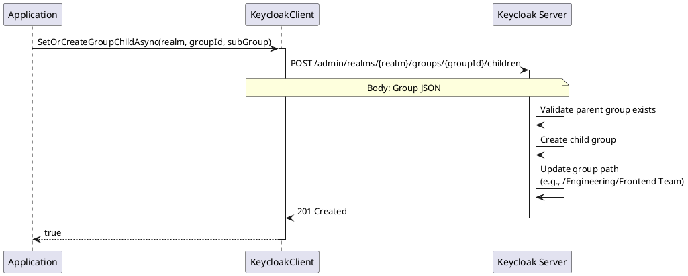

# Group Hierarchy Operations

> **Document Metadata**
> Last Updated: 2026-01-20 19:30:00 UTC
> Git Commit: `9bc2d34` (9bc2d34a37e88fae053f63977e0bfbd02a61441d)
> Library Version: 2.0.2

## Overview

Keycloak supports hierarchical group structures where groups can have parent-child relationships. This allows you to model organizational structures, department hierarchies, and nested team structures. This section covers operations for managing group hierarchies.

## Table of Contents

- [Create Child Group](#create-child-group)
- [Understanding Group Paths](#understanding-group-paths)
- [Working with Hierarchies](#working-with-hierarchies)

## Create Child Group

Creates a subgroup within an existing group.

```csharp
var subGroup = new Group
{
    Name = "Frontend Team",
    Attributes = new Dictionary<string, object>
    {
        ["team"] = new[] { "frontend" }
    }
};

bool success = await client.SetOrCreateGroupChildAsync("my-company", parentGroupId, subGroup);
```

**Sequence Diagram:**



**Parameters:**
- `realm` (required) - The realm name
- `groupId` (required) - The parent group identifier
- `group` (required) - The subgroup to create

**Returns:** `bool` - `true` if child group was created successfully

**Location:** `/src/Keycloak.ApiClient.Net/Groups/KeycloakClient.cs:86`

## Understanding Group Paths

Groups in Keycloak have hierarchical paths that reflect their position in the tree:

- Top-level group: `/Engineering`
- First-level child: `/Engineering/Frontend Team`
- Second-level child: `/Engineering/Frontend Team/UI Developers`

The path is automatically generated and maintained by Keycloak when you create parent-child relationships.

## Working with Hierarchies

### Retrieving Hierarchies

When you call `GetGroupHierarchyAsync()`, Keycloak returns groups with their `SubGroups` property populated:

```csharp
var groups = await client.GetGroupHierarchyAsync("my-company");

foreach (var group in groups)
{
    Console.WriteLine($"Top-level: {group.Name} ({group.Path})");

    if (group.SubGroups != null)
    {
        foreach (var subGroup in group.SubGroups)
        {
            Console.WriteLine($"  Child: {subGroup.Name} ({subGroup.Path})");

            if (subGroup.SubGroups != null)
            {
                foreach (var grandChild in subGroup.SubGroups)
                {
                    Console.WriteLine($"    Grandchild: {grandChild.Name} ({grandChild.Path})");
                }
            }
        }
    }
}
```

## Best Practices

1. **Hierarchy Depth**
   - Keep hierarchies shallow (3-4 levels maximum)
   - Deep hierarchies can impact performance
   - Consider flatter structures with attributes instead

2. **Group Organization**
   - Model real organizational structures
   - Use meaningful names at each level
   - Document hierarchy design decisions

3. **Role Inheritance**
   - Users inherit roles from parent groups
   - Plan role assignments at appropriate levels
   - Avoid role duplication across hierarchy

4. **Refactoring**
   - Moving groups requires deletion and recreation
   - Plan hierarchy structure carefully
   - Test hierarchy changes in non-production first

## Example: Building Organizational Structure

```csharp
using Keycloak.ApiClient.Net;
using Keycloak.ApiClient.Net.Models.Groups;

public async Task BuildOrganizationHierarchy()
{
    var client = new KeycloakClient(url, username, password);
    string realm = "my-company";

    // Create top-level departments
    var engineering = new Group
    {
        Name = "Engineering",
        Attributes = new Dictionary<string, object>
        {
            ["department"] = new[] { "Engineering" },
            ["costCenter"] = new[] { "ENG-001" }
        }
    };
    await client.CreateGroupAsync(realm, engineering);

    var sales = new Group
    {
        Name = "Sales",
        Attributes = new Dictionary<string, object>
        {
            ["department"] = new[] { "Sales" },
            ["costCenter"] = new[] { "SALES-001" }
        }
    };
    await client.CreateGroupAsync(realm, sales);

    // Get the created groups to get their IDs
    var groups = await client.GetGroupHierarchyAsync(realm);
    var engGroup = groups.First(g => g.Name == "Engineering");
    var salesGroup = groups.First(g => g.Name == "Sales");

    // Create engineering teams
    var frontend = new Group
    {
        Name = "Frontend",
        Attributes = new Dictionary<string, object>
        {
            ["team"] = new[] { "frontend" }
        }
    };
    await client.SetOrCreateGroupChildAsync(realm, engGroup.Id, frontend);

    var backend = new Group
    {
        Name = "Backend",
        Attributes = new Dictionary<string, object>
        {
            ["team"] = new[] { "backend" }
        }
    };
    await client.SetOrCreateGroupChildAsync(realm, engGroup.Id, backend);

    var devops = new Group
    {
        Name = "DevOps",
        Attributes = new Dictionary<string, object>
        {
            ["team"] = new[] { "devops" }
        }
    };
    await client.SetOrCreateGroupChildAsync(realm, engGroup.Id, devops);

    // Create sales regions
    var northAmerica = new Group { Name = "North America" };
    await client.SetOrCreateGroupChildAsync(realm, salesGroup.Id, northAmerica);

    var europe = new Group { Name = "Europe" };
    await client.SetOrCreateGroupChildAsync(realm, salesGroup.Id, europe);

    var asia = new Group { Name = "Asia Pacific" };
    await client.SetOrCreateGroupChildAsync(realm, salesGroup.Id, asia);

    // Display the hierarchy
    var fullHierarchy = await client.GetGroupHierarchyAsync(realm);
    DisplayHierarchy(fullHierarchy, 0);
}

private void DisplayHierarchy(IEnumerable<Group> groups, int level)
{
    var indent = new string(' ', level * 2);
    foreach (var group in groups)
    {
        Console.WriteLine($"{indent}{group.Name} ({group.Path})");
        if (group.SubGroups != null && group.SubGroups.Any())
        {
            DisplayHierarchy(group.SubGroups, level + 1);
        }
    }
}
```

## Example: Multi-Level Hierarchy

```csharp
public async Task CreateMultiLevelHierarchy()
{
    var client = new KeycloakClient(url, username, password);
    string realm = "my-company";

    // Level 1: Company
    var company = new Group { Name = "ACME Corp" };
    await client.CreateGroupAsync(realm, company);

    var groups = await client.GetGroupHierarchyAsync(realm, search: "ACME Corp");
    var companyGroup = groups.FirstOrDefault();

    if (companyGroup != null)
    {
        // Level 2: Division
        var techDivision = new Group { Name = "Technology Division" };
        await client.SetOrCreateGroupChildAsync(realm, companyGroup.Id, techDivision);

        // Get the division
        var updated = await client.GetGroupAsync(realm, companyGroup.Id);
        var divGroup = updated.SubGroups?.FirstOrDefault(g => g.Name == "Technology Division");

        if (divGroup != null)
        {
            // Level 3: Department
            var engineeringDept = new Group { Name = "Engineering Department" };
            await client.SetOrCreateGroupChildAsync(realm, divGroup.Id, engineeringDept);

            // Get the department
            var divUpdated = await client.GetGroupAsync(realm, divGroup.Id);
            var deptGroup = divUpdated.SubGroups?.FirstOrDefault(g => g.Name == "Engineering Department");

            if (deptGroup != null)
            {
                // Level 4: Team
                var webTeam = new Group { Name = "Web Development Team" };
                await client.SetOrCreateGroupChildAsync(realm, deptGroup.Id, webTeam);

                Console.WriteLine("Multi-level hierarchy created successfully");

                // Display the full path
                var finalGroup = await client.GetGroupAsync(realm, companyGroup.Id);
                DisplayHierarchy(new[] { finalGroup }, 0);
            }
        }
    }
}
```

## Common Patterns

### Department and Team Structure

```csharp
// Create department
var department = new Group { Name = "Engineering" };
await client.CreateGroupAsync(realm, department);

// Get department ID
var groups = await client.GetGroupHierarchyAsync(realm, search: "Engineering");
var dept = groups.FirstOrDefault();

// Create teams under department
var teams = new[] { "Frontend", "Backend", "Mobile", "QA" };
foreach (var teamName in teams)
{
    var team = new Group { Name = teamName };
    await client.SetOrCreateGroupChildAsync(realm, dept.Id, team);
}
```

### Geographic Hierarchy

```csharp
// Global -> Region -> Country -> City
var global = new Group { Name = "Global" };
await client.CreateGroupAsync(realm, global);

var groups = await client.GetGroupHierarchyAsync(realm, search: "Global");
var globalGroup = groups.FirstOrDefault();

var americas = new Group { Name = "Americas" };
await client.SetOrCreateGroupChildAsync(realm, globalGroup.Id, americas);

// Get Americas group and add countries
var updated = await client.GetGroupAsync(realm, globalGroup.Id);
var americasGroup = updated.SubGroups?.First(g => g.Name == "Americas");

var usa = new Group { Name = "United States" };
await client.SetOrCreateGroupChildAsync(realm, americasGroup.Id, usa);
```

## Related Resources

- [Group CRUD Operations](./group-crud.md)
- [Group Members](./group-members.md)
- [Group Permissions](./group-permissions.md)
- [Main Documentation](./README.md)
