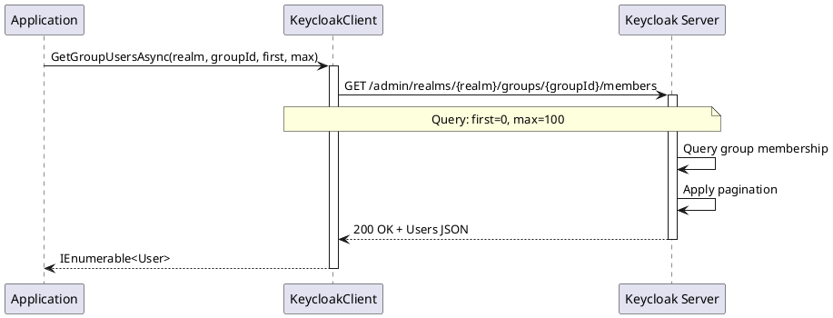

# Group Members

> **Document Metadata**
> Last Updated: 2026-01-20 19:30:00 UTC
> Git Commit: `9bc2d34` (9bc2d34a37e88fae053f63977e0bfbd02a61441d)
> Library Version: 2.0.2

## Overview

Group membership allows you to organize users and manage their permissions collectively. Users can belong to multiple groups and inherit roles and attributes from those groups. This section covers operations for managing group members.

## Table of Contents

- [Get Group Members](#get-group-members)
- [Understanding Group Membership](#understanding-group-membership)
- [Membership Benefits](#membership-benefits)

## Get Group Members

Retrieves users that are members of a group.

```csharp
var members = await client.GetGroupUsersAsync(
    realm: "my-company",
    groupId: groupId,
    first: 0,
    max: 100
);

foreach (var user in members)
{
    Console.WriteLine($"Member: {user.Username} ({user.Email})");
}
```

**Sequence Diagram:**



**Parameters:**
- `realm` (required) - The realm name
- `groupId` (required) - The group identifier
- `first` - Offset for pagination (default: 0)
- `max` - Maximum results to return (default: 100)

**Returns:** `IEnumerable<User>`

**Location:** `/src/Keycloak.ApiClient.Net/Groups/KeycloakClient.cs:107`

## Understanding Group Membership

### How Membership Works

1. **Direct Membership**: Users are explicitly added to a group
2. **Role Inheritance**: Members inherit all roles assigned to the group
3. **Attribute Inheritance**: Members can inherit group attributes
4. **Nested Groups**: Users in child groups are not automatically members of parent groups

### Membership Scope

- Group membership is realm-specific
- Users can belong to multiple groups
- Group membership affects role and permission assignments
- Membership changes take effect immediately

## Membership Benefits

1. **Centralized Role Management**
   - Assign roles to groups instead of individual users
   - Changes to group roles affect all members
   - Simplifies permission management

2. **Organizational Structure**
   - Model company departments and teams
   - Reflect reporting structures
   - Support multiple organizational views

3. **Attribute Management**
   - Share common attributes across users
   - Centralize metadata
   - Simplify user configuration

4. **Access Control**
   - Group-based access policies
   - Easier audit and compliance
   - Simplified onboarding/offboarding

## Best Practices

1. **Pagination**
   - Use pagination for large groups
   - Start with reasonable page sizes (100-500)
   - Implement progressive loading for UI

2. **Performance**
   - Cache member lists when appropriate
   - Monitor group sizes
   - Consider splitting very large groups

3. **Membership Management**
   - Regularly audit group membership
   - Remove inactive users
   - Document group purposes

4. **Security**
   - Limit access to membership queries
   - Log membership changes
   - Monitor privileged group membership

## Example: List All Group Members

```csharp
using Keycloak.ApiClient.Net;
using Keycloak.ApiClient.Net.Models.Users;
using Keycloak.ApiClient.Net.Models.Groups;

public async Task ListGroupMembers()
{
    var client = new KeycloakClient(url, username, password);
    string realm = "my-company";

    // Get a specific group
    var groups = await client.GetGroupHierarchyAsync(realm, search: "Engineering");
    var engineeringGroup = groups.FirstOrDefault();

    if (engineeringGroup != null)
    {
        Console.WriteLine($"Members of {engineeringGroup.Name}:");
        Console.WriteLine($"Path: {engineeringGroup.Path}");
        Console.WriteLine();

        var members = await client.GetGroupUsersAsync(
            realm: realm,
            groupId: engineeringGroup.Id,
            first: 0,
            max: 1000
        );

        Console.WriteLine($"Total members: {members.Count()}");
        foreach (var member in members)
        {
            Console.WriteLine($"  - {member.Username}");
            Console.WriteLine($"    Email: {member.Email}");
            Console.WriteLine($"    Name: {member.FirstName} {member.LastName}");
            Console.WriteLine();
        }
    }
}
```

## Example: Paginated Member Listing

```csharp
public async Task ListMembersPaginated()
{
    var client = new KeycloakClient(url, username, password);
    string realm = "my-company";
    string groupId = "engineering-group-id";

    int pageSize = 50;
    int currentPage = 0;
    bool hasMore = true;

    Console.WriteLine("Group Members (Paginated)");
    Console.WriteLine("========================");

    while (hasMore)
    {
        var members = await client.GetGroupUsersAsync(
            realm: realm,
            groupId: groupId,
            first: currentPage * pageSize,
            max: pageSize
        );

        if (!members.Any())
        {
            hasMore = false;
            continue;
        }

        Console.WriteLine($"\n--- Page {currentPage + 1} ---");
        foreach (var member in members)
        {
            Console.WriteLine($"{member.Username} ({member.Email})");
        }

        hasMore = members.Count() == pageSize;
        currentPage++;
    }
}
```

## Example: Member Statistics

```csharp
public async Task GetMemberStatistics()
{
    var client = new KeycloakClient(url, username, password);
    string realm = "my-company";

    // Get all groups
    var groups = await client.GetGroupHierarchyAsync(realm);

    Console.WriteLine("Group Membership Statistics");
    Console.WriteLine("===========================");

    foreach (var group in groups)
    {
        var members = await client.GetGroupUsersAsync(
            realm: realm,
            groupId: group.Id,
            first: 0,
            max: 10000
        );

        Console.WriteLine($"{group.Name}: {members.Count()} members");
        Console.WriteLine($"  Path: {group.Path}");

        // Analyze member attributes
        var enabledCount = members.Count(m => m.Enabled);
        var emailVerifiedCount = members.Count(m => m.EmailVerified);

        Console.WriteLine($"  Enabled: {enabledCount}/{members.Count()}");
        Console.WriteLine($"  Email Verified: {emailVerifiedCount}/{members.Count()}");
        Console.WriteLine();
    }
}
```

## Example: Find User's Groups

```csharp
public async Task FindUserGroups(string username)
{
    var client = new KeycloakClient(url, username, password);
    string realm = "my-company";

    // Get all groups
    var allGroups = await client.GetGroupHierarchyAsync(realm);

    Console.WriteLine($"Groups for user: {username}");
    Console.WriteLine("===========================");

    // Check each group for the user
    foreach (var group in allGroups)
    {
        var members = await client.GetGroupUsersAsync(
            realm: realm,
            groupId: group.Id,
            first: 0,
            max: 10000
        );

        if (members.Any(m => m.Username == username))
        {
            Console.WriteLine($"  - {group.Name} ({group.Path})");
        }

        // Check subgroups recursively
        if (group.SubGroups != null)
        {
            await CheckSubGroups(client, realm, username, group.SubGroups, 1);
        }
    }
}

private async Task CheckSubGroups(KeycloakClient client, string realm, string username,
    List<Group> subGroups, int level)
{
    var indent = new string(' ', level * 2);
    foreach (var subGroup in subGroups)
    {
        var members = await client.GetGroupUsersAsync(
            realm: realm,
            groupId: subGroup.Id,
            first: 0,
            max: 10000
        );

        if (members.Any(m => m.Username == username))
        {
            Console.WriteLine($"{indent}  - {subGroup.Name} ({subGroup.Path})");
        }

        if (subGroup.SubGroups != null)
        {
            await CheckSubGroups(client, realm, username, subGroup.SubGroups, level + 1);
        }
    }
}
```

## Common Use Cases

### Membership Audit
Regularly review group membership to ensure users have appropriate access.

### Onboarding
Add new users to appropriate groups to grant necessary permissions automatically.

### Offboarding
Remove users from groups when they change roles or leave the organization.

### Reporting
Generate reports on group membership for compliance and organizational analysis.

### Access Review
Periodically review who has access to specific resources through group membership.

## Related Resources

- [Group CRUD Operations](./group-crud.md)
- [Group Hierarchy Operations](./group-hierarchy.md)
- [Group Permissions](./group-permissions.md)
- [Main Documentation](./README.md)
