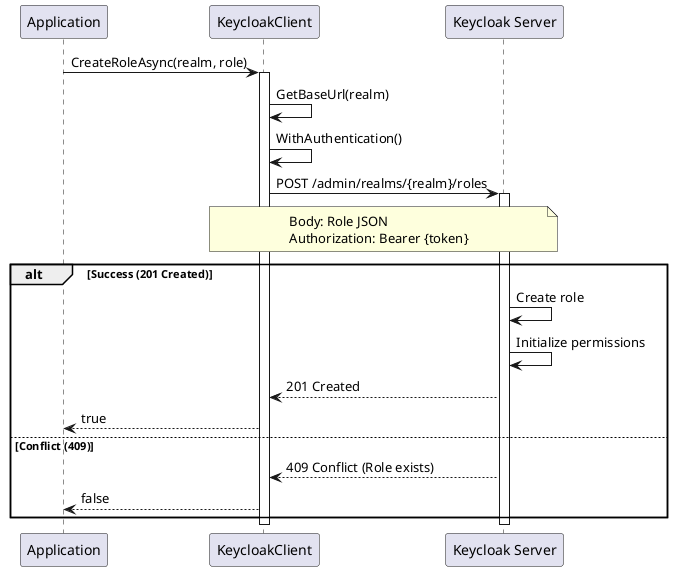

# Realm Role Operations

> **Document Metadata**
> Last Updated: 2026-01-20 19:30:00 UTC
> Git Commit: `9bc2d34` (9bc2d34a37e88fae053f63977e0bfbd02a61441d)
> Library Version: 2.0.2

## Overview

Realm roles are global roles available across all clients in a realm. They define permissions and access levels that can be used by any application within the realm. This section covers all CRUD operations for realm-level roles.

## Table of Contents

- [Create Realm Role](#create-realm-role)
- [Get Realm Roles](#get-realm-roles)
- [Get Realm Role by Name](#get-realm-role-by-name)
- [Update Realm Role](#update-realm-role)
- [Delete Realm Role](#delete-realm-role)

## Create Realm Role

Creates a new realm-level role.

```csharp
var role = new Role
{
    Name = "premium-user",
    Description = "Premium subscription users",
    Composite = false,
    Attributes = new Dictionary<string, object>
    {
        ["priority"] = new[] { "high" }
    }
};

bool success = await client.CreateRoleAsync("my-company", role);
```

**Sequence Diagram:**



**Returns:** `bool` - `true` if role was created successfully

**Location:** `/src/Keycloak.ApiClient.Net/Roles/KeycloakClient.cs:139`

## Get Realm Roles

Retrieves realm roles with optional filtering and pagination.

```csharp
// Get all realm roles
var roles = await client.GetRolesAsync("my-company");

// Search and paginate
var roles = await client.GetRolesAsync(
    realm: "my-company",
    search: "admin",
    first: 0,
    max: 20
);

foreach (var role in roles)
{
    Console.WriteLine($"Role: {role.Name}, Composite: {role.Composite}");
}
```

**Parameters:**
- `realm` (required) - The realm name
- `first` - Offset for pagination
- `max` - Maximum results to return
- `search` - Search term for role names

**Returns:** `IEnumerable<Role>`

**Location:** `/src/Keycloak.ApiClient.Net/Roles/KeycloakClient.cs:148`

## Get Realm Role by Name

Retrieves a specific realm role by its name.

```csharp
Role role = await client.GetRoleByNameAsync("my-company", "premium-user");

Console.WriteLine($"Role ID: {role.Id}");
Console.WriteLine($"Description: {role.Description}");
```

**Returns:** `Role`

**Location:** `/src/Keycloak.ApiClient.Net/Roles/KeycloakClient.cs:164`

## Update Realm Role

Updates an existing realm role.

```csharp
role.Description = "Premium users with full access";
role.Attributes["priority"] = new[] { "very-high" };

bool success = await client.UpdateRoleByNameAsync("my-company", "premium-user", role);
```

**Returns:** `bool` - `true` if update was successful

**Location:** `/src/Keycloak.ApiClient.Net/Roles/KeycloakClient.cs:169`

## Delete Realm Role

Deletes a realm role.

```csharp
bool success = await client.DeleteRoleByNameAsync("my-company", "premium-user");
```

**Returns:** `bool` - `true` if deletion was successful

**Location:** `/src/Keycloak.ApiClient.Net/Roles/KeycloakClient.cs:178`

## Best Practices

1. **Naming Conventions**
   - Use clear, descriptive names
   - Use lowercase with hyphens (e.g., `premium-user`)
   - Keep names consistent across your realm

2. **Role Design**
   - Keep realm roles for cross-application permissions
   - Use composite roles for hierarchical permissions
   - Document the purpose of each role

3. **Role Attributes**
   - Use attributes for metadata
   - Keep attribute names consistent
   - Document custom attributes

4. **Role Management**
   - Regularly audit realm roles
   - Remove unused roles
   - Use least privilege principle

## Related Resources

- [Client Role Operations](./client-roles.md)
- [Composite Role Operations](./composite-roles.md)
- [Role Associations](./role-associations.md)
- [Main Documentation](./README.md)
