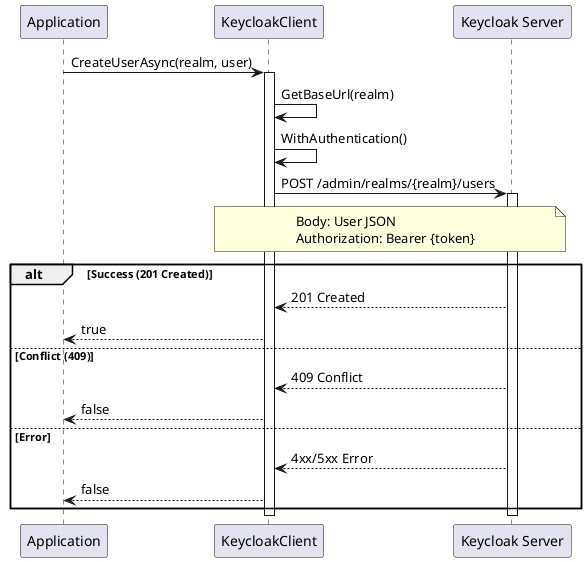
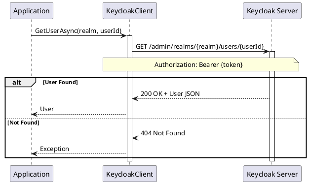
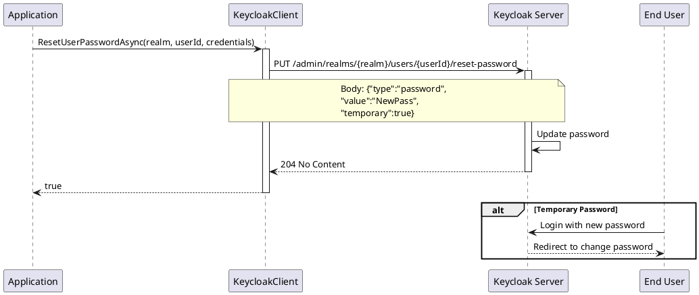
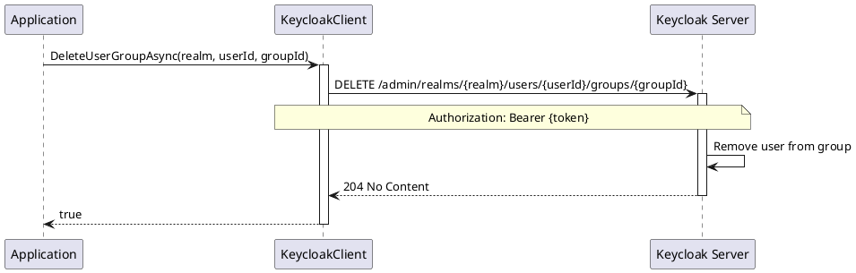
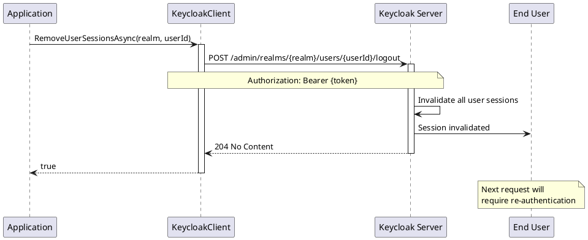
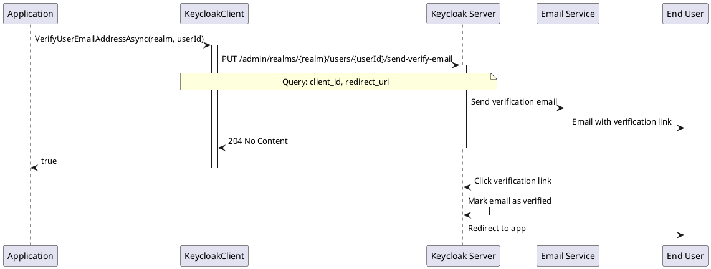

# User Management - Operations

> **Document Metadata**
> Last Updated: 2026-01-20 19:30:00 UTC
> Git Commit: `9bc2d34` (9bc2d34a37e88fae053f63977e0bfbd02a61441d)
> Library Version: 2.0.2

## Overview

The User Management API provides comprehensive CRUD operations for managing users in Keycloak realms. This includes user creation, retrieval, updates, deletion, password management, group assignments, and session management.

## Table of Contents

- [Key Features](#key-features)
- [User Model](#user-model)
- [User Operations](#user-operations)
  - [Create User](#create-user)
  - [Create User and Retrieve ID](#create-user-and-retrieve-id)
  - [Get Users](#get-users)
  - [Get Users Count](#get-users-count)
  - [Get User by ID](#get-user-by-id)
  - [Update User](#update-user)
  - [Delete User](#delete-user)
- [Password Management](#password-management)
  - [Reset User Password](#reset-user-password)
  - [Set User Password](#set-user-password)
  - [Remove User TOTP](#remove-user-totp)
- [Credential Management](#credential-management)
  - [Disable User Credentials](#disable-user-credentials)
- [Group Management](#group-management)
  - [Get User Groups](#get-user-groups)
  - [Get User Groups Count](#get-user-groups-count)
  - [Update User Group](#update-user-group)
  - [Remove User from Group](#remove-user-from-group)
- [Federated Identity Management](#federated-identity-management)
  - [Get User Social Logins](#get-user-social-logins)
  - [Add User Social Login Provider](#add-user-social-login-provider)
  - [Remove User Social Login Provider](#remove-user-social-login-provider)
- [Session Management](#session-management)
  - [Get User Sessions](#get-user-sessions)
  - [Remove User Sessions (Logout)](#remove-user-sessions-logout)
  - [Get User Offline Sessions](#get-user-offline-sessions)
- [Email Actions](#email-actions)
  - [Send Verification Email](#send-verification-email)
  - [Send Update Account Email](#send-update-account-email)
- [Consent Management](#consent-management)
  - [Get User Consents](#get-user-consents)
  - [Revoke User Consent](#revoke-user-consent)
- [Advanced Operations](#advanced-operations)
  - [Impersonate User](#impersonate-user)
- [Complete Example: User Lifecycle](#complete-example-user-lifecycle)
- [Best Practices](#best-practices)
- [Error Codes](#error-codes)
- [Related Resources](#related-resources)

## Key Features

- User CRUD operations
- Password management and reset
- User group membership
- Federated identity management
- Session management
- Email actions (verification, update account)
- Credential management
- User search and filtering

## User Model

The core `User` model includes:

```csharp
public class User
{
    public string Id { get; set; }
    public string Username { get; set; }
    public string Email { get; set; }
    public string FirstName { get; set; }
    public string LastName { get; set; }
    public bool? Enabled { get; set; }
    public bool? EmailVerified { get; set; }
    public List<Credentials> Credentials { get; set; }
    public List<string> RequiredActions { get; set; }
    public List<string> DisableableCredentialTypes { get; set; }
    public Dictionary<string, object> Attributes { get; set; }
    // Additional properties...
}
```

## User Operations

### Create User

Creates a new user in the specified realm.

```csharp
var user = new User
{
    Username = "john.doe",
    Email = "john.doe@example.com",
    FirstName = "John",
    LastName = "Doe",
    Enabled = true,
    EmailVerified = false,
    Credentials = new List<Credentials>
    {
        new Credentials
        {
            Type = "password",
            Value = "SecurePassword123!",
            Temporary = false
        }
    }
};

bool success = await client.CreateUserAsync("master", user);
```

**Sequence Diagram:**



**Returns:** `bool` - `true` if user was created successfully (HTTP 2xx), `false` otherwise

**Location:** `/src/Keycloak.ApiClient.Net/Users/KeycloakClient.cs:18`

### Create User and Retrieve ID

Creates a user and returns the generated user ID.

```csharp
string userId = await client.CreateAndRetrieveUserIdAsync("master", user);
// userId: "f4e7d8c9-1234-5678-9abc-def012345678"
```

**Returns:** `string` - The created user's ID extracted from the Location header, or `null` if creation failed

**Location:** `/src/Keycloak.ApiClient.Net/Users/KeycloakClient.cs:29`

### Get Users

Retrieves users with optional filtering and pagination.

```csharp
// Get all users
var users = await client.GetUsersAsync("master");

// Search by username
var users = await client.GetUsersAsync(
    realm: "master",
    username: "john.doe"
);

// Advanced filtering
var users = await client.GetUsersAsync(
    realm: "master",
    email: "john@example.com",
    firstName: "John",
    lastName: "Doe",
    first: 0,      // Offset
    max: 100,      // Limit
    search: "john" // General search term
);

// Brief representation (less detail)
var users = await client.GetUsersAsync(
    realm: "master",
    briefRepresentation: true
);
```

**Parameters:**
- `realm` (required) - The realm name
- `briefRepresentation` - Return brief user information
- `email` - Filter by email
- `first` - Offset for pagination
- `firstName` - Filter by first name
- `lastName` - Filter by last name
- `max` - Maximum results to return
- `search` - General search term
- `username` - Filter by username

**Returns:** `IEnumerable<User>`

**Location:** `/src/Keycloak.ApiClient.Net/Users/KeycloakClient.cs:38`

### Get Users Count

Gets the total count of users in a realm.

```csharp
int userCount = await client.GetUsersCountAsync("master");
```

**Returns:** `int` - Total number of users

**Location:** `/src/Keycloak.ApiClient.Net/Users/KeycloakClient.cs:66`

### Get User by ID

Retrieves a specific user by their ID.

```csharp
User user = await client.GetUserAsync("master", userId);
```

**Sequence Diagram:**



**Returns:** `User`

**Location:** `/src/Keycloak.ApiClient.Net/Users/KeycloakClient.cs:71`

### Update User

Updates an existing user's information.

```csharp
user.Email = "newemail@example.com";
user.Enabled = false;

bool success = await client.UpdateUserAsync("master", userId, user);
```

**Returns:** `bool` - `true` if update was successful

**Location:** `/src/Keycloak.ApiClient.Net/Users/KeycloakClient.cs:76`

### Delete User

Deletes a user from the realm.

```csharp
bool success = await client.DeleteUserAsync("master", userId);
```

**Returns:** `bool` - `true` if deletion was successful

**Location:** `/src/Keycloak.ApiClient.Net/Users/KeycloakClient.cs:85`

## Password Management

### Reset User Password

Resets a user's password using the `Credentials` model.

```csharp
var credentials = new Credentials
{
    Type = "password",
    Value = "NewPassword123!",
    Temporary = true  // User must change on next login
};

bool success = await client.ResetUserPasswordAsync("master", userId, credentials);
```

**Sequence Diagram:**



**Alternative Signature:**

```csharp
bool success = await client.ResetUserPasswordAsync(
    realm: "master",
    userId: userId,
    password: "NewPassword123!",
    temporary: false
);
```

**Returns:** `bool` - `true` if password reset was successful

**Location:** `/src/Keycloak.ApiClient.Net/Users/KeycloakClient.cs:223`

### Set User Password

Sets a permanent user password and returns detailed response.

```csharp
SetPasswordResponse response = await client.SetUserPasswordAsync(
    "master",
    userId,
    "NewPassword123!"
);

if (response.Success)
{
    Console.WriteLine("Password set successfully");
}
else
{
    Console.WriteLine($"Error: {response.ErrorMessage}");
}
```

**Returns:** `SetPasswordResponse` containing success status and error details if applicable

**Location:** `/src/Keycloak.ApiClient.Net/Users/KeycloakClient.cs:252`

### Remove User TOTP

Removes the user's Time-based One-Time Password (TOTP) configuration.

```csharp
bool success = await client.RemoveUserTotpAsync("master", userId);
```

**Returns:** `bool` - `true` if TOTP was removed successfully

**Location:** `/src/Keycloak.ApiClient.Net/Users/KeycloakClient.cs:214`

## Credential Management

### Disable User Credentials

Disables specific credential types for a user.

```csharp
var credentialTypes = new List<string> { "otp", "password" };
bool success = await client.DisableUserCredentialsAsync("master", userId, credentialTypes);
```

**Returns:** `bool` - `true` if credentials were disabled successfully

**Location:** `/src/Keycloak.ApiClient.Net/Users/KeycloakClient.cs:112`

## Group Management

### Get User Groups

Retrieves all groups a user belongs to.

```csharp
IEnumerable<Group> groups = await client.GetUserGroupsAsync("master", userId);
```

**Returns:** `IEnumerable<Group>`

**Location:** `/src/Keycloak.ApiClient.Net/Users/KeycloakClient.cs:161`

### Get User Groups Count

Gets the count of groups a user belongs to.

```csharp
long groupCount = await client.GetUserGroupsCountAsync("master", userId);
```

**Returns:** `long` - Number of groups

**Location:** `/src/Keycloak.ApiClient.Net/Users/KeycloakClient.cs:166`

### Update User Group

Adds a user to a group.

```csharp
bool success = await client.UpdateUserGroupAsync("master", userId, groupId, group);
```

**Returns:** `bool` - `true` if user was added to group

**Location:** `/src/Keycloak.ApiClient.Net/Users/KeycloakClient.cs:175`

### Remove User from Group

Removes a user from a group.

```csharp
bool success = await client.DeleteUserGroupAsync("master", userId, groupId);
```

**Sequence Diagram:**



**Returns:** `bool` - `true` if user was removed from group

**Location:** `/src/Keycloak.ApiClient.Net/Users/KeycloakClient.cs:184`

## Federated Identity Management

### Get User Social Logins

Retrieves federated identity providers linked to the user.

```csharp
IEnumerable<FederatedIdentity> identities =
    await client.GetUserSocialLoginsAsync("master", userId);

foreach (var identity in identities)
{
    Console.WriteLine($"Provider: {identity.IdentityProvider}");
    Console.WriteLine($"User ID: {identity.UserId}");
    Console.WriteLine($"Username: {identity.UserName}");
}
```

**Returns:** `IEnumerable<FederatedIdentity>`

**Location:** `/src/Keycloak.ApiClient.Net/Users/KeycloakClient.cs:138`

### Add User Social Login Provider

Links a federated identity provider to a user.

```csharp
var federatedIdentity = new FederatedIdentity
{
    IdentityProvider = "google",
    UserId = "google-user-id-123",
    UserName = "john.doe@gmail.com"
};

bool success = await client.AddUserSocialLoginProviderAsync(
    "master",
    userId,
    "google",
    federatedIdentity
);
```

**Returns:** `bool` - `true` if provider was linked successfully

**Location:** `/src/Keycloak.ApiClient.Net/Users/KeycloakClient.cs:143`

### Remove User Social Login Provider

Removes a federated identity provider from a user.

```csharp
bool success = await client.RemoveUserSocialLoginProviderAsync(
    "master",
    userId,
    "google"
);
```

**Returns:** `bool` - `true` if provider was unlinked successfully

**Location:** `/src/Keycloak.ApiClient.Net/Users/KeycloakClient.cs:152`

## Session Management

### Get User Sessions

Retrieves active sessions for a user.

```csharp
IEnumerable<UserSession> sessions = await client.GetUserSessionsAsync("master", userId);

foreach (var session in sessions)
{
    Console.WriteLine($"Session ID: {session.Id}");
    Console.WriteLine($"Start: {session.Start}");
    Console.WriteLine($"Last Access: {session.LastAccess}");
}
```

**Returns:** `IEnumerable<UserSession>`

**Location:** `/src/Keycloak.ApiClient.Net/Users/KeycloakClient.cs:283`

### Remove User Sessions (Logout)

Logs out a user by removing all their sessions.

```csharp
bool success = await client.RemoveUserSessionsAsync("master", userId);
```

**Sequence Diagram:**



**Returns:** `bool` - `true` if sessions were removed successfully

**Location:** `/src/Keycloak.ApiClient.Net/Users/KeycloakClient.cs:199`

### Get User Offline Sessions

Gets offline sessions for a specific client.

```csharp
IEnumerable<UserSession> offlineSessions =
    await client.GetUserOfflineSessionsAsync("master", userId, clientId);
```

**Note:** This method is marked as `[Obsolete("Not working yet")]`

**Location:** `/src/Keycloak.ApiClient.Net/Users/KeycloakClient.cs:209`

## Email Actions

### Send Verification Email

Sends an email verification link to the user.

```csharp
bool success = await client.VerifyUserEmailAddressAsync(
    realm: "master",
    userId: userId,
    clientId: "my-app",
    redirectUri: "https://myapp.com/verified"
);
```

**Sequence Diagram:**



**Returns:** `bool` - `true` if email was sent successfully

**Location:** `/src/Keycloak.ApiClient.Net/Users/KeycloakClient.cs:262`

### Send Update Account Email

Sends an email to the user with required actions.

```csharp
var requiredActions = new List<string>
{
    "UPDATE_PASSWORD",
    "UPDATE_PROFILE",
    "VERIFY_EMAIL"
};

bool success = await client.SendUserUpdateAccountEmailAsync(
    realm: "master",
    userId: userId,
    requiredActions: requiredActions,
    clientId: "my-app",
    lifespan: 3600,  // 1 hour
    redirectUri: "https://myapp.com/account"
);
```

**Common Required Actions:**
- `UPDATE_PASSWORD` - Force password update
- `UPDATE_PROFILE` - Update user profile
- `VERIFY_EMAIL` - Verify email address
- `CONFIGURE_TOTP` - Setup two-factor authentication
- `UPDATE_USER_LOCALE` - Update user locale

**Returns:** `bool` - `true` if email was sent successfully

**Location:** `/src/Keycloak.ApiClient.Net/Users/KeycloakClient.cs:121`

## Consent Management

### Get User Consents

Retrieves consents granted by a user.

```csharp
string consents = await client.GetUserConsentsAsync("master", userId);
```

**Note:** This method is marked as `[Obsolete("Not working yet")]`

**Location:** `/src/Keycloak.ApiClient.Net/Users/KeycloakClient.cs:95`

### Revoke User Consent

Revokes a user's consent and offline tokens for a specific client.

```csharp
bool success = await client.RevokeUserConsentAndOfflineTokensAsync(
    "master",
    userId,
    clientId
);
```

**Returns:** `bool` - `true` if consent was revoked successfully

**Location:** `/src/Keycloak.ApiClient.Net/Users/KeycloakClient.cs:103`

## Advanced Operations

### Impersonate User

Creates an impersonation session for a user (admin logs in as user).

```csharp
IDictionary<string, object> impersonation =
    await client.ImpersonateUserAsync("master", userId);
```

**Security Note:** This is a powerful feature that should be used with caution and proper auditing.

**Returns:** `IDictionary<string, object>` containing impersonation details

**Location:** `/src/Keycloak.ApiClient.Net/Users/KeycloakClient.cs:193`

## Complete Example: User Lifecycle

```csharp
using Keycloak.ApiClient.Net;
using Keycloak.ApiClient.Net.Models.Users;

public class UserManagement
{
    private readonly KeycloakClient _client;

    public UserManagement(string url, string username, string password)
    {
        _client = new KeycloakClient(url, username, password);
    }

    public async Task UserLifecycleExample()
    {
        string realm = "master";

        // 1. Create user
        var user = new User
        {
            Username = "jane.smith",
            Email = "jane.smith@example.com",
            FirstName = "Jane",
            LastName = "Smith",
            Enabled = true,
            Credentials = new List<Credentials>
            {
                new Credentials
                {
                    Type = "password",
                    Value = "TempPassword123!",
                    Temporary = true
                }
            }
        };

        string userId = await _client.CreateAndRetrieveUserIdAsync(realm, user);
        Console.WriteLine($"User created with ID: {userId}");

        // 2. Send verification email
        await _client.VerifyUserEmailAddressAsync(realm, userId);
        Console.WriteLine("Verification email sent");

        // 3. Get user details
        user = await _client.GetUserAsync(realm, userId);
        Console.WriteLine($"User email verified: {user.EmailVerified}");

        // 4. Update user
        user.EmailVerified = true;
        await _client.UpdateUserAsync(realm, userId, user);

        // 5. Reset password
        await _client.ResetUserPasswordAsync(
            realm,
            userId,
            "NewSecurePassword123!",
            temporary: false
        );

        // 6. Get user sessions
        var sessions = await _client.GetUserSessionsAsync(realm, userId);
        Console.WriteLine($"Active sessions: {sessions.Count()}");

        // 7. Logout user
        await _client.RemoveUserSessionsAsync(realm, userId);
        Console.WriteLine("User logged out");

        // 8. Delete user (cleanup)
        await _client.DeleteUserAsync(realm, userId);
        Console.WriteLine("User deleted");
    }
}
```

## Best Practices

1. **Password Security**
   - Always use strong passwords
   - Set `Temporary = true` for initial passwords
   - Force password change on first login

2. **Email Verification**
   - Send verification emails for new users
   - Don't enable accounts until email is verified

3. **Session Management**
   - Monitor active sessions
   - Implement timeout policies
   - Provide logout functionality

4. **Error Handling**
   - Check boolean return values
   - Handle `FlurlHttpException` for API errors
   - Validate user input before API calls

5. **Performance**
   - Use pagination (`first`, `max`) for large user lists
   - Use `briefRepresentation = true` when full details aren't needed
   - Implement caching for frequently accessed data

6. **Security**
   - Never log sensitive information (passwords, tokens)
   - Implement proper audit trails
   - Use impersonation sparingly and with logging
   - Validate email addresses before sending emails

## Error Codes

| HTTP Code | Meaning | Common Causes |
|-----------|---------|---------------|
| 400 | Bad Request | Invalid user data, malformed request |
| 401 | Unauthorized | Invalid or expired authentication token |
| 403 | Forbidden | Insufficient permissions |
| 404 | Not Found | User ID doesn't exist |
| 409 | Conflict | Username or email already exists |
| 500 | Server Error | Keycloak internal error |

## Related Resources

- [Keycloak User API Documentation](https://www.keycloak.org/docs-api/latest/rest-api/index.html#_users_resource)
- [Authentication Documentation](./authentication-core.md)
- [Group Management Documentation](./role-group-management-operations.md)
