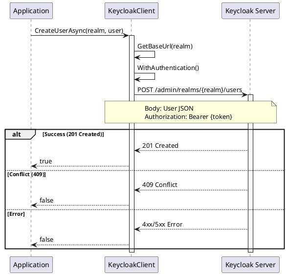
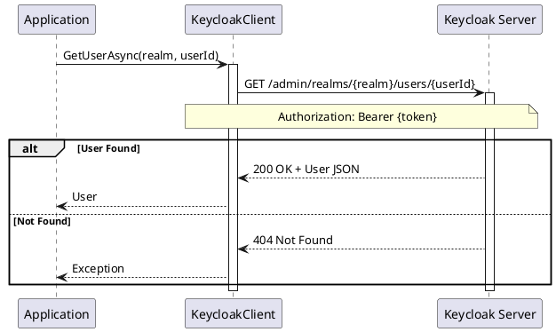

# User CRUD Operations

> **Document Metadata**
> Last Updated: 2026-01-20 19:30:00 UTC
> Git Commit: `9bc2d34` (9bc2d34a37e88fae053f63977e0bfbd02a61441d)
> Library Version: 2.0.2

This document covers the core Create, Read, Update, and Delete operations for user management in Keycloak.

## Create User

Creates a new user in the specified realm.

```csharp
var user = new User
{
    Username = "john.doe",
    Email = "john.doe@example.com",
    FirstName = "John",
    LastName = "Doe",
    Enabled = true,
    EmailVerified = false,
    Credentials = new List<Credentials>
    {
        new Credentials
        {
            Type = "password",
            Value = "SecurePassword123!",
            Temporary = false
        }
    }
};

bool success = await client.CreateUserAsync("master", user);
```

**Sequence Diagram:**



**Returns:** `bool` - `true` if user was created successfully (HTTP 2xx), `false` otherwise

**Location:** `/src/Keycloak.ApiClient.Net/Users/KeycloakClient.cs:18`

## Create User and Retrieve ID

Creates a user and returns the generated user ID.

```csharp
string userId = await client.CreateAndRetrieveUserIdAsync("master", user);
// userId: "f4e7d8c9-1234-5678-9abc-def012345678"
```

**Returns:** `string` - The created user's ID extracted from the Location header, or `null` if creation failed

**Location:** `/src/Keycloak.ApiClient.Net/Users/KeycloakClient.cs:29`

## Get Users

Retrieves users with optional filtering and pagination.

```csharp
// Get all users
var users = await client.GetUsersAsync("master");

// Search by username
var users = await client.GetUsersAsync(
    realm: "master",
    username: "john.doe"
);

// Advanced filtering
var users = await client.GetUsersAsync(
    realm: "master",
    email: "john@example.com",
    firstName: "John",
    lastName: "Doe",
    first: 0,      // Offset
    max: 100,      // Limit
    search: "john" // General search term
);

// Brief representation (less detail)
var users = await client.GetUsersAsync(
    realm: "master",
    briefRepresentation: true
);
```

**Parameters:**
- `realm` (required) - The realm name
- `briefRepresentation` - Return brief user information
- `email` - Filter by email
- `first` - Offset for pagination
- `firstName` - Filter by first name
- `lastName` - Filter by last name
- `max` - Maximum results to return
- `search` - General search term
- `username` - Filter by username

**Returns:** `IEnumerable<User>`

**Location:** `/src/Keycloak.ApiClient.Net/Users/KeycloakClient.cs:38`

## Get Users Count

Gets the total count of users in a realm.

```csharp
int userCount = await client.GetUsersCountAsync("master");
```

**Returns:** `int` - Total number of users

**Location:** `/src/Keycloak.ApiClient.Net/Users/KeycloakClient.cs:66`

## Get User by ID

Retrieves a specific user by their ID.

```csharp
User user = await client.GetUserAsync("master", userId);
```

**Sequence Diagram:**



**Returns:** `User`

**Location:** `/src/Keycloak.ApiClient.Net/Users/KeycloakClient.cs:71`

## Update User

Updates an existing user's information.

```csharp
user.Email = "newemail@example.com";
user.Enabled = false;

bool success = await client.UpdateUserAsync("master", userId, user);
```

**Returns:** `bool` - `true` if update was successful

**Location:** `/src/Keycloak.ApiClient.Net/Users/KeycloakClient.cs:76`

## Delete User

Deletes a user from the realm.

```csharp
bool success = await client.DeleteUserAsync("master", userId);
```

**Returns:** `bool` - `true` if deletion was successful

**Location:** `/src/Keycloak.ApiClient.Net/Users/KeycloakClient.cs:85`

## Related Resources

- [User Management README](./README.md)
- [Password Management](./passwords.md)
- [Group Management](./groups.md)
