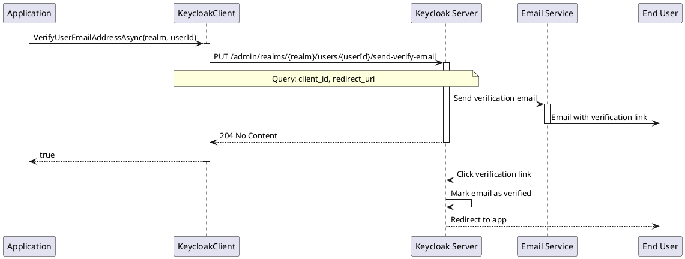

# Email Actions

> **Document Metadata**
> Last Updated: 2026-01-20 19:30:00 UTC
> Git Commit: `9bc2d34` (9bc2d34a37e88fae053f63977e0bfbd02a61441d)
> Library Version: 2.0.2

This document covers email action operations including sending verification emails and account update emails to users.

## Send Verification Email

Sends an email verification link to the user.

```csharp
bool success = await client.VerifyUserEmailAddressAsync(
    realm: "master",
    userId: userId,
    clientId: "my-app",
    redirectUri: "https://myapp.com/verified"
);
```

**Sequence Diagram:**



**Returns:** `bool` - `true` if email was sent successfully

**Location:** `/src/Keycloak.ApiClient.Net/Users/KeycloakClient.cs:262`

## Send Update Account Email

Sends an email to the user with required actions.

```csharp
var requiredActions = new List<string>
{
    "UPDATE_PASSWORD",
    "UPDATE_PROFILE",
    "VERIFY_EMAIL"
};

bool success = await client.SendUserUpdateAccountEmailAsync(
    realm: "master",
    userId: userId,
    requiredActions: requiredActions,
    clientId: "my-app",
    lifespan: 3600,  // 1 hour
    redirectUri: "https://myapp.com/account"
);
```

**Common Required Actions:**
- `UPDATE_PASSWORD` - Force password update
- `UPDATE_PROFILE` - Update user profile
- `VERIFY_EMAIL` - Verify email address
- `CONFIGURE_TOTP` - Setup two-factor authentication
- `UPDATE_USER_LOCALE` - Update user locale

**Returns:** `bool` - `true` if email was sent successfully

**Location:** `/src/Keycloak.ApiClient.Net/Users/KeycloakClient.cs:121`

## Complete Example: Email Actions

```csharp
using Keycloak.ApiClient.Net;
using Keycloak.ApiClient.Net.Models.Users;

public class EmailActionManagement
{
    private readonly KeycloakClient _client;

    public EmailActionManagement(string url, string username, string password)
    {
        _client = new KeycloakClient(url, username, password);
    }

    public async Task SendVerificationEmail(string realm, string userId)
    {
        // Send simple verification email
        bool sent = await _client.VerifyUserEmailAddressAsync(
            realm,
            userId
        );

        if (sent)
        {
            Console.WriteLine("Verification email sent successfully");
        }
        else
        {
            Console.WriteLine("Failed to send verification email");
        }
    }

    public async Task SendVerificationWithRedirect(string realm, string userId)
    {
        // Send verification email with custom redirect
        bool sent = await _client.VerifyUserEmailAddressAsync(
            realm: realm,
            userId: userId,
            clientId: "my-web-app",
            redirectUri: "https://myapp.com/email-verified"
        );

        if (sent)
        {
            Console.WriteLine("Verification email sent with redirect");
        }
    }

    public async Task SendPasswordResetEmail(string realm, string userId)
    {
        // Send email requiring password update
        var requiredActions = new List<string> { "UPDATE_PASSWORD" };

        bool sent = await _client.SendUserUpdateAccountEmailAsync(
            realm: realm,
            userId: userId,
            requiredActions: requiredActions,
            clientId: "my-app",
            lifespan: 3600, // Link valid for 1 hour
            redirectUri: "https://myapp.com/password-updated"
        );

        if (sent)
        {
            Console.WriteLine("Password reset email sent");
        }
    }

    public async Task SendAccountSetupEmail(string realm, string userId)
    {
        // Send email requiring multiple actions
        var requiredActions = new List<string>
        {
            "VERIFY_EMAIL",
            "UPDATE_PASSWORD",
            "UPDATE_PROFILE",
            "CONFIGURE_TOTP"
        };

        bool sent = await _client.SendUserUpdateAccountEmailAsync(
            realm: realm,
            userId: userId,
            requiredActions: requiredActions,
            clientId: "my-app",
            lifespan: 86400, // Link valid for 24 hours
            redirectUri: "https://myapp.com/setup-complete"
        );

        if (sent)
        {
            Console.WriteLine("Account setup email sent");
            Console.WriteLine("User must complete:");
            foreach (var action in requiredActions)
            {
                Console.WriteLine($"  - {action}");
            }
        }
    }

    public async Task OnboardNewUser(string realm, User user)
    {
        // Create user
        string userId = await _client.CreateAndRetrieveUserIdAsync(realm, user);

        // Send welcome email with verification and setup
        var requiredActions = new List<string>
        {
            "VERIFY_EMAIL",
            "UPDATE_PASSWORD"
        };

        await _client.SendUserUpdateAccountEmailAsync(
            realm: realm,
            userId: userId,
            requiredActions: requiredActions,
            clientId: "my-app",
            lifespan: 7200, // 2 hours
            redirectUri: "https://myapp.com/welcome"
        );

        Console.WriteLine($"New user created and welcome email sent to {user.Email}");
    }
}
```

## Best Practices

1. **Email Validation**
   - Validate email addresses before creating users
   - Check email deliverability
   - Handle bounced emails appropriately

2. **Link Expiration**
   - Set appropriate lifespan for action links
   - Shorter for security-sensitive actions (password reset: 1 hour)
   - Longer for less critical actions (profile update: 24 hours)

3. **User Experience**
   - Provide clear redirect URIs after actions complete
   - Use branded email templates
   - Include clear instructions in emails

4. **Security**
   - Don't reveal whether email exists in the system
   - Rate limit email sending to prevent abuse
   - Log all email sending operations

5. **Error Handling**
   - Check return values
   - Provide user feedback
   - Have fallback verification methods

6. **Testing**
   - Test email delivery in development
   - Verify link functionality
   - Test redirect URIs

## Use Cases

### New User Registration
```csharp
// Create user and send verification
var user = new User
{
    Username = "john.doe",
    Email = "john@example.com",
    Enabled = false // Don't enable until verified
};

string userId = await client.CreateAndRetrieveUserIdAsync("master", user);

await client.VerifyUserEmailAddressAsync(
    "master",
    userId,
    clientId: "my-app",
    redirectUri: "https://myapp.com/registration-complete"
);
```

### Forgot Password Flow
```csharp
// Send password reset email
var requiredActions = new List<string> { "UPDATE_PASSWORD" };

await client.SendUserUpdateAccountEmailAsync(
    realm: "master",
    userId: userId,
    requiredActions: requiredActions,
    lifespan: 3600 // 1 hour
);
```

### Account Reactivation
```csharp
// Reactivate dormant account
var requiredActions = new List<string>
{
    "VERIFY_EMAIL",
    "UPDATE_PASSWORD",
    "UPDATE_PROFILE"
};

await client.SendUserUpdateAccountEmailAsync(
    realm: "master",
    userId: userId,
    requiredActions: requiredActions,
    lifespan: 86400 // 24 hours
);
```

### Two-Factor Setup Reminder
```csharp
// Remind user to setup 2FA
var requiredActions = new List<string> { "CONFIGURE_TOTP" };

await client.SendUserUpdateAccountEmailAsync(
    realm: "master",
    userId: userId,
    requiredActions: requiredActions,
    lifespan: 604800 // 7 days
);
```

## Email Configuration Requirements

Before using email actions, ensure Keycloak is properly configured:

1. **SMTP Server Settings**
   - Configure in Realm Settings → Email
   - Set host, port, username, password
   - Enable SSL/TLS if required

2. **Email Templates**
   - Customize email templates in Keycloak themes
   - Brand emails with your organization's identity
   - Support multiple languages if needed

3. **Client Configuration**
   - Ensure client ID exists and is enabled
   - Configure valid redirect URIs
   - Set up proper CORS settings

## Troubleshooting

### Email Not Sent
- Check SMTP configuration in Keycloak
- Verify email address is valid
- Check Keycloak server logs for errors
- Ensure user has email address set

### Verification Link Not Working
- Check link hasn't expired
- Verify redirect URI is configured in client
- Ensure user hasn't already verified email
- Check for URL encoding issues

### Wrong Redirect After Action
- Verify redirect URI matches client configuration
- Check for trailing slashes in URIs
- Ensure URI is absolute, not relative

## Related Resources

- [User Management README](./README.md)
- [CRUD Operations](./crud-operations.md)
- [Password Management](./passwords.md)
- [Keycloak Email Configuration](https://www.keycloak.org/docs/latest/server_admin/#_email)
