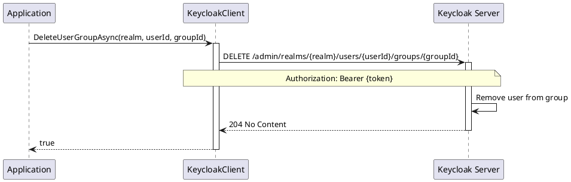

# Group Management

> **Document Metadata**
> Last Updated: 2026-01-20 19:30:00 UTC
> Git Commit: `9bc2d34` (9bc2d34a37e88fae053f63977e0bfbd02a61441d)
> Library Version: 2.0.2

This document covers user group membership operations including retrieving, adding, and removing users from groups.

## Get User Groups

Retrieves all groups a user belongs to.

```csharp
IEnumerable<Group> groups = await client.GetUserGroupsAsync("master", userId);
```

**Returns:** `IEnumerable<Group>`

**Location:** `/src/Keycloak.ApiClient.Net/Users/KeycloakClient.cs:161`

## Get User Groups Count

Gets the count of groups a user belongs to.

```csharp
long groupCount = await client.GetUserGroupsCountAsync("master", userId);
```

**Returns:** `long` - Number of groups

**Location:** `/src/Keycloak.ApiClient.Net/Users/KeycloakClient.cs:166`

## Update User Group

Adds a user to a group.

```csharp
bool success = await client.UpdateUserGroupAsync("master", userId, groupId, group);
```

**Returns:** `bool` - `true` if user was added to group

**Location:** `/src/Keycloak.ApiClient.Net/Users/KeycloakClient.cs:175`

## Remove User from Group

Removes a user from a group.

```csharp
bool success = await client.DeleteUserGroupAsync("master", userId, groupId);
```

**Sequence Diagram:**



**Returns:** `bool` - `true` if user was removed from group

**Location:** `/src/Keycloak.ApiClient.Net/Users/KeycloakClient.cs:184`

## Complete Example: Managing User Groups

```csharp
using Keycloak.ApiClient.Net;

public class UserGroupManagement
{
    private readonly KeycloakClient _client;

    public UserGroupManagement(string url, string username, string password)
    {
        _client = new KeycloakClient(url, username, password);
    }

    public async Task ManageUserGroups(string realm, string userId)
    {
        // Get all groups the user belongs to
        var groups = await _client.GetUserGroupsAsync(realm, userId);
        Console.WriteLine($"User belongs to {groups.Count()} groups");

        foreach (var group in groups)
        {
            Console.WriteLine($"- {group.Name} (ID: {group.Id})");
        }

        // Get group count
        long groupCount = await _client.GetUserGroupsCountAsync(realm, userId);
        Console.WriteLine($"Total groups: {groupCount}");

        // Add user to a new group
        string newGroupId = "group-id-here";
        var newGroup = new Group { Id = newGroupId, Name = "Developers" };
        bool added = await _client.UpdateUserGroupAsync(realm, userId, newGroupId, newGroup);

        if (added)
        {
            Console.WriteLine("User added to Developers group");
        }

        // Remove user from a group
        bool removed = await _client.DeleteUserGroupAsync(realm, userId, newGroupId);

        if (removed)
        {
            Console.WriteLine("User removed from group");
        }
    }
}
```

## Best Practices

1. **Group-Based Access Control**
   - Use groups to manage user permissions and roles
   - Assign roles to groups rather than individual users
   - Organize groups hierarchically for better management

2. **Performance**
   - Cache group memberships when possible
   - Use `GetUserGroupsCountAsync` before fetching all groups for large datasets

3. **Validation**
   - Verify group exists before adding user
   - Check if user is already in group before adding
   - Handle errors when removing non-existent memberships

4. **Auditing**
   - Log all group membership changes
   - Track who made the changes and when
   - Maintain audit trail for compliance

## Common Patterns

### Check if User Belongs to Specific Group
```csharp
var groups = await client.GetUserGroupsAsync("master", userId);
bool isMember = groups.Any(g => g.Id == targetGroupId);
```

### Add User to Multiple Groups
```csharp
var groupIds = new[] { "group1", "group2", "group3" };

foreach (var groupId in groupIds)
{
    var group = new Group { Id = groupId };
    await client.UpdateUserGroupAsync("master", userId, groupId, group);
}
```

### Remove User from All Groups
```csharp
var groups = await client.GetUserGroupsAsync("master", userId);

foreach (var group in groups)
{
    await client.DeleteUserGroupAsync("master", userId, group.Id);
}
```

## Related Resources

- [User Management README](./README.md)
- [CRUD Operations](./crud-operations.md)
- [Role & Group Management Documentation](../role-group-management-operations.md)
