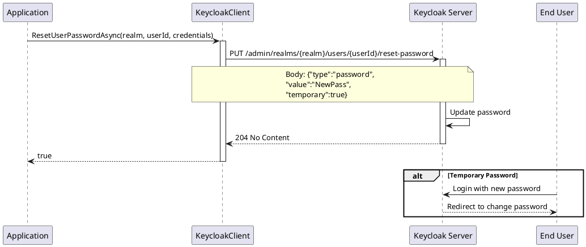

# Password Management

> **Document Metadata**
> Last Updated: 2026-01-20 19:30:00 UTC
> Git Commit: `9bc2d34` (9bc2d34a37e88fae053f63977e0bfbd02a61441d)
> Library Version: 2.0.2

This document covers password management operations including password resets, setting passwords, and TOTP management.

## Reset User Password

Resets a user's password using the `Credentials` model.

```csharp
var credentials = new Credentials
{
    Type = "password",
    Value = "NewPassword123!",
    Temporary = true  // User must change on next login
};

bool success = await client.ResetUserPasswordAsync("master", userId, credentials);
```

**Sequence Diagram:**



**Alternative Signature:**

```csharp
bool success = await client.ResetUserPasswordAsync(
    realm: "master",
    userId: userId,
    password: "NewPassword123!",
    temporary: false
);
```

**Returns:** `bool` - `true` if password reset was successful

**Location:** `/src/Keycloak.ApiClient.Net/Users/KeycloakClient.cs:223`

## Set User Password

Sets a permanent user password and returns detailed response.

```csharp
SetPasswordResponse response = await client.SetUserPasswordAsync(
    "master",
    userId,
    "NewPassword123!"
);

if (response.Success)
{
    Console.WriteLine("Password set successfully");
}
else
{
    Console.WriteLine($"Error: {response.ErrorMessage}");
}
```

**Returns:** `SetPasswordResponse` containing success status and error details if applicable

**Location:** `/src/Keycloak.ApiClient.Net/Users/KeycloakClient.cs:252`

## Remove User TOTP

Removes the user's Time-based One-Time Password (TOTP) configuration.

```csharp
bool success = await client.RemoveUserTotpAsync("master", userId);
```

**Returns:** `bool` - `true` if TOTP was removed successfully

**Location:** `/src/Keycloak.ApiClient.Net/Users/KeycloakClient.cs:214`

## Best Practices

1. **Use Temporary Passwords for Initial Setup**
   - When creating new users or resetting passwords administratively, always set `Temporary = true`
   - This forces users to change their password on first login

2. **Password Strength**
   - Enforce strong password policies at the realm level
   - Validate passwords before sending them to Keycloak

3. **Error Handling**
   - Use `SetUserPasswordAsync` when you need detailed error information
   - Use `ResetUserPasswordAsync` for simpler boolean responses

4. **Security**
   - Never log passwords in application logs
   - Use secure channels when transmitting passwords
   - Consider implementing password expiration policies

## Related Resources

- [User Management README](./README.md)
- [CRUD Operations](./crud-operations.md)
- [Credential Management](./credentials.md)
