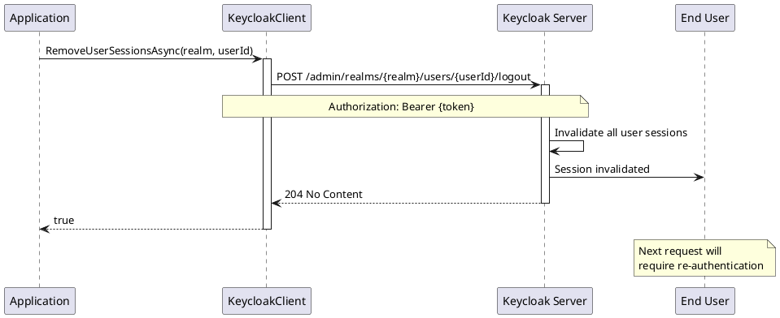

# Session Management

> **Document Metadata**
> Last Updated: 2026-01-20 19:30:00 UTC
> Git Commit: `9bc2d34` (9bc2d34a37e88fae053f63977e0bfbd02a61441d)
> Library Version: 2.0.2

This document covers user session management operations including retrieving active sessions, logging out users, and managing offline sessions.

## Get User Sessions

Retrieves active sessions for a user.

```csharp
IEnumerable<UserSession> sessions = await client.GetUserSessionsAsync("master", userId);

foreach (var session in sessions)
{
    Console.WriteLine($"Session ID: {session.Id}");
    Console.WriteLine($"Start: {session.Start}");
    Console.WriteLine($"Last Access: {session.LastAccess}");
}
```

**Returns:** `IEnumerable<UserSession>`

**Location:** `/src/Keycloak.ApiClient.Net/Users/KeycloakClient.cs:283`

## Remove User Sessions (Logout)

Logs out a user by removing all their sessions.

```csharp
bool success = await client.RemoveUserSessionsAsync("master", userId);
```

**Sequence Diagram:**



**Returns:** `bool` - `true` if sessions were removed successfully

**Location:** `/src/Keycloak.ApiClient.Net/Users/KeycloakClient.cs:199`

## Get User Offline Sessions

Gets offline sessions for a specific client.

```csharp
IEnumerable<UserSession> offlineSessions =
    await client.GetUserOfflineSessionsAsync("master", userId, clientId);
```

**Note:** This method is marked as `[Obsolete("Not working yet")]`

**Location:** `/src/Keycloak.ApiClient.Net/Users/KeycloakClient.cs:209`

## Complete Example: Session Management

```csharp
using Keycloak.ApiClient.Net;
using Keycloak.ApiClient.Net.Models.Users;

public class SessionManagement
{
    private readonly KeycloakClient _client;

    public SessionManagement(string url, string username, string password)
    {
        _client = new KeycloakClient(url, username, password);
    }

    public async Task ManageUserSessions(string realm, string userId)
    {
        // Get all active sessions
        var sessions = await _client.GetUserSessionsAsync(realm, userId);
        Console.WriteLine($"User has {sessions.Count()} active session(s)");

        foreach (var session in sessions)
        {
            Console.WriteLine($"\nSession ID: {session.Id}");
            Console.WriteLine($"IP Address: {session.IpAddress}");
            Console.WriteLine($"Started: {session.Start}");
            Console.WriteLine($"Last Access: {session.LastAccess}");

            // Display client sessions
            if (session.Clients != null)
            {
                Console.WriteLine("Clients:");
                foreach (var clientId in session.Clients.Keys)
                {
                    Console.WriteLine($"  - {clientId}");
                }
            }
        }

        // Logout user (remove all sessions)
        bool loggedOut = await _client.RemoveUserSessionsAsync(realm, userId);

        if (loggedOut)
        {
            Console.WriteLine("\nUser logged out successfully");
            Console.WriteLine("All sessions have been invalidated");
        }
    }

    public async Task MonitorSessions(string realm, string userId)
    {
        // Check for suspicious activity
        var sessions = await _client.GetUserSessionsAsync(realm, userId);

        foreach (var session in sessions)
        {
            // Check for sessions from unusual locations
            if (IsUnusualLocation(session.IpAddress))
            {
                Console.WriteLine($"Warning: Session from unusual IP: {session.IpAddress}");

                // Optionally, invalidate suspicious session
                // await client.RemoveUserSessionsAsync(realm, userId);
            }

            // Check for sessions that are too old
            var sessionAge = DateTime.UtcNow - session.Start;
            if (sessionAge.TotalHours > 24)
            {
                Console.WriteLine($"Warning: Session older than 24 hours");
            }
        }
    }

    private bool IsUnusualLocation(string ipAddress)
    {
        // Implement IP geolocation check
        return false;
    }
}
```

## Best Practices

1. **Session Monitoring**
   - Regularly monitor active sessions for security
   - Implement alerts for unusual session patterns
   - Track concurrent sessions per user

2. **Session Timeout**
   - Configure appropriate session timeouts at realm level
   - Implement idle timeout policies
   - Use refresh token rotation for enhanced security

3. **Forced Logout**
   - Logout users when:
     - Password is reset by admin
     - Account is disabled
     - Security incident is detected
     - User requests logout from all devices

4. **Security Considerations**
   - Log all session removal operations
   - Notify users when their sessions are terminated
   - Implement device tracking for better session management

5. **Performance**
   - Cache session counts for dashboards
   - Avoid frequent polling of session data
   - Use server-sent events or webhooks for real-time updates

## Use Cases

### Security Incident Response
```csharp
// Immediately logout compromised user
await client.RemoveUserSessionsAsync("master", userId);

// Disable account
var user = await client.GetUserAsync("master", userId);
user.Enabled = false;
await client.UpdateUserAsync("master", userId, user);
```

### Password Reset
```csharp
// Reset password and logout from all devices
await client.ResetUserPasswordAsync("master", userId, "NewPassword123!", temporary: true);
await client.RemoveUserSessionsAsync("master", userId);
```

### Session Limit Enforcement
```csharp
// Check if user has too many active sessions
var sessions = await client.GetUserSessionsAsync("master", userId);
if (sessions.Count() > 5)
{
    // Logout user and notify
    await client.RemoveUserSessionsAsync("master", userId);
    Console.WriteLine("User exceeded maximum concurrent sessions");
}
```

### Audit Trail
```csharp
// Log session information for compliance
var sessions = await client.GetUserSessionsAsync("master", userId);
foreach (var session in sessions)
{
    AuditLog.Write(new
    {
        UserId = userId,
        SessionId = session.Id,
        IpAddress = session.IpAddress,
        LastAccess = session.LastAccess
    });
}
```

## Session Properties

The `UserSession` object includes:
- `Id` - Unique session identifier
- `Start` - When the session was created
- `LastAccess` - Last activity timestamp
- `IpAddress` - Client IP address
- `Clients` - Map of client IDs to session data
- `UserId` - User identifier
- `Username` - Username

## Troubleshooting

### Sessions Not Removed
- Verify user ID is correct
- Check that admin has proper permissions
- Ensure realm name is correct

### Logout Not Working for User
- Session may be cached on client side
- Client application needs to clear local tokens
- Browser cookies may need manual clearing

### Too Many Sessions
- Configure session limits at realm level
- Implement custom session cleanup logic
- Check for token refresh abuse

## Related Resources

- [User Management README](./README.md)
- [CRUD Operations](./crud-operations.md)
- [Password Management](./passwords.md)
- [Keycloak Session Documentation](https://www.keycloak.org/docs/latest/server_admin/#_timeouts)
